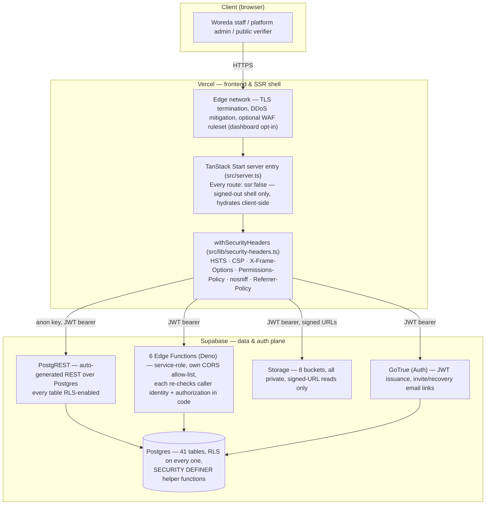

# System architecture

INSA Enforcer Phase 1.2. The structural counterpart to
[`docs/security-hardening.md`](./security-hardening.md), which maps each
layer below against the WAF/DDoS/TLS/API-Shield/Page-Shield capabilities a
Cloudflare-fronted stack would otherwise provide — read that document for the
control-by-control detail; this one is the shape.

## Deployment topology

## Why the shape is what it is

- **No server-side application logic between the browser and Supabase.**
  There are no `loader`s, no `beforeLoad` guards, no `createServerFn` calls
  anywhere in `src/routes`. Every page queries PostgREST directly with the
  anon key from `useQuery`/`useMutation`; the only privileged server-side
  code is the 6 Edge Functions, invoked explicitly for the handful of
  operations that must bypass RLS (inviting a user, signing a credential,
  activating an invited account, recording a login). See CLAUDE.md's "Data
  layer" section for the full rationale.
- **`ssr: false` on all 66 route files.** Auth state is bootstrapped
  client-side from `supabase.auth.getSession()`
  (`src/hooks/useAuthBootstrap.ts`), so a server-rendered pass has no session
  and no permissions. TanStack Start is present for the router, the build,
  and the server entry — not for SSR of authenticated pages.
- **RLS is the tenant boundary, not application code.** Every table scopes
  its policies to `woreda_id = get_user_woreda_id()` (or an explicit
  `is_super_admin()` escape hatch); a query that forgets a `woreda_id` filter
  still cannot cross tenants, because the database itself won't return the
  rows. See [`docs/erd.md`](./erd.md) for where that boundary sits per table.
- **Edge Functions run as service-role and re-check authorization
  themselves.** Service-role bypasses RLS entirely, so each of the 6
  functions independently verifies caller identity (via the caller's own JWT,
  never a body-supplied `user_id`) and role/status/permission before
  mutating anything — see [`docs/api-security.md`](./api-security.md) for the
  per-function breakdown.
- **Security headers are applied once, centrally, to every response.**
  `src/server.ts` wraps TanStack Start's server entry specifically because
  h3 (the underlying server framework) swallows in-handler throws into an
  opaque `500` JSON body; the same wrapper that recovers a readable error
  page also applies `withSecurityHeaders` on both the success and error path,
  so a failure mode can never accidentally ship without HSTS/CSP.

## What sits where

| Concern                              | Layer                                                                                            |
| ------------------------------------ | ------------------------------------------------------------------------------------------------ |
| TLS termination, cert renewal        | Vercel edge (auto-provisioned)                                                                   |
| DDoS mitigation (L3/L4)              | Vercel edge (always on) + Supabase                                                               |
| WAF (managed OWASP ruleset)          | Vercel Firewall — dashboard opt-in, not a repo change (see `docs/security-hardening.md`)         |
| Security response headers            | `src/lib/security-headers.ts`, applied in `src/server.ts`                                        |
| Authentication (session issuance)    | Supabase Auth (GoTrue) — JWT, `localStorage`-persisted client-side, bearer-header transport      |
| Authorization (row-level)            | Postgres RLS policies, keyed off `app_user.role`/`status` and the permission-override chain      |
| Authorization (Edge Function-level)  | In-function checks against the caller's own JWT — see `docs/api-security.md`                     |
| File storage                         | Supabase Storage — 8 private buckets, tenant-prefixed paths, signed-URL reads only               |
| Public, unauthenticated verification | Two RPCs (`verify_credential_token`, `verify_service_letter`) called directly by the anon client |

## Related documents

- [`docs/security-hardening.md`](./security-hardening.md) — the Cloudflare-capability
  equivalence table and what's still a manual dashboard action.
- [`docs/erd.md`](./erd.md) — the data model this architecture sits on top of.
- [`docs/api-security.md`](./api-security.md) — every Edge Function and RPC,
  categorized Public/Private/Internal.
- [`docs/dfd.md`](./dfd.md) — how data actually flows through this topology
  for the four flows that touch PII or money.
