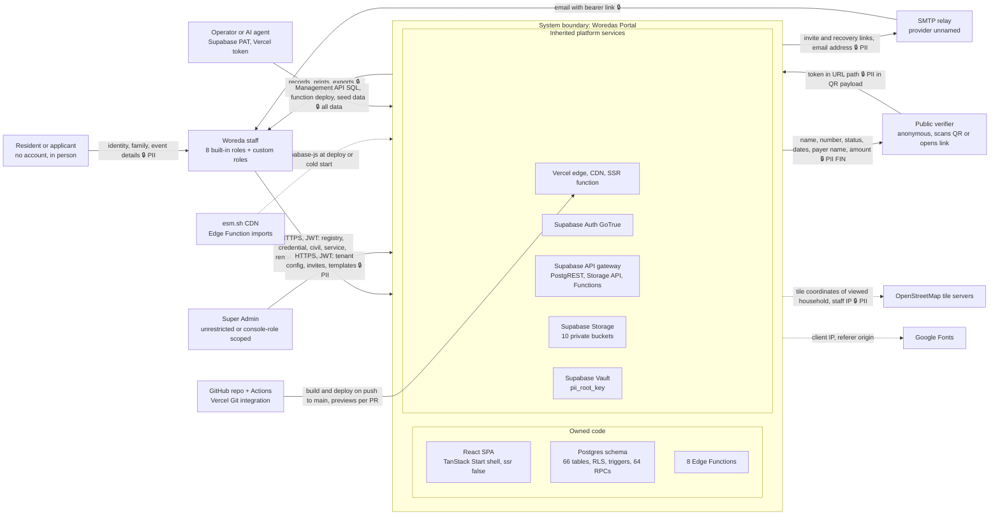
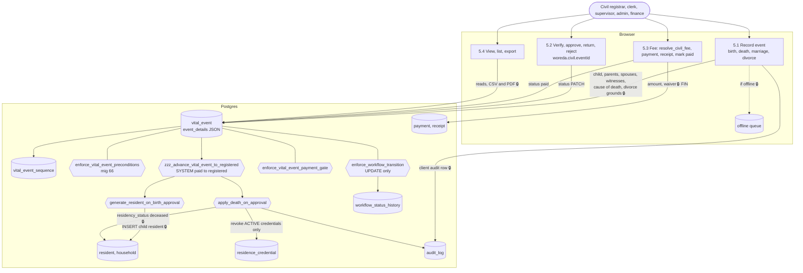

# Data Flow Diagrams — woredas-portal (as built, audit 2026-09-24)

Produced by `audit-architecture` (Wave 3). HEAD `9950f16`. Sources: the Wave 1–2 findings under `../findings/*.json`, `../api/endpoint-inventory.json`, `../privacy/pii-inventory.csv`, `../authz/*.md`, `architecture/erd.md`, and direct reading of `src/` and `supabase/migrations/` (latest definition of each function resolved across all 90 migrations). The live database and hosting dashboards were not reachable; anything that depends on them is marked **(live: unverified)**.

This document replaces nothing in the repository. It is the auditor's as-is view, to be compared with the project's own `docs/dfd.md` (see "Differences from docs/dfd.md" at the end).

## Legend

| Mark | Meaning |
|---|---|
| 🔒 | The flow carries personal data **[PII]** or financial data **[FIN]**. Each 🔒 flow in the tables below names its control(s) and, where the control is weak or missing, the finding ID that records the gap. |
| `TBn` | Trust boundary n (defined in §1). A flow that crosses a boundary is listed with the boundary it crosses. |
| **Owned** | Control implemented in this repository (code, migration, config). |
| **Inherited** | Control provided by Vercel or Supabase as a platform property. |
| **Weak** | A control exists but a Wave 1–2 finding shows it can be bypassed or is incomplete. |
| **Missing** | No control exists. |

Actor set (verified against `src/config/permissions.ts` and migration 41's `app_user_role_check`): 8 built-in tenant roles (`tenant_admin`, `civil_registrar`, `registry_clerk`, `finance_clerk`, `supervisor`, `auditor`, `viewer`, `print_officer`), tenant-defined `custom` roles (grants in `tenant_role_permission`), `super_admin` (unrestricted when `app_user.console_role_id IS NULL`, otherwise console-role scoped in the UI only — WP-AZ-001), the anonymous public verifier, and the resident/applicant, who never has an account. The operator (human or AI agent holding the account-level Supabase PAT and the Vercel token) is also an actor with direct production access (WP-OPS-007).

## 1. Trust boundaries

| ID | Boundary | What enforces it | Status |
|---|---|---|---|
| TB1 | Internet ↔ Vercel edge (static assets + SSR shell function) | TLS termination (Inherited, Vercel); HSTS, CSP, XFO, Permissions-Policy (Owned, `src/lib/security-headers.ts:48-97`, applied at `src/server.ts:46,49`) | Weak: CSP `script-src 'unsafe-inline'` (`security-headers.ts:52`, WP-APP-003). Live TLS/HSTS unverified (WP-OPS-013). WAF not evidenced (WP-INV-003). |
| TB2 | Browser (untrusted client) ↔ Supabase API gateway | TLS (Inherited); JWT bearer in `Authorization` header (GoTrue, Inherited); anon key identifies the project only | Weak: tokens live in `localStorage` (`src/integrations/supabase/client.ts:24`, WP-AUTH-003); no MFA (WP-AUTH-001). Every business rule not in Postgres is enforced only on this side of TB2 (WP-ARC-002). |
| TB3 | `anon` ↔ `authenticated` | RLS policies are all `TO authenticated`; three SECURITY DEFINER verify RPCs are the only anon surface (`verify_credential_token`, `verify_receipt`, `verify_service_letter`) | Weak: anon keeps table DML grants (WP-DB-015); `rental_eligibility()` probably anon-executable (WP-DB-009); verify RPCs unlimited (WP-API-006); self-registration not evidenced as disabled (WP-API-003/WP-AUTH-008). |
| TB4 | Tenant (woreda) ↔ tenant | RLS `woreda_id = get_user_woreda_id()` on every tenant table, storage path prefix `storage_path_woreda_id(name)` | Weak: status not checked (WP-DB-001); cross-tenant reads via DEFINER functions (WP-DB-003, WP-DB-009, WP-DB-010); FKs not woreda-composite (WP-DB-012). |
| TB5 | Role ↔ role inside a tenant | `user_has_perm()` on write policies; `enforce_workflow_transition()` on status changes | Weak: read permissions not enforced (WP-DB-004/WP-AZ-005); storage has no permission check (WP-DB-002); coarse UPDATE policies (WP-AZ-002/WP-WF-005); module toggles UI-only (WP-AZ-004). |
| TB6 | `authenticated` ↔ `service_role` (Edge Functions) | Each of the 8 functions resolves the caller from its own JWT, requires `status='active'`, re-checks woreda/role (`authz.md` §4) | Owned, sound. Gateway `verify_jwt` state undetermined (WP-API-004); no input schema validation (WP-API-002); console permissions not checked (WP-API-001). |
| TB7 | Supabase / browser ↔ third parties (SMTP relay, esm.sh, OSM tiles, Google Fonts) | CSP origin allow-list for the browser side (Owned) | Weak: esm.sh import unpinned (WP-INV-001); SMTP relay unnamed (WP-INV-010); OSM/Google Fonts receive IPs and viewed locations (WP-PRV-008, WP-INV-006). |
| TB8 | Control plane (operator, CI/CD) ↔ production data plane | Account-level Supabase PAT; Vercel Git integration | Weak: no staging (WP-OPS-001); previews can only reach production (WP-OPS-005); CI not a required check (WP-OPS-004); manual, agent-driven SQL with no migration ledger (WP-OPS-007). |
| TB9 | Browser session ↔ browser at rest (`localStorage`) | Sign-out sweeps drafts and the offline queue | Weak: plaintext PII in drafts/offline queue with no expiry (WP-PRV-003). |

## 2. Level 0 — context

Notes on L0:

- The resident never crosses TB2. Every resident-originated 🔒 flow is keyed in by staff; there is no self-service form (verified: no unauthenticated write route in `src/routes`; the three public routes only read).
- The QR token is not an opaque identifier: it carries name, sex, DOB, woreda, kebele and house number in readable base64 (`supabase/functions/sign-credential/index.ts:206-218`, WP-CRY-003, WP-PRV-009). The public verifier therefore holds PII before the system answers.
- The operator path (TB8) reaches every store, bypasses RLS and is the only way a new `woreda` row is created (`supabase/seed.sql:70-75`; no insert on `woreda` anywhere in `src/`). See WP-ARC-004.

## 3. Level 1 — processes and data stores

### 3.1 Overview

```mermaid
flowchart TB
    Staff(["Woreda staff"])
    SA(["Super Admin"])
    Pub(["Public verifier"])
    Ops(["Operator"])

    subgraph BROWSER["Browser: untrusted, TB2 below"]
        P1["P1 Sign-in and session bootstrap"]
        P2["P2 Resident registration"]
        P3["P3 Households"]
        P4["P4 Credentials ID card"]
        P5["P5 Civil registration"]
        P6["P6 Services, letters, complaints"]
        P7["P7 Rental houses and rent ledger"]
        P8["P8 Revenue payments and receipts"]
        P9["P9 Approvals inbox, dashboards, reports, exports"]
        P10["P10 Settings: tenant config, users, permissions"]
        P11["P11 Tenant provisioning and platform admin"]
        P12["P12 Public verification: card, letter, receipt"]
        P13["P13 Audit trail view"]
        LS[("D12 localStorage<br/>JWTs, drafts, offline queue")]
    end

    subgraph SUPA["Supabase project: TB2 gateway, TB4 RLS"]
        EFN["Edge Functions<br/>service_role, TB6"]
        D1[("D1 Identity and RBAC<br/>auth.users, app_user, role_permission,<br/>tenant_role, overrides, console_role")]
        D2[("D2 Registry<br/>resident, household, household_location,<br/>household_change_log, resident_document, kebele")]
        D3[("D3 Credentials<br/>credential_request, residence_credential,<br/>print, status and verification logs, templates")]
        D4[("D4 Civil<br/>vital_event")]
        D5[("D5 Services<br/>service_type, service_request,<br/>attachments, checkpoints")]
        D6[("D6 Rental<br/>18 tables: houses, occupancy, rent ledger,<br/>settlements, arrears, reconciliation")]
        D7[("D7 Revenue<br/>payment, receipt, fee_schedule")]
        D8[("D8 Tenant config<br/>woreda, woreda_settings, tenant_module_config,<br/>office, policies, workflow_transition")]
        D9[("D9 Audit<br/>audit_log, workflow_status_history,<br/>status history tables")]
        D10[("D10 Storage<br/>10 private buckets")]
        D11[("D11 Secrets<br/>Vault pii_root_key, Edge ES256 key")]
        D13[("D13 Counters and limiter<br/>8 sequence tables, rate_limit_bucket")]
    end

    Staff --> P1 & P2 & P3 & P4 & P5 & P6 & P7 & P8 & P9 & P10 & P13
    SA --> P1 & P11 & P13
    Pub --> P12
    Ops -. "TB8 SQL, seeds" .-> D8
    Ops -. "TB8 SQL" .-> D1
    Ops -. "TB8 SQL" .-> D2

    P1 -- "password, JWT 🔒" --> D1
    P1 --> EFN
    P2 -- "identity incl. FAN, ethnicity, religion 🔒" --> D2
    P2 -- "photos, scans 🔒" --> D10
    P3 -- "address, GPS, phone 🔒" --> D2
    P4 -- "request, payment, print 🔒" --> D3
    P4 --> EFN
    P5 -- "event details incl. cause of death 🔒" --> D4
    P5 -. "birth creates resident, death marks deceased 🔒" .-> D2
    P6 -- "applicant, complaint content 🔒" --> D5
    P7 -- "occupant, rent, settlements 🔒 FIN" --> D6
    P8 -- "amounts, payer 🔒 FIN" --> D7
    P9 -- "reads across D2 to D7 🔒" --> D2
    P10 -- "roles, invites, seals and signatures" --> D1
    P10 --> D8
    P10 --> EFN
    P11 --> D8
    P11 --> EFN
    P12 -- "token 🔒" --> D3
    P12 -- "token" --> D5
    P12 -- "token" --> D7
    P13 -- "old and new values 🔒" --> D9
    P2 -- "client-written audit rows 🔒" --> D9
    P4 -- "client-written audit rows 🔒" --> D9
    P5 -- "client-written audit rows 🔒" --> D9
    P6 -- "client-written audit rows 🔒" --> D9
    P2 -- "drafts 🔒" --> LS
    P4 -- "queued submissions 🔒" --> LS
    P5 -- "queued submissions 🔒" --> LS
    P6 -- "queued submissions 🔒" --> LS
    EFN -- "reads PII to sign, writes qr_payload 🔒" --> D3
    EFN -- "invite, activate, last login" --> D1
    EFN --> D11
    D2 -. "encrypt copies via trigger" .-> D11
```

### 3.2 Process catalogue

| Process | Routes (entry points) | Stores written | Server-side enforcement | Notes |
|---|---|---|---|---|
| P1 Sign-in, bootstrap | `/login`, `/set-password`, `/` (token_hash redemption) | `auth.users` (GoTrue), `app_user.last_login_at`, `app_user.status` | GoTrue; `record-login`, `activate-invited-user` self-scoped from JWT | `current_permissions()` falls back to compiled defaults on error (WP-AZ-008). |
| P2 Resident registration | `woreda.residents.*` | `resident` (+ `_enc` via trigger), `resident_document`, buckets `resident-photos`, `resident-clearance-letters`, `resident-documents`, `audit_log` | RLS + `resident.create/update` on write; AFTER INSERT audit trigger | Reads not permission-gated (WP-DB-004). Updates audited only by the browser (WP-PRV-001). |
| P3 Households | `woreda.households.*` | `household`, `household_location`, `household_change_log` | RLS + `household.*` on write | No ModuleGate (residents/households are always on). |
| P4 Credentials | `woreda.credentials.*` | see L2 §4 | FSM, INSERT guard, mint trigger, `sign-credential` | L2 below. |
| P5 Civil registration | `woreda.civil.*` | see L2 §5 | FSM (UPDATE only), payment gate, registration trigger | L2 below. |
| P6 Services | `woreda.services.*`, `woreda.complaints` | `service_request` (+ `applicant_phone_enc`), `service_request_attachment`, bucket `service-request-documents`, `service_request_status_history`, `service_request_checkpoint` | FSM (UPDATE only), payment and issuance gates, `services` module check for letters (`00000000000066:391-400`) | No INSERT status guard (WP-WF-001); letters can take complaint edges (WP-WF-002). |
| P7 Rental | `woreda.rental-houses.*`, `woreda.rental-accounts.$occupancyId`, `woreda.rental-reports` | `kebele_rental_house`, `rental_occupancy_request`, `rental_request_document`, bucket `rental-request-documents`; ledger tables only through RPCs | Rental FSM with insert guard and three-way SoD; DEFINER RPCs `provision_rent_account`, `generate_rent_charges`, `settle_rent_payment`, `settle_arrears_installments`, `reverse_rental_payment`, `create_arrears_repayment_plan`, `resolve_rental_checkpoint` | Strongest module: money moves only inside one locked DEFINER transaction (`00000000000087:693-742`). No route-level gate on rental pages; `rental_houses` module key unused (WP-INV-005). |
| P8 Revenue | `woreda.revenue.*`, payment cards inside P4/P5/P6 | `payment`, `receipt` | Exact-match fee guard, fee resolvers (fail-closed) | Non-atomic client sequence (WP-WF-009); non-rental status mutable (WP-WF-011); receipts not unique per payment (WP-CRY-007). |
| P9 Approvals, dashboards, reports | `woreda.approvals`, `woreda.dashboard`, `woreda.reports.*` | none (reads `approval_queue_v`, KPI and report RPCs); client-side CSV/PDF | KPI/report RPCs check permission; base-table reads do not | Exports unaudited, no volume limit (WP-PRV-004). |
| P10 Settings | `woreda.settings.*` | `woreda_settings`, bucket `tenant-assets` (logo, signature, stamp), `fee_schedule`, `service_type` (letter HTML), `role_permission`, `tenant_role*`, `user_permission_override`, `app_user`, bucket `staff-assets` | RLS + `tenant.manage`; A5/A7 guards; override woreda re-derived by trigger | Stored XSS in letter templates (WP-APP-001); any staff can overwrite seals (WP-DB-002). |
| P11 Tenant provisioning, platform admin | `admin.*` | `tenant_module_config`, `console_role*`, `id_card_template*`, bucket `credential-templates`, `app_user` via `invite-platform-admin` | `is_super_admin()`; `guard_console_role_assignment()` | Console permissions UI-only (WP-AZ-001); module toggles UI-only (WP-AZ-004); tenant creation out of band (WP-ARC-004). |
| P12 Public verification | `/v/$token`, `/verify/letter/$token`, `/verify/receipt/$token` | `credential_verification_log` (via DEFINER RPC) | Three anon DEFINER RPCs | Card verifier fails open (WP-CRY-001); no rate limit (WP-API-006). |
| P13 Audit view | `woreda.audit`, `admin.audit` | none | RLS tenant scope only (`audit.view` not enforced, WP-DB-004) | `audit_log` forgeable by any staff (WP-DB-008). |

**Store coverage check (A-02 "no undocumented stores").** All 66 tables from `architecture/erd.md` map to D1–D13 as follows (7 + 6 + 12 + 1 + 5 + 15 + 3 + 5 + 2 + 10 = 66); nothing is left over:

- D1 (7 + `auth.users`): `app_user`, `role_permission`, `tenant_role`, `tenant_role_permission`, `user_permission_override`, `console_role`, `console_role_permission`, plus `auth.users` in the GoTrue schema.
- D2 (6): `resident`, `resident_document`, `household`, `household_location`, `household_change_log`, `kebele`.
- D3 (12): `credential_request`, `credential_request_status_history`, `residence_credential`, `credential_status_history`, `credential_print_log`, `credential_verification_log`, `credential_policy`, `attachment`, `id_card_template`, `id_card_template_field`, `id_card_template_field_draft`, `approval` (no client use), plus the `approval_queue_v` view.
- D4 (1): `vital_event`.
- D5 (5): `service_type`, `service_request`, `service_request_attachment`, `service_request_status_history`, `service_request_checkpoint`.
- D6 (15, plus 3 counters in D13): `kebele_rental_house`, `rental_occupancy_request`, `rental_request_document`, `rental_occupancy`, `rental_policy`, `rental_payment`, `rent_account`, `rent_charge`, `rent_rate_history`, `rent_payment_settlement`, `rent_reminder`, `arrears_repayment_plan`, `arrears_repayment_installment`, `arrears_installment_charge`, `payment_reconciliation_exception`.
- D7 (3): `payment`, `receipt`, `fee_schedule`.
- D8 (5): `woreda`, `woreda_settings`, `tenant_module_config`, `office`, `workflow_transition`. `credential_policy` and `rental_policy` are listed with their modules.
- D9 (2): `audit_log`, `workflow_status_history`.
- D13 (10): `resident_number_sequence`, `credential_request_sequence`, `credential_number_sequence`, `vital_event_sequence`, `service_request_sequence`, `receipt_sequence`, `rental_request_sequence`, `rent_account_sequence`, `arrears_plan_sequence`, `rate_limit_bucket`.
- Non-DB stores: D10 (10 buckets: `resident-photos`, `resident-documents`, `resident-clearance-letters`, `credential-request-documents`, `attachments`, `credential-templates`, `service-request-documents`, `rental-request-documents`, `tenant-assets`, `staff-assets`), D11 (Vault `pii_root_key`; Edge secrets `HARARI_EC_PRIVATE_KEY`, `SUPABASE_SERVICE_ROLE_KEY`), D12 (`localStorage`: `sb-<ref>-auth-token`, form drafts `useFormDraft`, `offline-queue:<woredaId>`, idle timestamp), service-worker cache (app shell `/` only, `public/sw.js:36-47`; no API responses).

### 3.3 Sensitive flows (L1) and their controls

Every flow that carries PII or financial data. "Control" lists the control(s) that actually apply; "Gap" links the finding that shows the control is weak or missing. Transport on every browser↔Vercel and browser↔Supabase flow is TLS (**Inherited**; live version unverified, WP-OPS-013) and is not repeated per row.

| ID | Flow | Data | Boundary | Control (Owned / Inherited) | Gap |
|---|---|---|---|---|---|
| F01 🔒 | Staff → GoTrue `signInWithPassword` | email, password [PII] | TB2 | GoTrue bcrypt, per-IP limits (Inherited); client 8-char rule (Owned) | No MFA WP-AUTH-001; no CAPTCHA/lockout WP-AUTH-005; server password policy unverified WP-AUTH-007 |
| F02 🔒 | GoTrue → browser `localStorage` | access + refresh JWT | TB2, TB9 | Short-lived JWT (Inherited, unverified WP-AUTH-009); idle logout 25 min (Owned) | localStorage WP-AUTH-003; idle reset on reload WP-AUTH-004; suspension does not revoke WP-AUTH-002 |
| F03 🔒 | GoTrue → SMTP → invitee | email address, invite/recovery bearer link | TB7 | Redirect allow-list (Inherited, dashboard) | Relay unnamed, DMARC p=none WP-INV-010; implicit flow puts refresh token in URL fragment WP-AUTH-010 |
| F04 🔒 | Staff (P10/P11) → invite Edge Functions | invitee email, name, role, woreda | TB6 | JWT + active + role + woreda check; rate limit 10–20/600 s fail-open (Owned) | No body schema validation WP-API-002; CP not checked WP-API-001; audit rows carry email WP-API-009 |
| F05 🔒 | P2 → `resident` INSERT/UPDATE | name ×3 scripts, DOB, sex, FAN, phone, email, ethnicity, religion, mother's name [PII, special category] | TB2, TB4, TB5 | RLS `WITH CHECK` woreda + `resident.create/update` (Owned); Zod (Owned, client); `_enc` copy of FAN/phone/email via trigger (Owned) | FAN/phone format client-only WP-APP-005/WP-LOC-005; plaintext remains authoritative WP-DB-005/WP-CRY-006; special-category mandatory, no lawful basis WP-PRV-005 |
| F06 🔒 | D2 → any tenant member (SELECT, `resident_decrypted`) | all resident PII | TB4, TB5 | RLS tenant scope (Owned) | No read permission WP-DB-004; suspended users still read WP-DB-001; no column masking CLS-01 |
| F07 🔒 | P2/P3 → `audit_log` (client insert, old/new JSON) | full resident diffs incl. FAN, phone | TB2 | RLS insert (Owned) | Forgeable, browser-written WP-DB-008/WP-PRV-001; restricted PII copied into log readable by all staff WP-PRV-002 |
| F08 🔒 | P2 → buckets `resident-photos`, `resident-documents`, `resident-clearance-letters` | photos, scanned IDs and letters | TB2, TB4 | Private buckets, signed URLs 5–15 min, path-prefix policy (Owned); WebP conversion (Owned) | No permission check on objects WP-DB-002; no server MIME/size limit on 8 of 10 buckets (only `resident-documents`, `00000000000004:113-114`, and `rental-request-documents`, `00000000000072:263-264`, have one) WP-APP-004/WP-DB-014 |
| F09 🔒 | P2/P5/P6 → `localStorage` drafts and offline queue | wizard drafts, queued civil/service/credential submissions | TB9 | Per-woreda key; cleared on sign-out (Owned) | Plaintext, no expiry WP-PRV-003 |
| F10 🔒 | P3 → `household`, `household_location` | address, house number, GPS, phone, email, rent amount | TB2, TB4 | RLS + `household.*` (Owned); `_enc` copies of phone/email/rent (Owned) | Reads ungated WP-DB-004 |
| F11 🔒 | Browser → `*.tile.openstreetmap.org` | tile coordinates of the household being viewed + staff IP | TB7 | CSP `img-src` allow-list (Owned) | Third-party disclosure WP-PRV-008/WP-INV-006 |
| F12 | Browser → Google Fonts | IP, `strict-origin` referer | TB7 | CSP allow-list, `Referrer-Policy` (Owned) | WP-INV-006 (fonts already self-hosted) |
| F13 🔒 | P6 → `service_request`, `service-request-documents` | applicant name/phone, complaint details, respondent, incident place | TB2, TB4 | RLS + `service.*`; `applicant_phone_enc` (Owned) | Reads ungated WP-DB-004; INSERT at any status WP-WF-001 |
| F14 🔒 | P10 → `service_type.letter_body_html` → letter print | operator-authored HTML rendered in staff sessions | TB5 | Allow-list sanitiser on print (Owned) | Editor sink unsanitised, stored XSS WP-APP-001 |
| F15 🔒 | P7 → rental request + documents | occupant identity, family, rent amount, scans | TB2, TB4 | Insert guard, SoD, checklist, frozen fields (Owned, `00000000000089`); bucket-level MIME/size limits (Owned, `00000000000072:262-265`) | Billing start client-chosen WP-WF-013 |
| F16 🔒 | P7 → `settle_rent_payment` / `reverse_rental_payment` / arrears RPCs | amounts, payer, settlement [FIN] | TB2, TB5 | DEFINER RPC: permission + woreda + `FOR UPDATE` + idempotency key + exact-sum (Owned) | Reversal reason optional WP-WF-014; due dates one day early WP-LOC-001 |
| F17 🔒 | P8 → `payment` INSERT, `receipt` INSERT, status PATCH (credential/civil/service fees) | amount, channel, waiver, payer [FIN] | TB2 | Exact-match fee guard, fail-closed resolvers (Owned) | Three separate client calls WP-WF-009; waiver authority too broad WP-WF-010; status mutable WP-WF-011; extra receipts mintable WP-CRY-007; counters writable WP-DB-006; hard DELETE WP-DB-011 |
| F18 🔒 | P9 → CSV/PDF export, prints | bulk resident, civil, service, revenue data | TB2 → user device | Client permission gate `report.export` (Owned, client only) | Unaudited, unmarked, unlimited WP-PRV-004; report keys not enforced server-side WP-AZ-005 |
| F19 🔒 | P12 → `/v/$token` → `verify_credential_token` | token (name, sex, DOB, kebele, house no.) in, name/number/status/dates out | TB3 | ES256 signature check client-side; DEFINER RPC hides DOB/photo from anon (Owned, `00000000000034:273-300`) | Fails open WP-CRY-001; readable payload in URL WP-CRY-003/WP-PRV-009; no rate limit WP-API-006; full token stored in `credential_verification_log.attempted_value` (pii-inventory "Verification probes") |
| F20 🔒 | P12 → `verify_service_letter` | name, subject, summary out | TB3 | DEFINER RPC, status filter (Owned) | Letters verify via complaint path WP-WF-002; content mutable after issue WP-APP-002; token non-CSPRNG WP-DB-013 |
| F21 🔒 | P12 → `verify_receipt` | payer name, amount, type, channel out [PII, FIN] | TB3 | DEFINER RPC (Owned, `00000000000013:134-189`) | Client-chosen tokens accepted WP-CRY-008/WP-DB-013; untyped payments verifiable WP-WF-011 |
| F22 🔒 | Edge `sign-credential` → D2/D3 (service_role) | resident PII read, signed token written | TB6 | Caller JWT, active, same woreda, `credential.print` (Owned); key only in Edge secret (Owned) | Linked rows not re-pinned to woreda WP-API-012; no key id/rotation WP-CRY-004; no custody plan WP-OPS-003 |
| F23 🔒 | Operator → Management API SQL | any row | TB8 | Account PAT kept out of repo (Owned, SEC-01 PASS) | No staging, prod used for tests WP-OPS-001; manual, no ledger WP-OPS-007; token on command line WP-SUP-006 |
| F24 🔒 | Vercel preview deployment → production Supabase | whatever the preview's users do | TB8 | Preview protection unverified | WP-OPS-005 |
| F25 🔒 | Trigger `encrypt_pii_*` → Vault-derived key | phone, email, FAN, amounts | inside DB | Per-woreda HMAC-derived key from Vault root (Owned + Inherited Vault) | Plaintext twins WP-CRY-006; key custody WP-OPS-003 |
| F26 🔒 | P1 → `record-login`, `activate-invited-user` | own `user_id` from JWT | TB6 | Self-scoped from JWT (Owned) | Status not checked WP-API-014; sign-ins not in audit trail WP-PRV-007 |

## 4. Level 2 — Credentials (P4)

```mermaid
flowchart TB
    Staff(["Clerk, supervisor, admin, print role"])
    Pub(["Public verifier"])

    subgraph B["Browser"]
        P41["4.1 Intake<br/>woreda.credentials.new"]
        P42["4.2 Review, verify, approve, return<br/>woreda.credentials.requestId"]
        P43["4.3 Fee: resolve, pay, receipt, mark paid"]
        P44["4.4 Sign request"]
        P45["4.5 Print, confirm, activate<br/>woreda.credentials.requestId.print"]
        P46["4.6 Staff scanner<br/>HararildScanner"]
        P47["4.7 Public verify<br/>v.token"]
        Q[("offline queue")]
    end

    subgraph DB["Postgres: RLS + triggers"]
        CR[("credential_request")]
        CRH[("credential_request_status_history")]
        RC[("residence_credential")]
        CSH[("credential_status_history")]
        CPL[("credential_print_log")]
        CVL[("credential_verification_log")]
        ATT[("attachment")]
        PAY[("payment, receipt")]
        RES[("resident, household, kebele")]
        TPL[("id_card_template, fields")]
        AUD[("audit_log")]
        SEQ[("credential_number_sequence,<br/>credential_request_sequence, receipt_sequence")]
        ENG{{"enforce_workflow_insert<br/>enforce_workflow_transition<br/>log_workflow_transition"}}
        MINT{{"generate_residence_credential_on_payment<br/>mig 70"}}
    end

    subgraph S["Storage"]
        BA[("attachments, credential-request-documents")]
        BP[("resident-photos")]
        BT[("tenant-assets, credential-templates")]
    end

    subgraph E["Edge"]
        SIGN["sign-credential<br/>service_role, ES256 key"]
    end

    Staff --> P41 & P42 & P43 & P45 & P46
    P41 -- "resident_id, type, documents 🔒" --> CR
    P41 -- "scans 🔒" --> BA
    P41 --> ATT
    P41 -- "client-written history, audit" --> CRH
    P41 --> AUD
    P41 -. "if offline 🔒" .-> Q
    CR --- ENG
    P42 -- "status PATCH, actor columns" --> CR
    P42 --> CRH
    P43 -- "resolve_credential_fee RPC" --> PAY
    P43 -- "payment amount, waiver 🔒 FIN" --> PAY
    P43 -- "status paid" --> CR
    CR --> MINT
    MINT -- "INSERT ready_to_print, number via counter" --> RC
    MINT --> SEQ
    P44 -- "credentialId, woredaId, JWT" --> SIGN
    SIGN -- "reads PII 🔒" --> RES
    SIGN -- "qr_payload signed token 🔒" --> RC
    SIGN --> AUD
    P45 -- "reads resident_decrypted 🔒" --> RES
    P45 --> TPL
    P45 -- "signed URLs 🔒" --> BP
    P45 --> BT
    P45 -- "printing, printed, active" --> RC
    P45 --> CPL & CSH & AUD
    RC --- ENG
    P46 -- "token or 13-digit number" --> CVL
    Pub -- "scan QR, token in URL 🔒" --> P47
    P47 -- "verify_credential_token anon 🔒" --> RC
    P47 --> CVL
```

| Step | Control that holds | Gap (finding) |
|---|---|---|
| 4.1 Intake | INSERT guard: only `draft`/`submitted` (`00000000000029:87`) | Offline payload plaintext WP-PRV-003; attachment MIME client-only WP-APP-004; request number accepted from client WP-DB-006 |
| 4.2 Review/approve | FSM triple + permission, maker ≠ checker on entry to `approved` (`00000000000046:204-219`) | Stale actor columns WP-WF-003; non-status fields writable by viewer/auditor/finance WP-WF-005/WP-AZ-002/WP-AZ-003; content not frozen WP-WF-004 |
| 4.3 Fee | Exact-match fee guard; mint requires confirmed + receipted `credential_fee` for this request (`00000000000070:53-68`) | Non-atomic sequence, duplicates WP-WF-009; waiver WP-WF-010; receipts WP-CRY-007 |
| Mint | System-only via GUC `app.minting_credential` (`00000000000029:97-186`); 18+, photo, phone, not deceased; one active card per resident | Death does not revoke non-active cards WP-WF-006 |
| 4.4 Sign | Fields read from DB, never from the request; `credential.print` checked through caller JWT | WP-API-012 (FK rows not re-pinned); WP-CRY-004/005 (no kid/version); `print_officer` cannot sign WP-WF-012 |
| 4.5 Print | Print eligibility check; template fields positioned in mm | Status history and audit written by the browser (WP-PRV-001) |
| 4.6/4.7 Verify | Algorithm pinned, signature over exact bytes; anon sees collapsed status | Public page fails open WP-CRY-001; staff scanner verifies on signature only WP-CRY-002; `get_credential_live_status()` cross-woreda WP-DB-010 |

## 5. Level 2 — Civil Registration (P5)

| Step | Control that holds | Gap (finding) |
|---|---|---|
| 5.1 Record | Preconditions: death subject active in this woreda and not already deceased, one open death per resident; marriage parties in this woreda (`00000000000066:406-470`) | **No INSERT status guard**: an event can be created directly at `awaiting_payment`, skipping verify/approve (latest `enforce_vital_event_preconditions()` has no status check; `enforce_workflow_insert()` covers only the two credential tables, `00000000000029:87-97,204-211`) WP-WF-001; special-category data mandatory WP-PRV-005; no attachment support at all (the `attachment` entity helper has no `vital_event` arm, `00000000000053:93-98`) |
| 5.2 Verify/approve | FSM triple + permission; maker ≠ checker on entry to `approved` | Stale actors WP-WF-003; `event_type`/`event_details` editable after approval WP-WF-004 |
| 5.3 Fee | Payment gate: confirmed `civil_registration_fee` + receipt linked to this event; one payment per event (`00000000000059:32`) | Divorce has no fee mapping, cannot register WP-WF-008; finance_clerk payer rolls back death finalisation, leaving orphaned payment WP-WF-007 |
| Registration | System transition under GUC, same transaction; birth idempotent | Birth trigger reads a mother across woredas WP-DB-003; death revokes only `active` cards and is reversible by any `resident.update` holder WP-WF-006; death audit row lacks woreda/actor WP-WF-007 |
| 5.4 View/export | RLS tenant scope | `civil.read` not enforced WP-DB-004; exports unaudited WP-PRV-004 |

## 6. Differences from `docs/dfd.md` (A-01..A-03 drift)

| `docs/dfd.md` claim | Verdict | Evidence |
|---|---|---|
| L0 actors: resident, "Woreda Staff (8 roles)", platform admin, public verifier (`docs/dfd.md:11-14`) | CONFIRMED for people; incomplete | 8 built-in tenant roles match `permissions.ts`; `custom` roles, console-role scoping, the operator and all external services (SMTP, OSM, Google Fonts, esm.sh, Vercel, GitHub) are absent. |
| Trust boundary is "the Supabase project" (`docs/dfd.md:16`) | CONTRADICTED (incomplete) | Nine boundaries exist (§1); the browser/Supabase boundary is the only one drawn and the browser side is where many business rules live (WP-ARC-002). |
| "Two public verification routes" (`docs/dfd.md:28-30`, L0 edge `:23`) | CONTRADICTED | Three: `/verify/receipt/$token` → `verify_receipt` (`00000000000013:189`, `src/routes/verify.receipt.$token.tsx:65`). |
| "Verifier sends token only, no PII in request"; "QR encodes only the token" (`docs/dfd.md:73-74,98`) | CONTRADICTED | Token payload is readable base64 with name, sex, DOB, kebele, house number (`sign-credential/index.ts:206-218`). |
| L1 has 5 processes and 6 stores (`docs/dfd.md:42-57`) | CONTRADICTED (incomplete) | Civil registration, rental (18 tables incl. counters), settings, tenant provisioning, approvals/reports, audit view, receipt verification, all 10 buckets, Vault, `localStorage` and the offline queue are missing. No L2 exists. |
| `national_id_no`, `phone_number`, `email` protected by RLS, not column-level encryption (`docs/dfd.md:85-88`) | CONTRADICTED (stale) | `_enc` copies since migrations 23 and 44; plaintext still authoritative (WP-DB-005). |
| Invite functions and activation write `audit_log` (`docs/dfd.md:119-120`) | CONFIRMED | `activate-invited-user`, `invite-*`, `resend-*`, `send-password-reset-link`, `sign-credential` insert into `audit_log`; `record-login` does not. |
| `attachments` bucket serves "the credential and civil-registration workflows" (CLAUDE.md, Storage) | CONTRADICTED | Only credential routes upload to it (`woreda.credentials.new.tsx:372`); `entity_belongs_to_woreda()` has no `vital_event` arm (`00000000000053:93-98`). |
