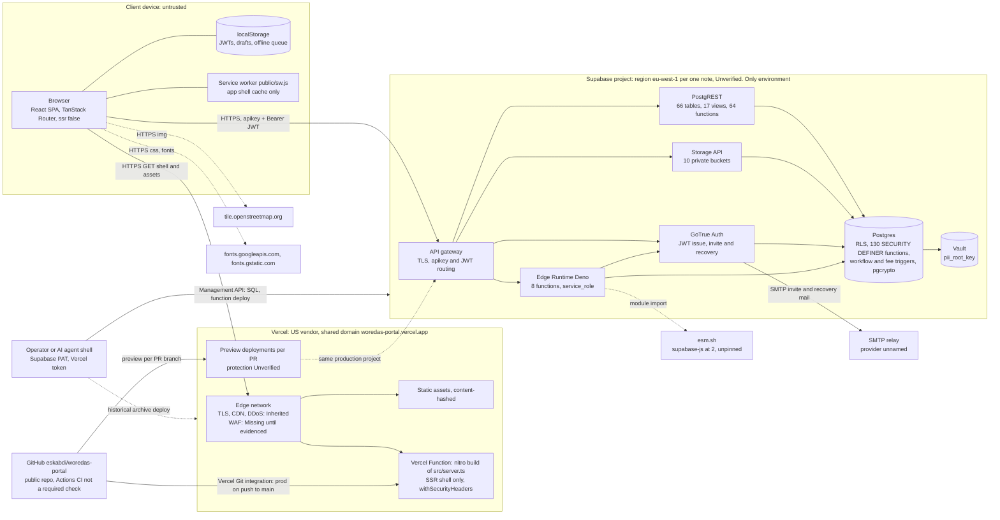

# System Architecture — woredas-portal (as built, audit 2026-09-24)

Produced by `audit-architecture` (Wave 3), HEAD `9950f16`. This is the auditor's as-is view built from code, migrations and the Wave 1–2 outputs. It supersedes nothing in the repository; the project's own `docs/architecture.md` is reconciled against it in §6. Hosting dashboards (Vercel, Supabase) and the live database were **not** reachable, so every statement about platform settings is marked **Unverified** unless the repository itself proves it.

Status vocabulary used in every table below:

- **Owned**: implemented in this repository and evidenced by `path:line`.
- **Inherited**: provided by Vercel or Supabase as a platform property. Where the platform makes it optional, it is only "Inherited" if there is evidence it is switched on.
- **Missing**: no control exists, or it is optional and there is no evidence it is enabled.
- **Unverified**: depends on dashboard or live state that the audit could not see.

## 1. Deployment view (A-04)

Cloud-only, two PaaS vendors, no on-premises component and no custom domain.

| Deployment fact | Value | Evidence | Status |
|---|---|---|---|
| Model | Public cloud PaaS (Vercel + Supabase), no on-prem, no hybrid | `src/server.ts`, `vite.config.ts:112-115` (nitro, no preset), `supabase/config.toml:1` | Owned design |
| Frontend host | Vercel, shared domain `woredas-portal.vercel.app`; no `vercel.json` in repo (framework/build settings are dashboard-only) | `src/config/credentialCryptoConfig.ts:39-41` (QR fallback origin); `ls vercel.json` → absent | Inherited; settings Unverified |
| Frontend deploy path | Vercel Git integration: production on push to `main`, previews per PR (vercel[bot] deployments), before CI finishes | `raw/ops-scope-github-api.txt:129-142`; WP-OPS-004 | Owned process, weak |
| Supabase project | One project, used as production, dev and test | `supabase/config.toml:1`; `docs/staging-runbook.md:9`; WP-OPS-001 | Missing separation |
| Data region | eu-west-1, recorded once in an execution note; no data-residency statement | `docs/fix-task-v3-execution-notes.md:16-18`; WP-OPS-011 | Unverified |
| Vercel function region | Not recorded anywhere in the repository | no `vercel.json`; `grep -rn "iad1\|fra1" docs` → none | Unverified |
| Schema, seed and Edge deploy | Manual Management API / CLI from operator or agent shells with an account-level PAT; no migration ledger | `scripts/deploy-functions.sh:28-40`; `docs/architecture.md:400-424`; WP-OPS-007 | Owned process, weak |
| Backups / PITR | Not documented; free-tier project cap recorded | `docs/go-live-declaration.md:180`; WP-OPS-002 | Unverified, likely Missing |

## 2. Component view (A-05)

```mermaid
flowchart TB
    subgraph SPA["Browser SPA: src/"]
        direction TB
        RT_PUB["Public routes<br/>index, login, set-password,<br/>v.token, verify.letter.token, verify.receipt.token"]
        RT_ADM["Admin console routes admin.*<br/>ConsolePermissionGate"]
        RT_WOR["Woreda portal routes woreda.*<br/>PermissionGate, ModuleGate"]
        AUTHS["authStore + useAuthBootstrap<br/>current_permissions, compiled fallback"]
        IDLE["useIdleTimeout 20 min warn, 25 min sign-out"]
        OFFQ["offlineQueue + offlineSync<br/>credential, civil, service intake and fee replay"]
        EFC["edgeFunction.ts invokeEdgeFunction<br/>errorMessages translateError"]
        CRY["harariCredentialCrypto + credentialCryptoConfig<br/>ES256 verify, public key only"]
        LET["letterTemplate.ts<br/>token substitution + allow-list sanitiser"]
        IMG["imageCompression WebP"]
        EXP["tableExport, reportExport<br/>CSV and PDF client-side"]
        SBC["integrations/supabase/client.ts<br/>anon key, localStorage session"]
        SBS["client.server.ts service_role<br/>imported by nothing"]
    end

    subgraph SSR["Vercel Function"]
        SRV["src/server.ts<br/>error capture + withSecurityHeaders"]
    end

    subgraph EDGEF["Edge Functions: supabase/functions"]
        SIGN["sign-credential"]
        INVT["invite-tenant-user"]
        INVP["invite-platform-admin"]
        RSP["resend-platform-invite"]
        RST["resend-tenant-invite"]
        ACT["activate-invited-user"]
        RLOG["record-login"]
        PWR["send-password-reset-link"]
        SHR["_shared: response.ts CORS and safeError,<br/>rateLimit.ts, clientIp.ts"]
    end

    subgraph DBL["Postgres logic: supabase/migrations"]
        RLS["RLS helpers: get_user_woreda_id, user_has_perm,<br/>is_super_admin, is_tenant_admin, storage_path_woreda_id"]
        FSM["Workflow engine: workflow_transition,<br/>enforce_workflow_transition, enforce_workflow_insert"]
        FEE["Fee resolvers + exact-match fee guard"]
        SIDE["Side-effect triggers: credential mint,<br/>birth to resident, death to revoke, rental approval"]
        ENC["Encryption triggers + decrypted views<br/>Vault-derived per-woreda keys"]
        NUM["Numbering triggers + counter tables"]
        AUDT["Audit triggers: log_workflow_transition,<br/>log_workflow_status_history, resident insert"]
        RPCS["RPC groups, see table"]
    end

    RT_PUB --> CRY
    RT_PUB --> SBC
    RT_ADM --> SBC
    RT_WOR --> SBC
    RT_ADM --> EFC
    RT_WOR --> EFC
    RT_WOR --> OFFQ
    RT_WOR --> LET
    RT_WOR --> IMG
    RT_WOR --> EXP
    AUTHS --> SBC
    OFFQ --> SBC
    EFC --> SIGN & INVT & INVP & RSP & RST & ACT & RLOG & PWR
    SIGN & INVT & INVP & RSP & RST & ACT & RLOG & PWR --> SHR
    SBC --> RLS
    SBC --> RPCS
    RPCS --> RLS
    FSM --> RLS
    SHR --> RPCS
```

### 2.1 Edge Functions (all 8)

| Function | Caller (client file) | Authorization (in function) | Rate limit | Service-to-service calls |
|---|---|---|---|---|
| `sign-credential` | `src/utils/harariCredentialCrypto.ts:90` | JWT → `getUser`; active; same woreda; `user_has_perm('credential.print')` unless super_admin | none | PostgREST (service_role) reads `residence_credential`, `resident`, `household`, `kebele`, `woreda`, `woreda_settings`; writes `qr_payload`, `audit_log`; reads Edge secret `HARARI_EC_PRIVATE_KEY` |
| `invite-tenant-user` | `src/components/settings/UsersRolesTab.tsx:787` | active tenant_admin of `woredaId` or super_admin | 20/600 s, fail-open | GoTrue admin invite; `app_user` insert; `audit_log`; `rate_limit_hit` |
| `invite-platform-admin` | `PlatformUsersTab.tsx:679`; `admin.tenants.$woredaId.provision.tsx:166` | active super_admin; `console.console_users.manage` only when minting super_admin | 10/600 s, fail-open | GoTrue admin invite; `app_user`; `audit_log` |
| `resend-platform-invite` | `PlatformUsersTab.tsx:307` | active super_admin | 10/600 s, fail-open | `auth.admin.getUserById`; GoTrue invite |
| `resend-tenant-invite` | `UsersRolesTab.tsx:283` | active tenant_admin (target in caller woreda) or super_admin | 10/600 s, fail-open | `auth.admin.getUserById`; GoTrue invite |
| `send-password-reset-link` | `UsersRolesTab.tsx:304`; `PlatformUsersTab.tsx:325` | tenant_admin same woreda, staff target, target active; or super_admin | 10/600 s, fail-open | GoTrue `/auth/v1/recover` |
| `activate-invited-user` | `src/routes/set-password.tsx:128` | self, from JWT; only `pending` rows | none | `app_user` update; `audit_log` |
| `record-login` | `src/routes/login.tsx:132,142` | self, from JWT | none | `app_user.last_login_at` update |

Source: `api/endpoint-inventory.json`, `supabase/functions/*/index.ts`. Every function reads `SUPABASE_URL`, `SUPABASE_ANON_KEY`, `SUPABASE_SERVICE_ROLE_KEY` from the Edge environment; six also read `SITE_URL` (CORS + redirect).

### 2.2 RPC groups (all 64 functions exposed in `public`)

| Group | Count | Members | Exposure |
|---|---|---|---|
| Public verification | 3 | `verify_credential_token`, `verify_receipt`, `verify_service_letter` | anon + authenticated (DEFINER) |
| Session / authorization (client-called) | 2 | `current_permissions`, `current_console_permissions` | authenticated |
| Authorization helpers used by RLS | 14 | `user_has_perm`, `user_has_any_perm`, `user_has_console_perm`, `is_super_admin`, `is_tenant_admin`, `is_active_app_user`, `get_user_woreda_id`, `default_role_perms`, `user_permission_override_target_role_ok`, `entity_read_perm_ok`, `entity_attach_perm_ok`, `entity_approve_perm_ok`, `entity_belongs_to_woreda`, `storage_path_woreda_id` | exposed via `/rest/v1/rpc` with no client caller (WP-API-010) |
| Fee resolution | 3 | `resolve_credential_fee`, `resolve_service_fee`, `resolve_civil_fee` | authenticated |
| Search (blind index) | 5 | `my_national_id_blind_index`, `my_phone_blind_index` (client); `national_id_blind_index`, `phone_blind_index`, `normalize_phone` (revoked) | mixed |
| PII encryption | 7 | `encrypt_pii_text`, `encrypt_pii_numeric`, `decrypt_pii_text`, `decrypt_pii_numeric`, `derive_woreda_key`, `pii_root_key`, `pii_encryption_status` | decrypt exposed, rest revoked |
| KPIs | 3 | `get_service_kpis`, `get_credential_kpis`, `get_civil_kpis` | authenticated |
| Credentials and templates | 5 | `check_credential_print_eligibility`, `get_credential_live_status`, `publish_id_card_template`, `discard_id_card_template_draft`, `luhn_check_digit` | authenticated |
| Rental ledger writes | 8 | `provision_rent_account`, `generate_rent_charges`, `settle_rent_payment`, `settle_arrears_installments`, `reverse_rental_payment`, `create_arrears_repayment_plan`, `resolve_rental_checkpoint`, `resolve_reconciliation_exception` | authenticated, DEFINER with permission + woreda checks |
| Rental helpers | 6 | `resolve_rental_checkpoint_core`, `rental_eligibility`, `rental_period_month_index`, `refresh_rent_ledger_statuses`, `generate_rent_reminders`, `get_rent_account_ledger_summary` | mixed; `rental_eligibility` likely anon (WP-DB-009) |
| Rental reports | 5 | `get_rental_arrears_aging_report`, `get_rental_billing_collection_report`, `get_rental_checkpoint_activity_report`, `get_rental_plan_compliance_report`, `get_rental_reconciliation_report` | authenticated |
| Verification tokens | 2 | `gen_letter_verification_token`, `gen_receipt_verification_token` | exposed, no client caller |
| Rate limiting | 1 | `rate_limit_hit` | revoked (service_role only) |

Totals 64, matching `00-context/shared-context.md` and `api/endpoint-inventory.json` (`counts.rpc_candidates`).

### 2.3 External integrations

| Integration | Direction | Data shared | Auth | Evidence | Status |
|---|---|---|---|---|---|
| Supabase GoTrue SMTP relay | Supabase → mailbox | staff email, invite/recovery bearer link | platform-managed | `send-password-reset-link/index.ts` (GoTrue `/recover`); WP-INV-010 | Unverified provider |
| OpenStreetMap tiles | browser → OSM | tile coordinates of viewed location, IP | none | `src/components/gis/LocationDisplayMap.tsx:4`; CSP `security-headers.ts:55` | Owned choice, privacy gap WP-PRV-008 |
| Google Fonts | browser → Google | IP, origin | none | `src/routes/__root.tsx:124`; CSP `:53-54` | Owned choice, WP-INV-006 |
| esm.sh | Edge runtime → esm.sh | none (code download) | none | `supabase/functions/sign-credential/index.ts:1`; WP-INV-001 | Unpinned |
| GitHub + Vercel Git integration | repo → Vercel | source | GitHub app | `raw/ops-scope-github-api.txt:129-142` | CI not gating (WP-OPS-004) |
| Payment gateway / SMS | none | — | — | no SDK/URL in `src/`, `supabase/functions`, `package.json` (inventory drift, CONFIRMED) | N/A by design |

## 3. Security layers (A-06)

| Layer | Where | Status | Evidence | Gap |
|---|---|---|---|---|
| DNS / domain ownership | `*.vercel.app` shared domain | **Inherited** (vendor-owned name) / custom domain **Missing** | `credentialCryptoConfig.ts:39-41` | Printed QR codes bind to a vendor subdomain; no HSTS preload possible (WP-OPS-008) |
| TLS termination, browser ↔ Vercel | Vercel edge | **Inherited** | `docs/security-hardening.md:82` (claim) | Live protocol versions **Unverified** (WP-OPS-013) |
| TLS termination, browser ↔ Supabase | Supabase gateway | **Inherited** | `VITE_SUPABASE_URL` is https | **Unverified** live |
| HSTS | SSR function responses | **Owned** | `src/lib/security-headers.ts:77` (2 y, includeSubDomains, no preload) | Applies only to responses that pass through `src/server.ts`; static assets and Supabase responses carry the platform's own headers |
| CSP, XFO, nosniff, Referrer-Policy, Permissions-Policy | HTML documents | **Owned** | `security-headers.ts:48-97`, `server.ts:46,49` | `script-src 'unsafe-inline'` (WP-APP-003); no CSP reporting (WP-INV-003) |
| CDN / static caching | Vercel | **Inherited** | nitro Build Output (CLAUDE.md, Vercel section) | — |
| DDoS L3/L4 | Vercel, Supabase | **Inherited** (platform default) | `docs/security-hardening.md:81` (claim only) | No evidence of L7 protection |
| WAF (managed OWASP rules) | Vercel Firewall | **Missing** until evidenced | `docs/security-hardening.md:52-54` lists it as a dashboard to-do | WP-INV-003 |
| DMZ / network segmentation | — | **N/A** as a network zone (serverless PaaS, no customer-managed network). The functional equivalent is the Supabase gateway + RLS; direct Postgres network restrictions are **Unverified** | `docs/security-hardening.md:71-74` (to-do) | Postgres port exposure unknown |
| IDS / IPS | — | **Missing** | `docs/tech-stack.md:85` states none | WP-INV-003 |
| SIEM, log forwarding, alerting | — | **Missing** | `src/server.ts:34,48`, `_shared/response.ts:79` log to console only | WP-OPS-006 |
| API gateway key + JWT routing | Supabase gateway | **Inherited** | anon key in `client.ts` | JWT algorithm / lifetime / refresh rotation **Unverified** (WP-AUTH-009) |
| Edge gateway `verify_jwt` | Supabase Edge | **Unverified** | `supabase/config.toml` has no `[functions]` block; `scripts/deploy-functions.sh:40` | WP-API-004 |
| Edge in-function JWT verification | 8 functions | **Owned** | every function calls `auth.getUser` and checks `status='active'` (`authz.md` §4) | Console permission not checked (WP-API-001); no body schema validation (WP-API-002) |
| Edge CORS allow-list | `_shared/response.ts` | **Owned** | `_shared/response.ts:22-23` | Production trusts `http://localhost:5173` (WP-API-005) |
| Authentication factors | GoTrue | password only; MFA **Missing**; CAPTCHA **Missing** | `src/routes/login.tsx:96` | WP-AUTH-001, WP-AUTH-005 |
| Rate limiting | GoTrue (auth), Postgres limiter (5 functions) | Auth: **Inherited, Unverified**; app: **Owned** (fail-open); public RPCs: **Missing** | `supabase/migrations/00000000000022_rate_limit.sql:11`; `_shared/rateLimit.ts` | WP-API-006 |
| Session storage + idle timeout | Browser | **Owned** (localStorage by choice; 25 min idle) | `client.ts:24`; `src/config/idleTimeout.ts` | WP-AUTH-003, WP-AUTH-004; suspension does not revoke sessions (WP-AUTH-002) |
| Tenant isolation (RLS) | Postgres | **Owned** | RLS enabled on 66/66 tables in migrations (`findings/database.md`) | Status not checked (WP-DB-001); read permissions not enforced (WP-DB-004); FORCE RLS not used (WP-DB-015) |
| Object-store isolation | Storage policies | **Owned** | `00000000000001_storage.sql:124` (path prefix) | No permission check (WP-DB-002); MIME/size limits on 2 of 10 buckets (WP-DB-014) |
| Business-rule enforcement | Workflow engine, fee guard, rental RPCs | **Owned** | `00000000000025`, `…46`, `…66`, `…87`, `…89` | Insert guard gaps and SoD staleness (WP-WF-001..003); multi-step fee transactions in the browser (WP-ARC-002) |
| Column-level encryption | pgcrypto triggers, Vault root key | **Owned** (derivation, triggers) + **Inherited** (Vault) | `00000000000023_pii_encryption.sql:100,408-427` | Plaintext twins remain authoritative (WP-CRY-006, WP-DB-005) |
| Disk encryption at rest | Supabase (AWS) | **Inherited** | provider property | **Unverified** |
| Secrets management | Edge secrets, Vault, Vercel env | **Inherited** stores; custody/rotation **Missing** | `HARARI_EC_PRIVATE_KEY` only in Edge env (CRY-01); Vault key generated in DB | WP-OPS-003, WP-CRY-004; service_role key requested for the SSR tier that does not use it (WP-ARC-005) |
| Supply-chain pinning (Edge) | Deno imports | **Missing** | `sign-credential/index.ts:1` `esm.sh/@supabase/supabase-js@2` | WP-INV-001 |
| Audit trail | `audit_log`, history tables | **Owned**, partial | trigger writers in `…25`, `…58`; 68 client insert sites | Forgeable, browser-written (WP-DB-008, WP-PRV-001) |
| Backups / PITR / DR | Supabase | **Unverified**, likely **Missing** | `docs/go-live-declaration.md:180` | WP-OPS-002 |
| Environment separation | — | **Missing** | `docs/staging-runbook.md:9` | WP-OPS-001, WP-OPS-005 |
| CI security gates | GitHub Actions | lint/build/tests **Owned** but not required; dependency and secret scanning **Missing** | `.github/workflows/ci.yml:30-41` | WP-OPS-004, WP-SUP-001 |
| Monitoring / error tracking / uptime | — | **Missing** | no SDK in `package.json` | WP-OPS-006 |

## 4. Architectural observations (not visible from any single module)

1. **There is no server-side application tier.** `docs/architecture.md:46-53` states this as a design choice: every page talks to PostgREST with the anon key, and only 8 Edge Functions run privileged code. The consequence is that every business invariant has to be expressed as RLS, a trigger or a DEFINER RPC, or it is enforced only by the browser. The rental module shows the design working (all money movement is one locked DEFINER transaction, `00000000000087:693-742`). The credential, civil and service fee paths, the audit trail and the status-history tables show it not working: 68 client-side `audit_log` insert sites, 21 client-side status-history insert sites, and a three-call payment → receipt → status sequence. See WP-ARC-002.
2. **One origin, three trust levels.** The anonymous verification pages, the tenant portal and the super-admin console are the same SPA on the same origin, sharing one `localStorage` session key (`client.ts:24`) under a CSP that allows inline script. Any script-execution bug on any page reaches the session of whoever is signed in on that browser. See WP-ARC-003.
3. **Tenant creation is outside the application.** The console "provisioning" flow only upserts `tenant_module_config` and invites a tenant admin (`src/routes/admin.tenants.$woredaId.provision.tsx:150-175`). `woreda` rows exist only because `supabase/seed.sql:70-75` inserts them, and the `AFTER INSERT ON woreda` triggers that seed permissions, offices and rental policy (`00000000000015:71`, `00000000000048:103`, `00000000000071:247-248`) run only on that operator path. See WP-ARC-004.
4. **The SSR tier is configured as if it were privileged.** `.env.example:30` asks for `SUPABASE_SERVICE_ROLE_KEY` "Required by `client.server.ts`", and `client.server.ts:10` reads it, but nothing imports that module. See WP-ARC-005.

## 5. Reconciliation with `architecture/erd.md` (audit-database)

- Store model: the 66 tables and 17 views in `architecture/erd.md` map one-to-one onto DFD stores D1–D13 (`dfd.md` §3.2 coverage check, 66/66, no leftovers). The 10 storage buckets, Vault, Edge secrets and `localStorage` are non-relational stores that the ERD rightly omits but the DFD must show; they are in `dfd.md` D10–D12.
- The ERD's tenant model (54 FKs to `woreda`, 7 platform tables without `woreda_id`, 4 child tables scoped through their parent, nullable `woreda_id` on `app_user`, `audit_log`, `credential_verification_log`) matches TB4 in the DFD. The three nullable cases are exactly the places where a platform actor (super_admin, a platform audit event, an anonymous probe) enters a tenant store.
- The ERD's note that no FK is woreda-composite (WP-DB-012) is why TB4 is shown as "Weak" for joins made by DEFINER functions.
- No table in the ERD lacks a process that writes it, except `approval` (no client writer, no RPC writer found), `rental_payment` and `rent_reminder` (written only inside DEFINER RPCs), `household_location` (no client use) and `office` (seeded by trigger). These are listed so that A-02's "no undocumented stores" is satisfied explicitly rather than by omission.

## 6. Drift against `docs/architecture.md`

| Claim | Verdict | Evidence |
|---|---|---|
| Deployment diagram: "6 Edge Functions", "43 tables", "Storage — 9 buckets" (`docs/architecture.md:29-31`) | CONTRADICTED | 8 functions (`scripts/deploy-functions.sh:28-37`), 66 tables, 10 buckets (`00000000000001:24-48`, `…04:113`, `…14:23`, `…48:345`) |
| "Public, unauthenticated verification: Two RPCs" (`docs/architecture.md:89`) | CONTRADICTED | Three, including `verify_receipt` (`00000000000013:189`) |
| "No server-side application logic between the browser and Supabase" (`docs/architecture.md:46-53`) | CONFIRMED | No loaders, `beforeLoad` or `createServerFn` in `src/routes` (shared-context) |
| "Every table scopes its policies to `woreda_id = get_user_woreda_id()`… a query that forgets a filter still cannot cross tenants" (`docs/architecture.md:59-63`) | CONFIRMED for PostgREST table access; CONTRADICTED for DEFINER functions | WP-DB-003, WP-DB-009, WP-DB-010 |
| WAF: "dashboard opt-in" (`docs/architecture.md:83`) | CONFIRMED as stated; no evidence it was enabled | WP-INV-003 |
| Diagram shows no region, preview environment, SMTP relay, operator path or third-party origins | NOT FOUND (omitted) | §1, §2.3 above |
