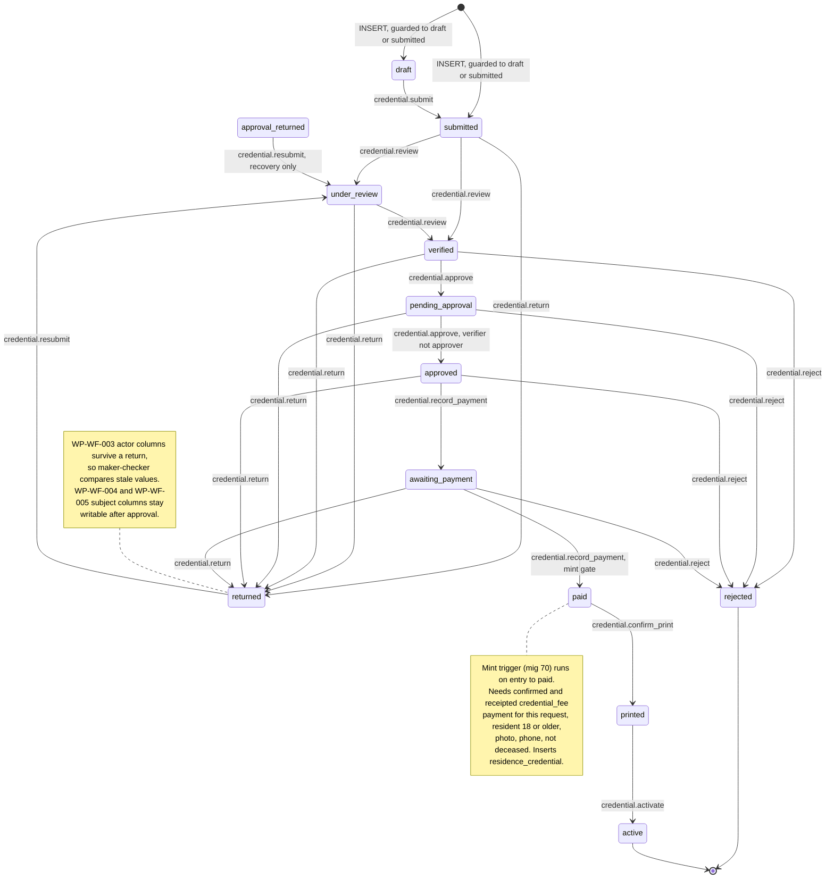
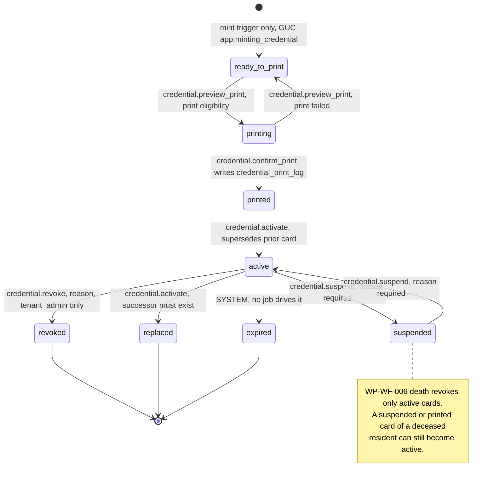
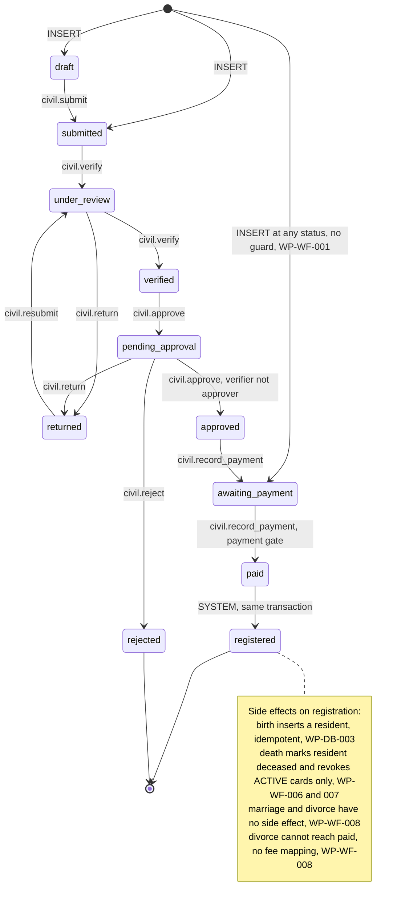
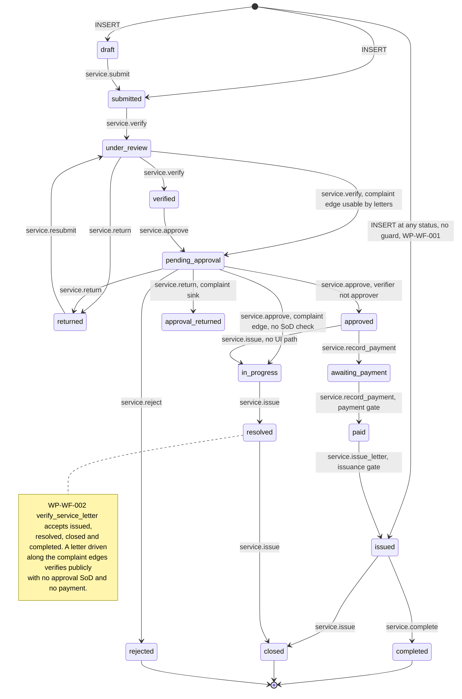
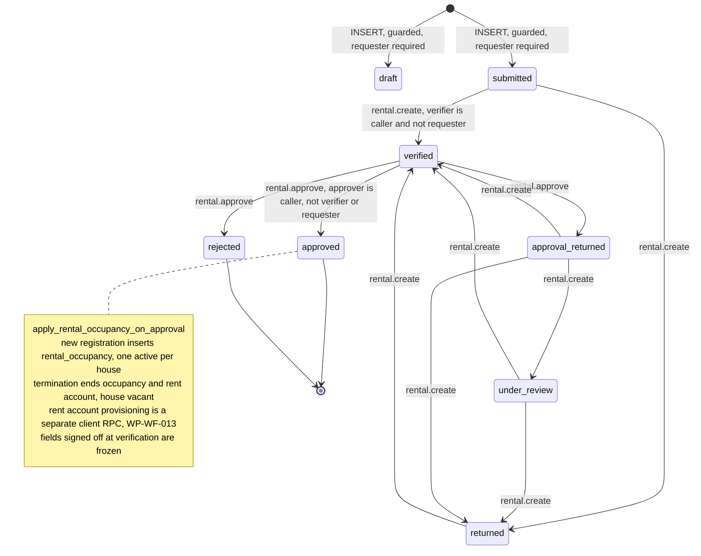
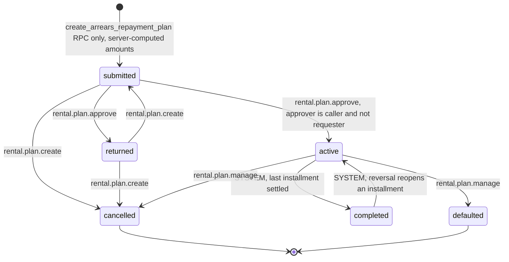
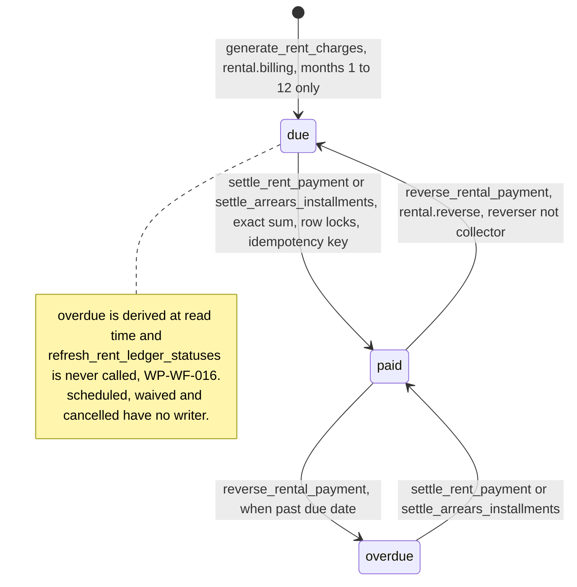
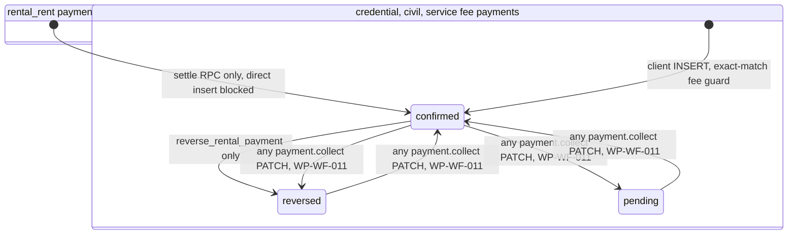

# Workflow State Machines — consolidated (audit 2026-09-24)

Produced by `audit-architecture` (Wave 3) by consolidating the diagrams in `../findings/workflows.md` §4 and re-checking every edge against the replayed transition table `../raw/workflows-fsm-reconstructed.txt` (83 rows, 6 entities, after replaying every `INSERT INTO public.workflow_transition` in migrations 25, 26, 27, 28, 58, 61, 72, 75, 80, 81, 85 and the `DELETE … LIKE 'LEGACY-28:%'` in `00000000000030:82`). Guards and side effects were re-checked against the **latest** definition of each function:

| Function | Latest definition |
|---|---|
| `enforce_workflow_transition()` | `00000000000046_task10_credential_lifecycle.sql:135` |
| `enforce_workflow_insert()` (credential tables only) | `00000000000029_workflow_insert_guard.sql:81`, triggers `:204-211` |
| `enforce_rental_request_integrity_guards()` (rental insert guard) | `00000000000089_rental_review_round6_fixes.sql:87` |
| `enforce_vital_event_preconditions()` / `enforce_service_request_preconditions()` | `00000000000066_payment_hardening_review_fixes.sql:406` / `:339` (neither checks `NEW.status` on INSERT) |
| `generate_residence_credential_on_payment()` (mint) | `00000000000070_mint_guard_deceased_check.sql:28` |
| `apply_death_on_approval()`, `generate_resident_on_birth_approval()` | `00000000000059_task14a_civil_payment_and_preconditions.sql:82`, `:118` |
| `reverse_rental_payment()` | `00000000000089_rental_review_round6_fixes.sql` (rent_charge back to `due`/`overdue` at `:513`) |
| `settle_rent_payment()` | `00000000000087_rental_review_round4_fixes.sql:693-742` |

Labels show the `required_permission` of the seeded triple. `SYSTEM` = `is_system = true`, reachable only inside a SECURITY DEFINER body that sets the transaction-scoped GUC `app.system_transition`. Every diagram below was parse-checked with Mermaid 11.

## Corrections made to the Wave 2 diagrams

| # | Diagram | Wave 2 version | Corrected to | Evidence |
|---|---|---|---|---|
| 1 | Service request | Omitted the seeded edge `approved → in_progress` (`service.issue`); it was mentioned only in prose | Edge drawn | `raw/workflows-fsm-reconstructed.txt` (service_request block); `00000000000061:112-130` |
| 2 | Service request | Label contained `;`, which Mermaid 11 rejects (diagram failed to render) | Rewritten | Parse check (this audit) |
| 3 | Rent charge / payment | Labels contained `;` and nested notes (diagram failed to render) | Split into two valid diagrams | Parse check (this audit) |
| 4 | Civil registration | Showed `[*] --> submitted` as the INSERT entry | Direct INSERT at **any** status shown explicitly; latest `enforce_vital_event_preconditions()` has no status check and `enforce_workflow_insert()` is attached only to the two credential tables | `00000000000066:406-440`; `00000000000029:204-211` |
| 5 | Service request | Same as 4 | Same correction | `00000000000066:339-360` |
| 6 | Payment status | Showed `pending --> confirmed` as a guarded edge | Shown as unguarded PATCH for non-rental payment types; only `rental_rent` rows are guarded | `00000000000086:74` (rental guard); `baseline.sql:1600` (payment UPDATE policy) |

No edge in the Wave 2 diagrams was absent from the replayed table, and no replayed edge other than #1 was missing from them.

## 1. Credential request (`credential_request`) — 22 transitions

`approval_returned` is legal in the CHECK constraint but nothing leads into it (reachable only by data written before the FSM).

## 2. Residence credential (`residence_credential`) — 9 transitions

## 3. Civil registration (`vital_event`: birth, death, marriage, divorce) — 12 transitions

The `[*] --> awaiting_payment` edge stands for "any status in the CHECK constraint, including `approved`, `paid` and `registered`". It is not in `workflow_transition`; it exists because no BEFORE INSERT trigger on `vital_event` inspects `status`. Dead states: `approval_returned`, `issued`.

## 4. Service request (`service_request`: letters and complaints share one FSM) — 20 transitions

`approval_returned` has no exit (WP-WF-016). The `[*] --> issued` edge stands for "any status", as in §3.

## 5. Rental occupancy request (`rental_occupancy_request`) — 11 transitions

`draft` has no exit and `pending_approval` is unreachable (WP-WF-016).

## 6. Arrears repayment plan (`arrears_repayment_plan`) — 9 transitions

## 7. Rent charge (`rent_charge.status`, not engine-guarded; written only by DEFINER RPCs)

## 8. Payment status (`payment.status`: pending, confirmed, reversed)

A waiver is a `confirmed` payment with `amount = 0` and `waived = true` (reason ≥ 5 characters, any module's approve permission — WP-WF-010). There is no `due`, `overdue` or `waived` payment status: those live on `rent_charge` and `arrears_repayment_installment`.

## 9. Where each guard lives (summary)

| Entity | UPDATE FSM | INSERT status guard | Actor pinned to caller | Maker ≠ checker in DB | Payment gate | Subject frozen after approval | Trigger-written trail |
|---|---|---|---|---|---|---|---|
| `credential_request` | yes | yes | no | verifier ≠ approver at `approved` | yes (mint) | no | `audit_log` |
| `residence_credential` | yes | yes (mint only) | `revoked_by` only | n/a | print gate | number, serial, QR only | `audit_log` |
| `vital_event` | yes | **no** | no | verifier ≠ approver at `approved` | yes | `resident_id` once set | `workflow_status_history` |
| `service_request` | yes | **no** | no | verifier ≠ approver at `approved` only | yes + issuance | no | `workflow_status_history` |
| `rental_occupancy_request` | yes | yes | yes | requester ≠ verifier ≠ approver | n/a | yes | `workflow_status_history` |
| `arrears_repayment_plan` | yes | RPC only | yes | requester ≠ approver | n/a | yes | `audit_log` |

Source: `../findings/workflows.md` §3, re-checked for the two INSERT rows as described in correction 4–5.
