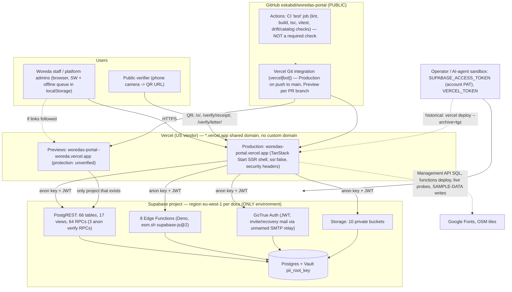

# Operations, Environments and Testing Scope — audit-ops-scope

Audit of `eskabdi/woredas-portal` at HEAD `9950f16e`, 2026-09-24 (Meskerem 14, 2019 EC).
This review is read-only. The machine-readable companion is `ops-scope.json`, and the INSA Phase 6
testing-scope draft is `ops-scope-testing-scope.md`. Raw evidence is in `../raw/ops-scope-github-api.txt`
and `../raw/ops-scope-tls-probe.txt`.

## 1. Summary

The application is secured more carefully than it is operated. The code-level transport controls hold:
HSTS, a scoped CSP, and no mixed content. CI is well constructed, with a SHA-pinned setup-bun action,
a frozen lockfile and least-privilege `contents: read`. Keeping credentials out of the repository is
also a mature practice here. What is missing is everything around the code:

- **No staging.** Production is the development, test and verification environment. That includes
  committed test writes and at least one hand-inserted `audit_log` row (WP-OPS-001, High).
- **Backups and DR are unevidenced.** Two documents record a free-tier project cap, so the project is
  probably in a free-tier organisation. Nothing backs up Storage objects: legal document scans, photos,
  official signatures (WP-OPS-002, High). The two root keys have no documented escrow (WP-OPS-003).
- **CI is advisory.** `main` is protected, but no status check is required, and Vercel promotes every
  push to `main` to production in parallel with CI (WP-OPS-004).
- **No monitoring or alerting** of any kind (WP-OPS-006).
- **Vendor-owned QR target.** Printed ID cards and receipts permanently encode a vendor-owned shared
  domain, `woredas-portal.vercel.app`, as the public verification origin (WP-OPS-008).

| Severity | Count | IDs |
|---|---|---|
| High | 2 | WP-OPS-001, WP-OPS-002 |
| Medium | 6 | WP-OPS-003, -004, -005, -006, -007, -008 |
| Low | 4 | WP-OPS-009, -010, -011, -012 |
| Info | 1 | WP-OPS-013 |

Checklist verdicts: A-04 PARTIAL, A-05 PARTIAL (inputs), A-06 PARTIAL (inputs), D-04 UNVERIFIED,
F-01 PARTIAL, F-02 PARTIAL, F-03 PARTIAL, **OPS-01 FAIL**.

## 2. Method and limits

- Read CI (`.github/workflows/ci.yml`), `supabase/config.toml`, the deploy, seed and probe scripts, the
  `deploy`/`verify`/`acceptance-harness` skills, and every ops-relevant document. The documents were
  treated as claims.
- **GitHub public API (unauthenticated, read-only).** Captured repository visibility, the `main`
  protection summary, the last 100 workflow runs, and the deployment records. The full protection
  object (review rules, admin bypass) requires an admin token and was not visible.
- **Live probe.** `curl -sSI` to `https://woredas-portal.vercel.app/` and to the Supabase API host. The
  audit sandbox's egress policy refused both with HTTP 403 on CONNECT, and they were not retried. Note
  that even a successful probe would not have shown the production TLS configuration: the sandbox proxy
  re-terminates TLS, so a TLS-version result would describe the proxy, not Vercel. No login was
  attempted and no credential was sent.
- No database, Supabase dashboard, or Vercel dashboard access. Everything that lives only in a
  dashboard is marked `Needs-live-verification`, and the owner questions are in §9.

## 3. As-is deployment and component architecture (A-04 / A-05 inputs)

**Component inventory the architecture agent should reconcile against `docs/architecture.md`**

| Component | Count / detail | Evidence |
|---|---|---|
| Edge Functions | 8: `sign-credential`, `invite-tenant-user`, `invite-platform-admin`, `resend-platform-invite`, `resend-tenant-invite`, `activate-invited-user`, `record-login`, `send-password-reset-link` | `scripts/deploy-functions.sh:28-37` |
| Anon RPCs | `verify_credential_token`, `verify_receipt` (explicit GRANT), `verify_service_letter` (default PUBLIC execute retained) | `migrations/…34:305`, `…13:189`, `…07:70` |
| Storage buckets | 10: credential-request-documents, credential-templates, rental-request-documents, resident-clearance-letters, resident-photos, service-request-documents, tenant-assets, resident-documents, staff-assets, attachments | `migrations/…01:24-48`, `…04:113`, `…14:23`, `…48:345` |
| External runtime integrations | Google Fonts, OSM tiles, esm.sh (Edge imports), GoTrue SMTP relay (provider unnamed) | `src/lib/security-headers.ts:39-47`; WP-INV-001, WP-INV-010 |
| Deploy paths | Frontend: Vercel Git integration (since 2026-09-20). Schema/functions: manual Management API/CLI from operator shells | `raw/ops-scope-github-api.txt:129-142`; `docs/architecture.md:400-424` |

The documented diagram (`docs/architecture.md:26-31`) still shows 6 functions, 43 tables and 9 buckets.
It records no region, no preview environment, no SMTP relay and no domain.

## 4. Security layers: Owned / Inherited / Absent (A-06 / B-05 input)

| Layer | Status | Evidence / note |
|---|---|---|
| TLS termination and certificates | **Inherited** (Vercel edge; Supabase) | `docs/architecture.md:81`. Live version not verified (WP-OPS-013) |
| HSTS | **Owned** (2 years, includeSubDomains, no preload) | `src/lib/security-headers.ts:77` |
| CSP, XFO, Permissions-Policy, nosniff, Referrer-Policy | **Owned** | `src/lib/security-headers.ts:48-97` |
| L3/L4 DDoS mitigation | **Inherited** (platform default) | `docs/security-hardening.md:81` (claim) |
| WAF (managed OWASP rules) | **Absent until evidenced.** Vercel Firewall is a dashboard opt-in | `docs/security-hardening.md:52-54` lists it as a to-do |
| Preview Deployment Protection | **Unverified** | `docs/security-hardening.md:55-57` to-do; 26 previews exist |
| Auth rate limiting / CAPTCHA / leaked-password check | Rate limiting **Inherited** (GoTrue defaults); CAPTCHA **Absent** (no `captchaToken` in `login.tsx`) | `docs/testing-scope.md:52-54` unchecked |
| App-level rate limiting | **Owned** (invite/reset functions; fail-open) | `supabase/functions/_shared/rateLimit.ts`; migration 22 |
| Postgres network restrictions | **Unverified** | `docs/security-hardening.md:71-74` to-do |
| IDS/IPS | **Absent** | No evidence anywhere (WP-INV-003) |
| SIEM / log forwarding / alerting | **Absent** | WP-OPS-006, WP-INV-003 |
| Error tracking / uptime monitoring | **Absent** | WP-OPS-006 |
| Backups / PITR | **Unverified, likely insufficient** | WP-OPS-002 |
| Secret scanning in CI | **Absent** (manual `secret-sweep` agent only) | `ci.yml:30-41`; WP-SUP-001 |

## 5. Environments and CI/CD

**Environments.** There is one Supabase project, and it is production: one `project_id` in
`supabase/config.toml:1`, one ref across every script, and `docs/staging-runbook.md:9` states it
outright. Local development, the `verify` skill, the acceptance harness, `scripts/run-live-probes.py`
(which defaults to the production ref) and "SAMPLE-DATA" verification all run against it. The
production CORS set trusts `http://localhost:5173` (`_shared/response.ts:22-23`). Vercel preview
deployments exist for every PR branch, and with no second Supabase project they can only reach
production or nothing (WP-OPS-005). No test users or passwords appear in any migration. The only
`auth.users` reference is the FK at `baseline.sql:631`. `seed-app-users.sql` binds real people's
accounts (WP-OPS-010).

**CI.** The workflow is a single `test` job. It runs lint, build, `tsc`, vitest, three drift/catalog
checks and a permissions-doc check on every PR and on every push to `main`. The last 100 runs are
almost all successes; two PR runs failed. The workflow has no dependency audit, no secret scan, no
SAST and no Deno typecheck (WP-SUP-001, WP-BQ-002/013). **Branch protection:** `main` is protected,
but `required_status_checks.contexts` and `.checks` are both empty. CI is therefore not a merge gate,
which contradicts `CLAUDE.md:113` and `docs/architecture.md:497` (WP-OPS-004).

**CD.** The frontend now reaches production through the Vercel Git integration: vercel[bot] created
the Production deployment for `9950f16e` about 36 seconds after the push, before CI could finish. The
documented `vercel deploy --archive=tgz` path is historical. Schema, seed and Edge Functions are
deployed manually from operator or agent shells using an account-level PAT. There is no migration
ledger, and production has been hand-edited at least once (WP-OPS-007).

## 6. Backups, DR and key custody

No document states the Supabase plan, backup retention, PITR, RPO or RTO, or any restore test. The
go-live "Rollback path" (`docs/go-live-declaration.md:263-289`) covers code only. Two documents
record that creating a second project hit the account's **free-tier project cap**
(`docs/go-live-declaration.md:180`, `docs/architecture.md:447`). This strongly suggests a free
organisation, in which case PITR is not available at all. The ten Storage buckets hold scanned legal
documents, resident photos and official signatures and stamps. Supabase database backups do not
include object bytes in any plan, and the repository's `dump-*.sql` scripts explicitly exclude
operational data and files (WP-OPS-002). The Vault `pii_root_key` is generated inside Postgres and
never leaves it. The ES256 signing key exists only in Edge secrets. Neither key has a documented
escrow or recovery path (WP-OPS-003).

## 7. Monitoring

There is none beyond platform consoles. Server-side errors go to `console.error`
(`src/server.ts:34,48`; `_shared/response.ts:79`). There is no error-tracking SDK, no uptime check,
no log drain and no alert rules. The project's own documentation concedes that the fail-open rate
limiter can only be checked by hand (`docs/testing-scope.md:61-70`) (WP-OPS-006).

## 8. Hosting and TLS (D-04)

The code side passes: HSTS on every SSR document response (`security-headers.ts:77`, applied at
`server.ts:46,49`) and zero `http://` URLs under `src/`. The live side is **UNVERIFIED** because both
production hosts were blocked by the sandbox egress policy (`raw/ops-scope-tls-probe.txt`). Hosting
is on the shared `*.vercel.app` namespace with no custom domain. This rules out HSTS preload and a
Cloudflare front. It also means the QR codes on printed cards and receipts point at a vendor-owned
name, which is what WP-OPS-008 addresses. According to one execution note, the data region is
eu-west-1, and data residency is undocumented (WP-OPS-011).

## 9. Findings

Full records (evidence, CVSS, references, fix examples) are in `ops-scope.json`. Short form:

| ID | Sev | Conf | Title |
|---|---|---|---|
| WP-OPS-001 | High | Confirmed | No staging: production doubles as the dev/test/verification environment. Test users are created there, SAMPLE-DATA writes are committed and later deleted, and one audit_log row was inserted by hand |
| WP-OPS-002 | High | Needs-live | Backup, PITR and DR are unevidenced; the project is probably in a free-tier organisation; Storage objects have no backup |
| WP-OPS-003 | Medium | Confirmed | No custody, escrow or recovery for `HARARI_EC_PRIVATE_KEY` and the Vault `pii_root_key` |
| WP-OPS-004 | Medium | Likely | CI is not a required check on `main`; Vercel deploys production on push regardless of CI |
| WP-OPS-005 | Medium | Needs-live | Previews and `localhost:5173` are trusted by production; letter QR uses `window.location.origin` |
| WP-OPS-006 | Medium | Confirmed | No error tracking, uptime monitoring, log retention or alerting |
| WP-OPS-007 | Medium | Confirmed | Manual, agent-driven, ledger-less data-plane change process with an account-level PAT; production hand-edited |
| WP-OPS-008 | Medium | Likely | Printed QR codes encode the vendor shared subdomain `woredas-portal.vercel.app`; no government domain (takeover or look-alike risk) |
| WP-OPS-009 | Low | Confirmed | Staging seeder: 1 woreda, 4 of 9 roles, shared password, no teardown, so isolation cannot be tested |
| WP-OPS-010 | Low | Confirmed | Real people's e-mails and privileged account mapping in a public repo (`seed-app-users.sql`, reports) |
| WP-OPS-011 | Low | Needs-live | Hosting jurisdiction and cross-border PII transfer are undocumented (eu-west-1) |
| WP-OPS-012 | Low | Confirmed | `docs/testing-scope.md` is stale: 6 of 8 functions, 42 of 66 tables, no Storage, no receipt verify |
| WP-OPS-013 | Info | Needs-live | Live TLS/HSTS not verifiable from the sandbox; owner to supply an SSL Labs report |

Related findings owned by other agents, cross-referenced rather than duplicated: WP-INV-003 (no
SIEM/IDS, WAF unevidenced), WP-INV-010 (DMARC `p=none`), WP-SUP-001 (no dependency or secret scan in
CI), WP-SUP-006 (PAT on the command line), WP-DB-011 (hard DELETE on financial records, relevant to
how SAMPLE-DATA cleanup was possible).

### Priority order

1. **Before any penetration test or go-live signature:** provision staging and seed the full test
   matrix (WP-OPS-001, -009). Confirm the plan and enable PITR, start off-platform Storage backups,
   and write down RPO/RTO (WP-OPS-002).
2. **Before mass card printing:** a government domain and no vendor fallback (WP-OPS-008), plus key
   escrow (WP-OPS-003).
3. **Within one sprint:** make CI a required check and gate the production deploy on it (WP-OPS-004);
   turn on preview protection and remove localhost from production CORS (WP-OPS-005); add error
   tracking and alerting (WP-OPS-006).
4. **Structural:** a migration ledger and CI-driven data-plane deploys (WP-OPS-007).

## 10. Checklist

| ID | Status | Note |
|---|---|---|
| A-04 | PARTIAL | Diagram exists but is stale. It lacks region, previews, SMTP, domain, backups, and the fact that no staging exists. As-is diagram in §3 |
| A-05 | PARTIAL (inputs) | 8 functions / RPC groups / external integrations listed in §3 for the architecture agent |
| A-06 | PARTIAL (inputs) | Layer table in §4. WAF unevidenced; IDS/IPS/SIEM absent |
| D-04 | UNVERIFIED | Code: HSTS present, no mixed content. Live probe blocked |
| F-01 | PARTIAL | Repo artifact stale; complete auditor table in `ops-scope-testing-scope.md` |
| F-02 | PARTIAL | Repo matrix is 4 roles × 1 woreda; full placeholder matrix in `ops-scope-testing-scope.md` §4 |
| F-03 | PARTIAL | No test users or passwords in migrations or the repo, but there is no staging, testing is done on production, and real users are seeded from a public repo |
| OPS-01 | FAIL | No staging; backups unevidenced; no monitoring |

## 11. Documentation drift (see `ops-scope.json` `drift[]`, 17 entries)

**Contradicted:**
- CI checks are "required to pass before mergeable".
- "Secrets-enforced-out-by-CI".
- The testing-scope counts: 6 functions and 42 tables.
- "`bun audit` clean".
- The architecture diagram's 6 functions / 43 tables / 9 buckets.
- The security-hardening counts: 7 buckets and 4 functions.
- Frontend deploys are "archive-tgz, not git-linked".

**Confirmed:**
- No staging exists.
- The staging seeder refuses the production ref.
- `seed-app-users.sql` holds real accounts.
- The HSTS value is as documented.

**Not found:**
- The required-review rule (needs an admin token to see).
- The `--teardown` flag in `seed-staging-users.ts`.
- The Edge Functions' `verify_jwt:false` gateway state (`config.toml` has no function block and
  `deploy-functions.sh` passes no `--no-verify-jwt`, so the live value is indeterminate).
- "TLS 1.2+ enforced".
- WAF/DDoS enablement.

## 12. Questions for the owner (needed to close UNVERIFIED items)

1. Supabase organisation plan, Database > Backups screenshot, and PITR status. Has a restore ever been
   performed?
2. Output of `gh api repos/eskabdi/woredas-portal/branches/main/protection` (admin token), or a
   screenshot of the rule.
3. Vercel: Firewall (WAF) status, Deployment Protection for previews, and environment-variable
   scoping (are the production Supabase keys exposed to Preview?).
4. An SSL Labs report for the production host. Is a government domain planned before cards are
   printed in volume?
5. Where are `HARARI_EC_PRIVATE_KEY` and any escrow of the Vault key held, and by whom?
6. Supabase Auth dashboard: rate limits, CAPTCHA, leaked-password protection, JWT expiry, and the
   Postgres network restrictions.
7. Data-residency determination for eu-west-1 hosting.
