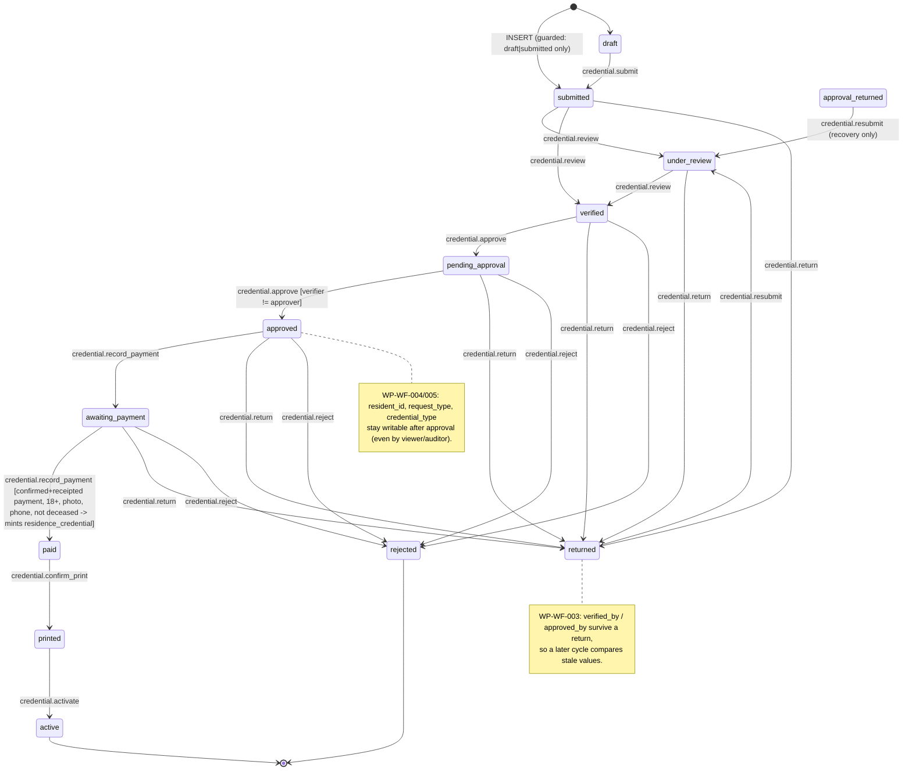
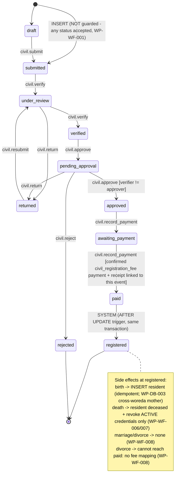
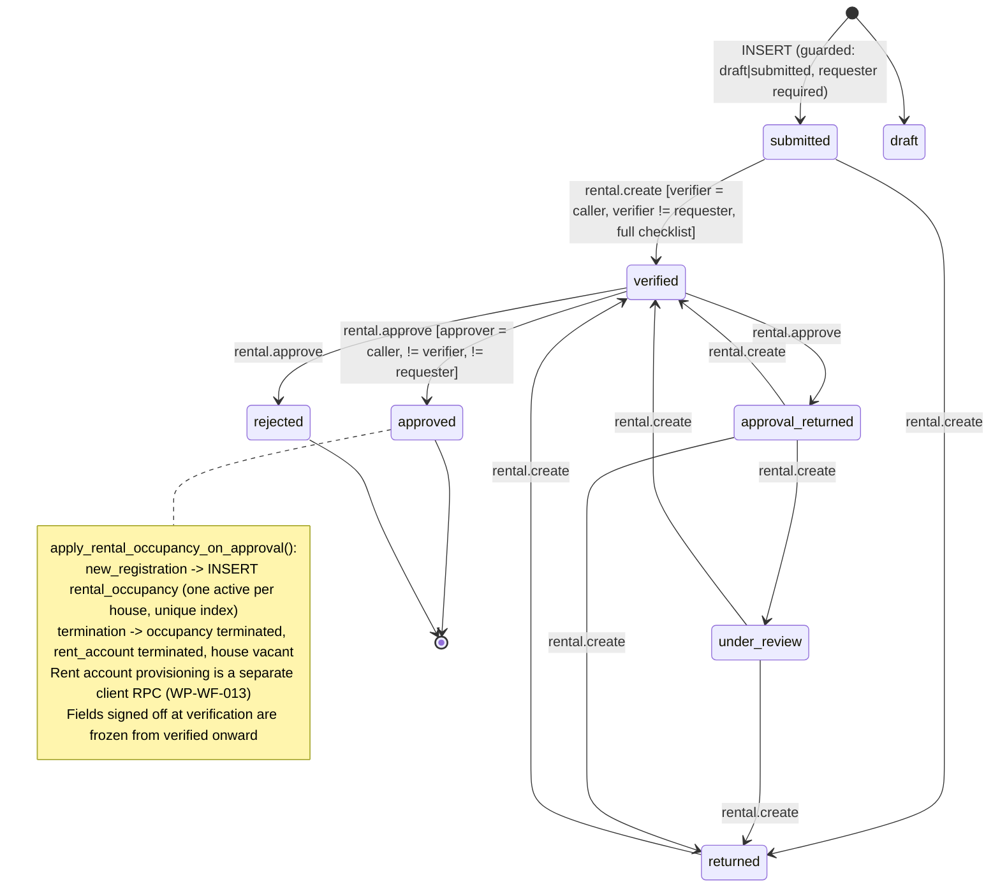
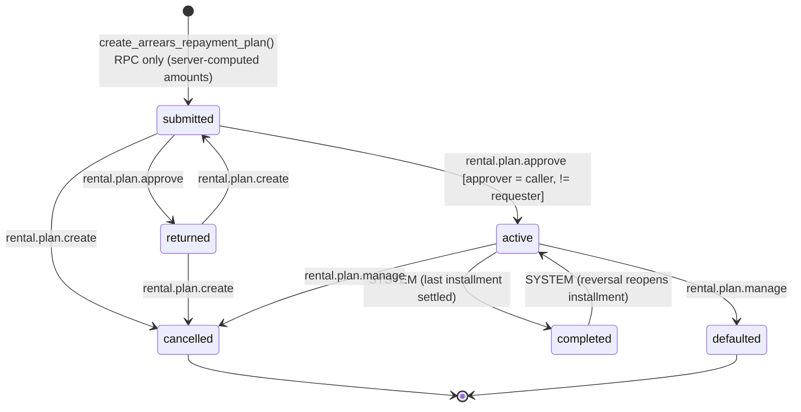

# Workflows, Maker-Checker and Business Logic — woredas-portal audit (2026-09-24)

**Agent:** audit-workflows (Wave 2) · **Repository HEAD:** `9950f16` · **Checklist IDs owned:** MC-01, MC-02, MC-03, BL-01 (workflow part), BL-02
**Machine-readable output:** `findings/workflows.json` · **Supporting evidence:** `raw/workflows-fsm-reconstructed.txt`

## 1. Scope and method

This review covers the shared workflow engine (`workflow_transition` + `enforce_workflow_transition()`) and every table it guards: credential requests and residence credentials, civil registration (`vital_event`: birth, death, marriage, divorce), service requests (letters and complaints), rental occupancy requests, and arrears repayment plans. It also covers the fee resolvers and exact-match fee guard, the waiver path, and the rental financial core (billing, settlement, arrears, reversal).

Method:

- **Latest definitions only.** For each function I resolved the highest-numbered `CREATE OR REPLACE` across all 90 migrations (for example, `enforce_workflow_transition` is from `00000000000046`, `generate_residence_credential_on_payment` from `00000000000070`, `reverse_rental_payment` from `00000000000089`).
- **FSM reconstructed by replay.** `workflow_transition` is seeded in 10 migrations with `ON CONFLICT DO NOTHING`, and one migration deletes rows (`00000000000030` removes the `LEGACY-28` rows). I replayed every `INSERT`/`DELETE` in order to get the final table: **83 transitions across 6 entities**. I then checked it against each `*_status_check` constraint, against `default_role_perms()` (migration 83), against `permissions.ts`, and against the status literals the UI writes. Result: no seeded state is missing from its CHECK constraint, and every `required_permission` exists and is held by at least one built-in role.
- **Rental module.** The project's own `workflow-fsm-review` and `rental-financial-integrity-review` agents were used as leads for invariants and known non-findings. Where a migration header records a "known gap", I verified it against the code rather than taking the header's word.
- **No live database was available.** Findings describe behaviour as reconstructed from migrations. Confidence is `Likely` where exploitation depends on live state matching the migrations, and `Needs-live-verification` where it also depends on runtime behaviour.

Related Wave 1 findings (referenced here, not repeated): **WP-DB-003** (birth trigger reads a cross-woreda mother), **WP-DB-006** (writable number counters, client-supplied numbers), **WP-DB-008** (forgeable `audit_log`), **WP-DB-011** (hard `DELETE` on payment/receipt/requests).

## 2. Summary

| Severity | Count | IDs |
|---|---|---|
| Critical | 0 | — |
| High | 6 | WP-WF-001, 002, 003, 004, 005, 006 |
| Medium | 7 | WP-WF-007, 008, 009, 010, 011, 012, 013 |
| Low | 3 | WP-WF-014, 015, 016 |

| Checklist | Verdict | One-line reason |
|---|---|---|
| MC-01 Maker ≠ checker in DB | **FAIL** | Enforced only on entry into `approved`, against stale actor columns. The complaint approval edge has no check. |
| MC-02 No direct status jumps | **PARTIAL** | UPDATE is fully policed on 6 tables, but `vital_event`/`service_request` can be INSERTed at any state and letters can use complaint edges. |
| MC-03 Waiver/revocation/deletion controls | **FAIL** | Credential revocation passes. Waivers, rental reversal, non-rental payment reversal, deletions and death reversal fall short. |
| BL-01 Unique, race-safe numbers (workflow part) | **PARTIAL** | Counters are race-safe and numbers are unique, but payments/receipts are not unique per request/payment. |
| BL-02 Civil side effects atomic + idempotent | **PARTIAL** | Side effects are atomic and idempotent, but death handling is incomplete and reversible, and divorce cannot complete. |

**Overall.** The engine does what it was built for: it closed the original F-01 (PATCH straight to `paid`), system transitions really are unreachable from a user session, and the credential mint gate is strong. The weaknesses are all in what the engine does *not* police:

- **Row creation.** Only the credential tables have an INSERT guard.
- **Non-status columns.** Nothing freezes the subject of a request after approval.
- **The identity behind a stage.** Actor columns can be stale; they are never tied to the person performing the current transition.
- **Row-level context.** Letter and complaint share one FSM.

The rental module already implements all four missing controls (insert guard, field freeze after verification, `verified_by = auth.uid()`, three-way SoD). It is the template for the fixes below.

## 3. How enforcement works today

| Entity | UPDATE FSM (`zz_enforce_workflow_transition`) | INSERT status guard | Actor pinned to caller at the stage | DB maker ≠ checker | Payment gate | Subject fields frozen after approval | Trigger-written trail |
|---|---|---|---|---|---|---|---|
| `credential_request` | Yes (mig 26:445, WHEN clause) | Yes: `draft`/`submitted` (29:87) | No (only "if changed and non-null", baseline:1214) | verifier ≠ approver at `approved` | Yes (mint, 70:53-68) | **No** | `audit_log` on UPDATE (25:399) |
| `residence_credential` | Yes (26:456) | Yes: mint-only via GUC (29:97) | `revoked_by` only | n/a | Print gate (46:70) | Number/serial/QR only (46:31) | `audit_log` on UPDATE |
| `vital_event` | Yes (58:140) | **No** | No | verifier ≠ approver at `approved` | Yes (66:244) | `resident_id` once non-null only (33:66) | `workflow_status_history` on UPDATE |
| `service_request` | Yes (61:73) | **No** | No | verifier ≠ approver at `approved` only | Yes (66:207) plus issuance gate (62:70) | **No** | `workflow_status_history` on UPDATE |
| `rental_occupancy_request` | Yes (58:150) | Yes (89:99) | **Yes** (89:172, 89:204) | requester ≠ verifier ≠ approver | n/a | **Yes** (89:154-167) | `workflow_status_history` on UPDATE |
| `arrears_repayment_plan` | Yes (80:300) | No INSERT policy (RPC only) | **Yes** (88:436) | requester ≠ approver | n/a | Yes (82:347) | `audit_log` on UPDATE (80:305) |

System transitions (`is_system = true`) require `app.system_transition = 'on'`. That flag is set only inside SECURITY DEFINER bodies, always with `set_config(..., true)` (transaction-scoped; every call site verified). PostgREST cannot reach `set_config`, so a user session cannot drive `paid → registered`, `active → completed` (plans), `completed → active` or `active → expired`. The `rental_rent` payment insert and update guards use the same flag.

## 4. State machines (as seeded — final table after replaying all migrations)

Transition labels show the required permission. `SYSTEM` means the transition is driven only by a SECURITY DEFINER trigger or RPC under the GUC. Notes flag gaps found in this review.

### 4.1 Credential request (`credential_request`)



### 4.2 Residence credential (`residence_credential`)

```mermaid
stateDiagram-v2
    [*] --> ready_to_print : mint trigger only (GUC app.minting_credential)
    ready_to_print --> printing : credential.preview_print [print eligibility: paid request, confirmed payment+receipt, resident active]
    printing --> printed : credential.confirm_print (writes credential_print_log)
    printing --> ready_to_print : credential.preview_print (print failed)
    printed --> active : credential.activate (supersedes prior active card)
    active --> suspended : credential.suspend [reason]
    suspended --> active : credential.suspend [reason]
    active --> revoked : credential.revoke [reason; tenant_admin only]
    active --> replaced : credential.activate [successor must exist]
    active --> expired : SYSTEM (no job drives this - WP-WF-016)
    revoked --> [*]
    replaced --> [*]
    expired --> [*]
    note right of suspended
      WP-WF-006: death revokes only 'active'; a suspended or printed
      card of a deceased resident can become active again.
    end note
```



### 4.3 Civil registration (`vital_event` — birth, death, marriage, divorce)



Dead states (legal in the CHECK constraint, but nothing leads into them): `approval_returned` and `issued`.

### 4.4 Service requests (`service_request` — one FSM for letters and complaints)

```mermaid
stateDiagram-v2
    [*] --> submitted : INSERT (NOT guarded, WP-WF-001)
    [*] --> draft
    draft --> submitted : service.submit
    submitted --> under_review : service.verify
    under_review --> verified : service.verify
    under_review --> pending_approval : service.verify (complaint edge, usable by letters)
    under_review --> returned : service.return
    returned --> under_review : service.resubmit
    verified --> pending_approval : service.approve
    pending_approval --> approved : service.approve [verifier != approver]
    pending_approval --> in_progress : service.approve (complaint edge - NO SoD check)
    pending_approval --> returned : service.return
    pending_approval --> approval_returned : service.return (complaint; sink - WP-WF-016)
    pending_approval --> rejected : service.reject
    approved --> awaiting_payment : service.record_payment
    awaiting_payment --> paid : service.record_payment [confirmed service_fee payment + receipt]
    paid --> issued : service.issue_letter [issuance gate: only from paid]
    issued --> completed : service.complete
    issued --> closed : service.issue
    in_progress --> resolved : service.issue
    resolved --> closed : service.issue
    completed --> [*]
    closed --> [*]
    rejected --> [*]
    note right of resolved
      WP-WF-002: verify_service_letter() treats issued, resolved,
      closed and completed as valid, so a LETTER driven along the
      complaint edges verifies publicly with no approval and no payment.
    end note
```

`approved → in_progress` is also seeded (`service.issue`), but no path in the UI uses it.

### 4.5 Rental occupancy request (`rental_occupancy_request`)



`draft` has no exit and `pending_approval` is unreachable. Neither is written by the UI (WP-WF-016).

### 4.6 Arrears repayment plan (`arrears_repayment_plan`)



### 4.7 Rent charge and payment (financial core)

```mermaid
stateDiagram-v2
    state "rent_charge" as RC {
        [*] --> due : generate_rent_charges() (rental.billing; ON CONFLICT DO NOTHING; months 1-12 only)
        due --> paid : settle_rent_payment() / settle_arrears_installments() [exact sum, FOR UPDATE ORDER BY id, idempotency key]
        paid --> due : reverse_rental_payment() [rental.reverse, reverser != collector]
        paid --> overdue : reverse_rental_payment() (if past due)
        overdue --> paid : settle_*()
        note right of due
          overdue is derived at read time; refresh_rent_ledger_statuses()
          is never called (WP-WF-016). scheduled/waived/cancelled: no writer.
        end note
    }
    state "payment.status" as PAY {
        [*] --> confirmed : client INSERT (credential/civil/service fee) or settle_*() (rental_rent)
        confirmed --> reversed : rental: reverse_rental_payment() only / other types: any payment.collect PATCH (WP-WF-011)
        reversed --> confirmed : other types only: any payment.collect PATCH
        [*] --> pending
        pending --> confirmed
    }
```

`payment.status` values in the DB are `pending`, `confirmed` and `reversed` (baseline:577). The code only ever writes `confirmed` and `reversed`, and `payment.waived` (boolean) carries the fee waiver. There is no `Due`/`Overdue`/`Waived` payment status: due and overdue live on `rent_charge` and `arrears_repayment_installment`, and a waiver is a zero-amount `confirmed` payment with `waived = true`.

## 5. Findings

### WP-WF-001 — High — Workflow INSERT guard covers only the credential tables: civil events and service requests can be created directly at approved, awaiting_payment, registered or issued

`enforce_workflow_insert()` (`00000000000029_workflow_insert_guard.sql:87`, `:97`) only handles `credential_request` and `residence_credential`. When `vital_event` (migration 58) and `service_request` (migration 61) were brought under the engine, no INSERT arm was added. Their INSERT policies check only permission and woreda (`00000000000058:100-107`, `00000000000061:35-42`), and none of their BEFORE INSERT triggers checks status. The issuance and payment gates are BEFORE UPDATE only (`00000000000062:70`), and the history writers are AFTER UPDATE only (`00000000000058:70`).

- **Civil registration.** A `registry_clerk` (holds `civil.create_event`) can POST a death event at `awaiting_payment` for any active resident. Verification and approval are skipped entirely. A routine zero-fee payment then drives the system `paid → registered` transition, which marks the resident deceased and revokes their ID.
- **Letters.** A `registry_clerk` (holds `service.create`) can POST a letter at `issued` with `issued_at` set. The token trigger assigns a verification token, and the anonymous `verify_service_letter()` (`00000000000064:47`) confirms the letter publicly.

In both cases no `workflow_status_history` row is written.

*Fix:* extend `enforce_workflow_insert()` to both tables (`draft`/`submitted` only; actor and issuance columns must be NULL) and log creation with an AFTER INSERT trigger. Migration 89:99 already does this for rental.

### WP-WF-002 — High — Letters can take the complaint edges, skipping approval SoD and payment, and the public verifier accepts `resolved`/`closed`

The complaint edges (`00000000000061:114`, `:126`, `:128`, `:129`) are seeded on the same entity as the letter FSM, and the database cannot tell the two categories apart. Maker ≠ checker is evaluated only on entry into `approved` (`00000000000046:204`), and the payment and issuance gates only on `paid` and `issued`. A letter taken along `pending_approval → in_progress → resolved → closed` therefore bypasses all three, and `verify_service_letter()` accepts `resolved` and `closed`.

Who can do it: a tenant_admin alone, or a supervisor (holds `service.verify` and `service.approve`) plus any clerk with `service.issue`.

Issued letter content (`letter_summary`, `subject`, `issued_letter_html`, `resident_id`, `issued_at`) is also not pinned after issuance. Any `service.*` holder can therefore edit a genuine issued letter, and it still verifies.

*Fix:* make the FSM category-aware, restrict letter verification to `issued`/`completed`, and freeze letter content from `issued` onward.

### WP-WF-003 — High — Maker ≠ checker compares stale actor columns

The engine forbids *clearing* `verified_by_user_id`/`approved_by_user_id` (`00000000000046:154`). `force_actor_columns()` re-pins a column only when the caller sends a new non-null value (`baseline:1214`). Nothing requires the user who moves a row into `verified` or `approved` to be recorded in those columns.

After any return — credentials: `00000000000025:513,516`, `00000000000027:49`; civil: `00000000000058:174`; services: `00000000000061:97` — one user holding both verbs can run the whole cycle alone:

1. Re-verify with a bare `{status:'verified'}`, which leaves the previous verifier recorded.
2. Approve with `approved_by_user_id` set to themselves.

The check at `00000000000046:219` then compares the approver against the previous cycle's verifier and passes. If the request had been approved before, omitting `approved_by_user_id` also leaves the previous approver on record, so the approval is misattributed.

Who holds both verbs by default: tenant_admin for all three modules, and supervisor for services. Anyone else can get both through `user_permission_override`. The UI hides the approve button from the recorded verifier (`woreda.credentials.$requestId.index.tsx:1121`), but that is the only check that looks at the current actor.

Requester ≠ approver is not enforced for these entities, and the database does not require the verification checklist.

*Fix:* copy the rental pattern (`00000000000089:172-217`): pin both actor columns to `auth.uid()` on entry into their stage, compare against the requester as well, and reset both on a return.

### WP-WF-004 — High — Approved content is not frozen

Only status and actor columns are policed. The following columns stay writable at every stage, and the side effects read them at execution time rather than as they were approved:

- `credential_request`: `resident_id`, `request_type`, `credential_type` — read by the mint (`00000000000070:120`).
- `vital_event`: `event_type` and `event_details`. `resident_id` may still go from NULL to a value (`00000000000033:66`), and the death side effect acts on the current values (`00000000000059:91`).
- `service_request`: resident and subject fields.
- `residence_credential`: `resident_id`, `expiry_date`, `issue_date`. Only the number, serial and QR are pinned (`00000000000046:31`).

Consequences:

- An approved credential request can be re-pointed to another resident before payment, and that resident receives the ID card.
- An approved birth can be turned into a death of any resident.

Rental already freezes signed-off fields once verified (`00000000000089:154-167`).

### WP-WF-005 — High — `credential_request` UPDATE policy gives write access to read-only roles

`credential_request_update` (`baseline:1569`, the latest definition) admits `credential.verify`. Migration 25:34 itself describes that permission as the public ID-lookup permission held by `viewer` and `auditor` (`00000000000083:108-109`). The policy also admits `payment.collect`/`revenue.collect` (finance_clerk). None of these roles can change status, but they can rewrite every other column, which enables WP-WF-004. They can also claim `verified_by_user_id`, which then names a read-only user as the second person in the four-eyes check.

*Fix:* limit the policy to the workflow verbs that actually write the row.

### WP-WF-006 — High — Registered deaths are neither complete nor irreversible

`apply_death_on_approval()` (`00000000000059:94`, `:99`) revokes only credentials in status `active`:

- A `suspended` card of a deceased resident can be reactivated: the suspension lift is `credential.suspend`, with no residency check (`00000000000025:534`).
- A `printed` card can still be handed over (`00000000000025:531`).

`resident.residency_status` is plain data. Any `resident.update` holder can PATCH `deceased` back to `active` (`baseline:1627`). No guard trigger or reason is required and no audit row is written (the resident table only has an AFTER INSERT audit trigger). Once the resident is active again, the credential mint's deceased check (migration 70) passes.

*Fix:* revoke every non-terminal credential on death, block reactivation and handover for deceased residents, and allow death reversal only through a governed correction path.

### WP-WF-007 — Medium — Death finalisation fails for a finance_clerk payer; revocation audit lacks woreda and actor

Revoking the deceased resident's ID is a normal, non-system edge (`active → revoked`, `00000000000025:533`). The engine therefore checks `credential.revoke` against the user who recorded the civil fee, and `finance_clerk` does not hold it (`00000000000083:107`). The whole `paid → registered` transaction rolls back, but the payment and receipt were committed by earlier, separate client calls and are left behind (`woreda.civil.$eventId.tsx:1264`).

The side effect's `audit_log` insert (`00000000000059:108`) has no `woreda_id` and no actor, so the woreda audit view never shows it. Confidence: needs live verification.

### WP-WF-008 — Medium — Divorce cannot be registered; marriage/divorce are unvalidated and have no side effects

Neither `resolve_civil_fee()` (`00000000000059:397-412`) nor the fee guard (`00000000000066:100`) maps `divorce`. The divorce payment card errors out and the event stops at `awaiting_payment`.

Marriage and divorce never update `resident.marital_status`. The only party check is that a spouse's resident ID belongs to the woreda. Nothing checks that the parties are distinct, alive, adult, or in the right current marital status.

### WP-WF-009 — Medium — Fee payment is a non-atomic client sequence with no uniqueness backstop

Payment, receipt and `paid` transition are three separate PostgREST calls: online in each detail route, and during offline replay (`src/lib/offlineSync.ts:244`, `:265`, `:277`). Only `vital_event` payments are unique per request (`00000000000059:32`), and `receipt` has no `UNIQUE(payment_id)`. The fee guard does not check the request's status, so payment can also be recorded before approval.

A retry or double-click therefore produces extra confirmed payments with publicly verifiable receipts, and a second `paid` PATCH silently repoints `payment_id`.

*Fix:* one SECURITY DEFINER RPC per module, following the `settle_rent_payment()` pattern (lock, status check, idempotency key), plus partial unique indexes.

### WP-WF-010 — Medium — Fee-waiver control is weak

The waiver requires a reason of at least 5 characters and `amount = 0`, which is good. But:

- Authorisation accepts *any* module's approve permission (`00000000000066:165`), contrary to `docs/architecture.md`.
- By default only tenant_admin holds both `payment.collect` and an approve permission, so the approver can waive their own approval.
- No trigger writes the `PAYMENT_WAIVED` audit row. The browser inserts it (`offlineSync.ts:332`, `woreda.credentials.$requestId.index.tsx:1736`), and `audit_log` is forgeable (WP-DB-008).
- tenant_admin can zero a fee in `fee_schedule`/`service_type` (`baseline:1579`), collect exact-match zero payments with no waiver and no reason, then restore the fee. None of these edits is audited.

### WP-WF-011 — Medium — Non-rental payment status is freely mutable; untyped payments yield verifiable receipts

Only `rental_rent` rows are protected by `guard_rental_payment_status_change()` (`00000000000086:74`). For every other payment type, any `payment.collect` holder can flip `confirmed ↔ reversed ↔ pending` with no reason and no audit row (`baseline:1600`). `penalty` and `house_rent` also skip the fee guard (`00000000000066:76`), so a cashier can create a confirmed payment of any amount, not linked to anything, whose receipt `verify_receipt()` confirms publicly (`00000000000013:180`).

### WP-WF-012 — Medium — `print_officer` cannot print

The dedicated print role holds `preview_print`/`confirm_print`/`activate` (`00000000000083:110`), but none of the permissions required by:

- the `residence_credential`/`credential_request` UPDATE policies (`baseline:1622`, `:1569`);
- the print route (`woreda.credentials.$requestId.print.tsx:59`);
- the `sign-credential` function (`index.ts:122`).

Printing therefore falls back to the clerks who take and verify requests, which defeats the segregation the role was created for.

### WP-WF-013 — Medium — Rental billing gaps around a sound core

1. **Billing start.** `provision_rent_account()` accepts a client-computed billing start period and only checks its format (`00000000000087:141`).
2. **Termination month.** A termination never sets `billing_end_period_key`, and `generate_rent_charges()` bills only active accounts (`00000000000076:585`). The termination month is never charged, a gap migration 87:93 records itself.
3. **Provisioning.** The rent account is provisioned by a second client call after the approval commits (`woreda.rental-houses.requests.$requestId.index.tsx:339`).

### WP-WF-014 — Low — Rental payment reversal does not require a reason

`reverse_rental_payment()` enforces `rental.reverse` (tenant_admin only), reverser ≠ collector, locking and an audit row. But `_reason` is optional in the RPC (`00000000000089:436`) and in the UI (`woreda.rental-accounts.$occupancyId.tsx:336`).

### WP-WF-015 — Low — Letter print route is ungated

`/woreda/services/$requestId/print` renders a complete official letter with letterhead and QR for any request, at any status, for any authenticated woreda user (`woreda.services.$requestId.print.tsx:16`, `:61`). The QR does not verify until the letter is issued, which limits the damage.

### WP-WF-016 — Low — FSM hygiene

- The live complaint "Return" button at approval writes `approval_returned`, a state with no exit (`00000000000061:117`, `woreda.services.$requestId.index.tsx:872`).
- `rental_occupancy_request.draft` has no exit.
- No process drives `active → expired` for credentials (`00000000000025:536`), and nothing calls `refresh_rent_ledger_statuses()`.
- The engine's terminal-state test (`00000000000046:182`) omits the newer terminal states (`completed`, `closed`, `registered`, `cancelled`, `defaulted`).

## 6. Positive controls verified (evidence that did hold up)

- **F-01 is closed for UPDATE.** Every status change on the six guarded tables must match a seeded triple and the caller must hold that triple's permission. `workflow_transition` is super-admin-write only and has no `woreda_id`, so tenants cannot remove a gate (`00000000000025:60-116`).
- **System transitions cannot be driven by users.** Every GUC write is transaction-scoped and inside a DEFINER body.
- **Credential mint** (`00000000000070`):
  - runs only from `awaiting_payment`;
  - requires a confirmed, receipted `credential_fee` payment linked to *this* request and woreda;
  - requires the resident to be 18+ with photo and phone and not deceased;
  - fires only through the payment trigger (direct INSERT is blocked);
  - is backed by a unique index allowing one active credential per resident.
- **Exact-match fee guard.** The fee is resolved against the linked request's own woreda. It re-fires if the payment is re-linked, it fails closed when no active catalog row exists, and every payment gate checks the payment type (`00000000000066`).
- **Fee resolvers** resolve the caller's own woreda internally, check permission, and raise when there is no active row. Divorce is the exception (WP-WF-008).
- **Credential revocation**: tenant_admin only (`credential.revoke` is a reserved key), non-empty reason enforced in the engine, and a trigger-written audit row.
- **Rental financial core**:
  - settlement is exact-sum, with amounts recomputed server-side from locked rows (`FOR UPDATE ORDER BY rent_charge_id`);
  - there is at most one active settlement per charge (unique index), and a monthly charge is never split;
  - a mismatch creates a reconciliation exception instead of a partial post;
  - `UNIQUE(woreda_id, idempotency_key)` is enforced in the database;
  - Pagumē is blocked by both a CHECK constraint and an RPC check;
  - direct `rental_rent` inserts and updates are blocked;
  - reversal and exception resolution both require a different user than the original actor;
  - arrears plans are created only by RPC, with server-computed amounts and requester ≠ approver.
- **Rental occupancy workflow**: insert guard, three-way SoD with pinned actors, checklist enforced in the database, signed-off fields frozen, one active occupancy per house (unique index), and the house's occupancy status is changeable only by the system.

## 7. Checklist verdicts

See §2 for the one-line reasons and `workflows.json → checklist[]` for full evidence. MC-01 **FAIL**, MC-02 **PARTIAL**, MC-03 **FAIL**, BL-01 (workflow part) **PARTIAL**, BL-02 **PARTIAL**.

## 8. Documentation drift (summary; full list in JSON)

| Claim | Source | Verdict |
|---|---|---|
| The engine is attached to 5 tables | CLAUDE.md, architecture.md:179 | CONTRADICTED (6 — includes `arrears_repayment_plan`) |
| "One person can never both verify and approve the same row" | CLAUDE.md, architecture.md:189 | CONTRADICTED (WP-WF-002/003) |
| INV-05 PASS; the engine "blocks every illegal status change" | go-live-declaration.md:25,46 | CONTRADICTED (WP-WF-001/002/003) |
| A waiver needs supervisor authorisation "for that module" | architecture.md:386-388 | CONTRADICTED (any module's approve permission) |
| Civil fee resolver covers civil registration | CLAUDE.md | CONTRADICTED (no `divorce`) |
| Resolvers are fail-closed and tenant-internal; zero fee still records payment + receipt; `workflow_transition` has no `woreda_id`; system transitions are user-unreachable; the two audit writers | CLAUDE.md | CONFIRMED |
| "SET LOCAL by a PostgREST caller does not survive…" | migration 25 comment | CONTRADICTED (by migration 29:55-58) |
| Generic maker-checker "wired only to credential tables" | migration 87 comment | CONTRADICTED |
| `print_officer` is a working print role | migration 25:44-47, permissions.ts | CONTRADICTED (WP-WF-012) |

## 9. Limitations

- **No live database.** The FSM, policies and trigger order were reconstructed from migrations. The live project was originally built through the dashboard and may carry extra triggers or policies. Confirm with Appendix C catalog queries against `pg_trigger`, `pg_policies` and `workflow_transition` before remediation.
- **Nothing was executed.** No exploit was run against any environment. Every attack scenario is reasoned from code.
- **Excluded scope.** Card signing and QR details belong to the crypto-qr agent, audit-log integrity to privacy-logging, and cross-tenant FK and storage issues to the database agent. They are referenced here only where they affect a workflow outcome.
