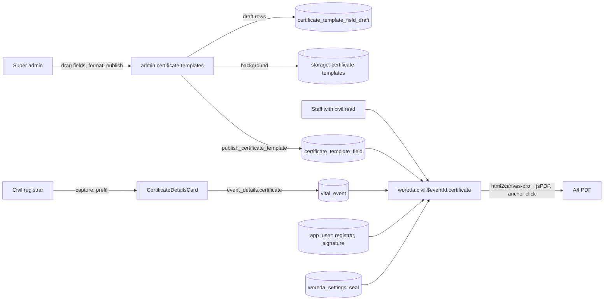
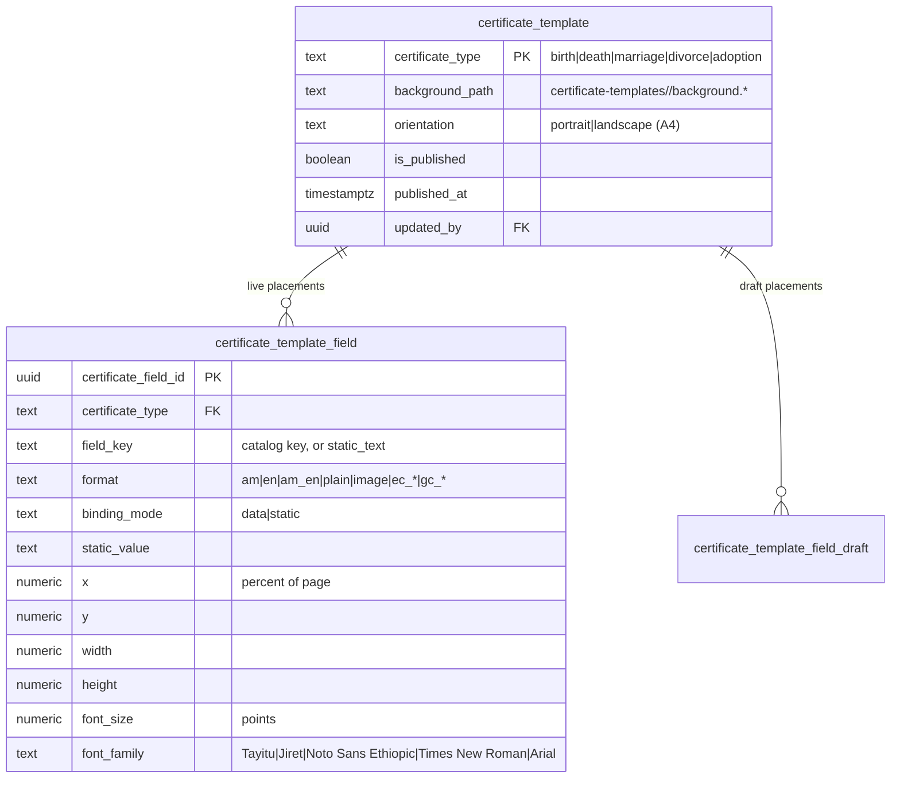

# Civil-registration certificates

Birth, death, marriage, divorce and adoption certificates: the field model,
the super-admin template builder, data capture, printing, and the security
controls. Introduced by migration `00000000000101_civil_certificate_templates.sql`.

## Actors

| Actor                                                                                         | Can                                                                                                                                 |
| --------------------------------------------------------------------------------------------- | ----------------------------------------------------------------------------------------------------------------------------------- |
| Super admin with `console.certificate_template.manage` (or unrestricted)                      | Upload a certificate background, drag data fields onto the page, choose language and date format, save the draft, publish, discard. |
| Woreda staff with `civil.register` / `civil.create_event` / `civil.verify` / `civil.resubmit` | Capture certificate details on a civil event until it is registered.                                                                |
| Woreda staff with `civil.read`                                                                | Print the certificate of a registered event, once its template is published.                                                        |
| Anyone else                                                                                   | Nothing. Drafts are readable only with the console permission; captured data follows the `vital_event` read policy (migration 99).  |

## Field model

`src/config/certificateFields.ts` is the single catalog. It defines every
field of the five certificates (from the specification supplied by the
system owner), its Amharic and English label, its palette group, its kind and
its source:

| Group            | Examples                                                                                                                                                                                             |
| ---------------- | ---------------------------------------------------------------------------------------------------------------------------------------------------------------------------------------------------- |
| Identifiers      | register form number, registration unique ID (`vital_event.event_number`), birth-registration IDs of the people involved                                                                             |
| Applicant        | child / deceased / wife / divorcee 1 / adoptee: name, father's name, grandfather's name (Ethiopian three-part name), sex, date of birth, place / region / zone / woreda of birth, nationality, title |
| Spouse / Parents | husband, divorcee 2, mother's and father's full name and nationality                                                                                                                                 |
| Event            | date and place of the event, registration date, certificate issue date, issuing woreda, marriage place breakdown (region, zone, city, sub-city, woreda, kebele)                                      |
| Registrar        | registrar's name / father's name / grandfather's name (split from the registrar's `app_user.full_name`), signature (`app_user.signature_path`), woreda seal (`woreda_settings.stamp_url`)            |

Kinds and the formats a placed field can choose:

| Kind      | Stored as                    | Formats                                                                                                                                |
| --------- | ---------------------------- | -------------------------------------------------------------------------------------------------------------------------------------- |
| bilingual | `<key>_am`, `<key>_en`       | Amharic, English, Amharic / English                                                                                                    |
| date      | ISO `yyyy-mm-dd` (Gregorian) | Ethiopian full / day / month / year; Gregorian full / day / month / year. Ethiopian dates use Arabic numerals and Amharic month names. |
| sex       | `male` / `female`            | ወንድ/Male, ሴት/Female, both                                                                                                              |
| text      | as typed                     | as entered                                                                                                                             |
| image     | storage path                 | image                                                                                                                                  |

Captured values live in `vital_event.event_details.certificate`. Dates the
event row already holds (event date, registration date) are used when the
captured value is empty.

## Data flow

## Entities

`vital_event.event_type` also accepts `adoption` (numbering code `AD`), and
`resolve_civil_fee()` maps divorce (previously unmapped) and adoption to
zero-fee `fee_schedule` rows that each woreda can price in Settings.

## Interfaces

| Interface                                            | Type                  | Classification          | Notes                                                                                                                             |
| ---------------------------------------------------- | --------------------- | ----------------------- | --------------------------------------------------------------------------------------------------------------------------------- |
| `certificate_template`, `certificate_template_field` | PostgREST SELECT      | Private (authenticated) | Read by every signed-in user so woredas can print.                                                                                |
| `certificate_template_field_draft`                   | PostgREST CRUD        | Private (console)       | RLS: `user_has_console_perm('console.certificate_template.manage')`.                                                              |
| `certificate_template` UPDATE                        | PostgREST             | Private (console)       | Background path, orientation.                                                                                                     |
| `publish_certificate_template(_type)`                | RPC, SECURITY DEFINER | Private (console)       | Checks the console permission as the caller, replaces the live placements with the draft in one transaction, writes an audit row. |
| `discard_certificate_template_draft(_type)`          | RPC, SECURITY DEFINER | Private (console)       | Restores the draft from live; audit row.                                                                                          |
| `vital_event.event_details.certificate`              | PostgREST UPDATE      | Private (tenant)        | Existing `vital_event_update` policy (civil keys, own woreda); frozen once registered.                                            |
| `storage: certificate-templates`                     | Storage               | Private                 | Read: authenticated. Write/delete: console permission. PNG/JPEG/WebP, 10 MB.                                                      |

## Security controls

- **Authorization** is enforced in the database, not only the UI: draft and
  template writes, the publish/discard RPCs and the bucket all check
  `console.certificate_template.manage` (P1-7 pattern). The live placement
  table has no client write policy at all; only the publish RPC writes it.
- **Integrity of issued certificates**: `trg_pin_vital_event_certificate`
  rejects any change to `event_details.certificate` from a user session once
  the event is registered or issued, so what prints is what was approved.
  The print route prints only registered or issued events, and only from the
  published template.
- **Input validation**: field keys match `^[a-z0-9_]{1,64}$`, formats,
  fonts, alignment, colour (`#rrggbb`), geometry (0–100 %) and font size are
  CHECK-constrained; static text is capped at 500 characters; captured
  values are trimmed and capped at 300 characters. Values render as React
  text nodes (no HTML), so a captured value cannot inject markup.
- **Audit**: field add/remove, draft save, background upload, orientation,
  publish, discard, certificate details saved, certificate printed.
- **Tenant isolation**: captured data inherits `vital_event` RLS (woreda +
  `civil.*` family, migration 99); registrar and seal are read from the
  caller's own woreda.
- **Print pipeline**: dedicated capture node at paper width, `html2canvas-pro`,
  images converted to data URLs first (no CORS dependency), PDF opened with an
  anchor click (pdf-print-pipeline skill).

## Open items

- Amharic labels were written for this feature and should get a
  native-speaker review before the first certificates are issued.
- Each woreda should set the divorce and adoption fees in Settings (seeded at
  0 ETB like the other civil registration fees).
- No certificate template is published yet: a platform administrator must
  upload each blank certificate and place the fields before printing works.
