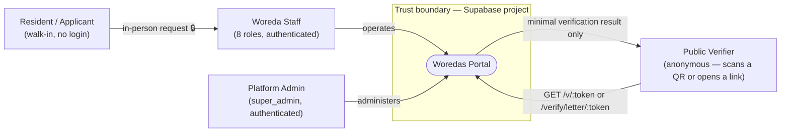
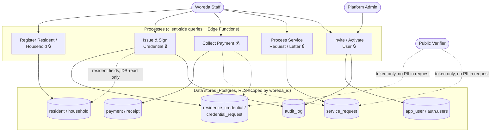

# Data Flow Diagram

INSA Enforcer Phase 1.1. Legend used throughout: 🔒 = flow carries PII,
💰 = flow carries financial data, dashed lines cross the Supabase trust
boundary.

## Level 0 — context

A resident never has an account or a session — every 🔒 flow from a resident
into the system passes through a staff member keying it in, not a
self-service form. The only anonymous entry points are the two public
verification routes, and both return the smallest possible result (validity

- a few display fields), never a full record.

## Level 1 — internal processes and data stores

## Four flows worth walking through

### 1. Resident / household registration 🔒

Staff enters a resident's name, sex, date of birth, phone, email, national ID
number and family relationships through a Zod-validated form
(`woreda.residents.new.tsx`); the row lands directly in `resident` via the
anon-key PostgREST client, RLS-scoped to the staff member's `woreda_id`.
`national_id_no`, `phone_number` and `email` are the fields flagged 🔒 in
[`docs/erd.md`](./erd.md#residents--households) — currently protected by RLS
tenant-scoping, not column-level encryption (see the Session & Cookie /
Encryption discussion in
[`docs/security-functionality.md`](./security-functionality.md)).

### 2. Credential issue → sign → verify 🔒

1. Staff submits a `credential_request`; an approval workflow (statuses,
   `credential_request_status_history`) moves it to `ready_to_print`.
2. The `sign-credential` Edge Function reads every field of the printed
   payload **from the database itself** — never from the request body — and
   signs a compact ES256 token stored in `residence_credential.qr_payload`.
3. A public verifier scans the printed QR, which encodes only the token.
   `src/routes/v.$token.tsx` checks the signature client-side, then calls the
   `verify_credential_token()` RPC for live revocation status. The verifier
   never sees the full resident record — only what the route explicitly
   renders (validity + a few display fields).

### 3. Payment → receipt 💰

Staff collects a fee (cash/bank/mobile) against a credential request, rental
request, or service request; the `payment` row records `amount` and
`channel`. A `receipt` is generated with its own sequence number and
verification token. No external payment gateway is involved anywhere in this
flow — see [`docs/tech-stack.md`](./tech-stack.md#third-party-integrations-none).

### 4. Invite → activate 🔒

An admin or tenant admin calls `invite-tenant-user`/`invite-platform-admin`,
which sends the invite through Supabase Auth's own mailer (GoTrue) to the
new user's email and inserts a `pending` `app_user` row. The invited user
sets a password at `/set-password`, which calls `activate-invited-user` —
resolving the caller from their own fresh JWT, never a request-body user ID —
to flip their own row to `active`. Both invite functions and the activation
function write to `audit_log`.

## Related documents

- [`docs/erd.md`](./erd.md) — the data stores referenced above, in full.
- [`docs/architecture.md`](./architecture.md) — the deployment topology these
  flows run over.
- [`docs/api-security.md`](./api-security.md) — every process above that's an
  Edge Function or RPC, categorized Public/Private/Internal.
