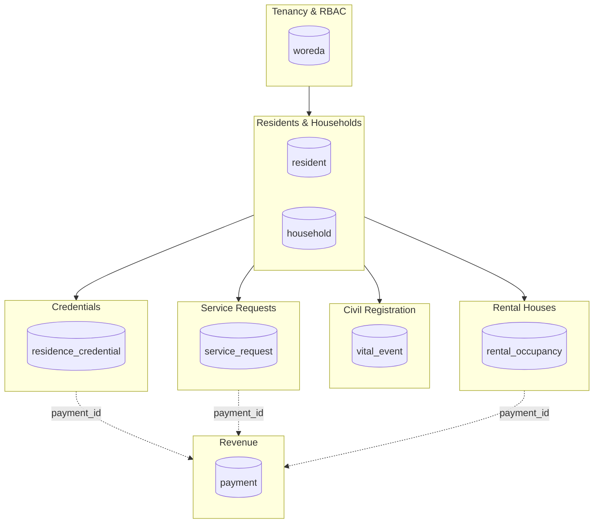
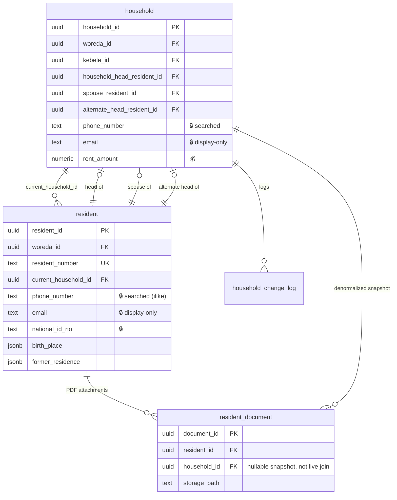
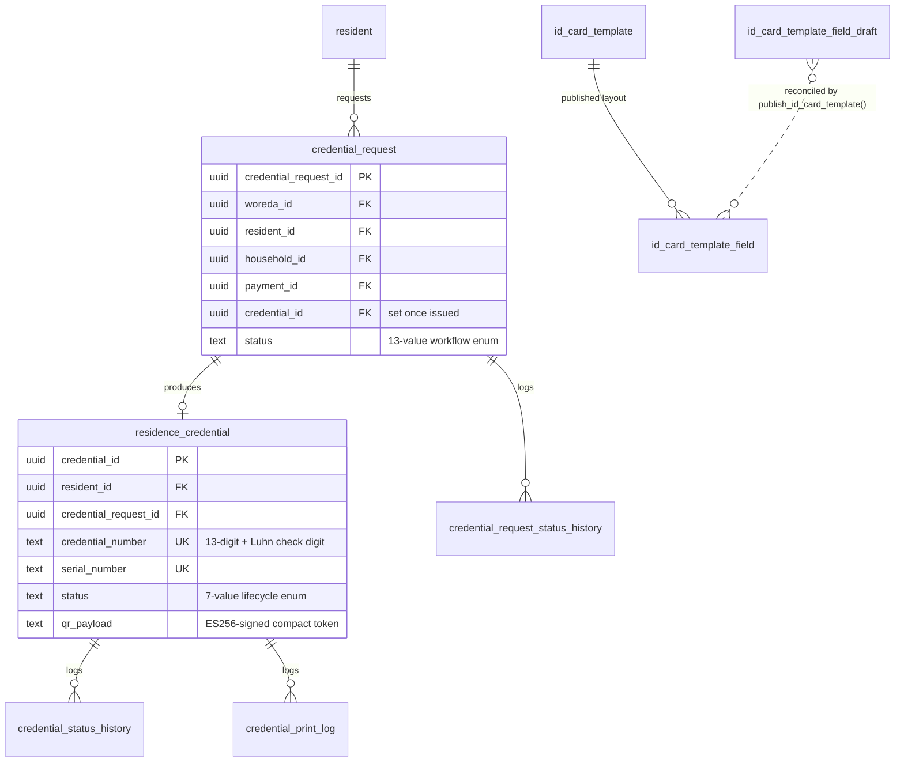
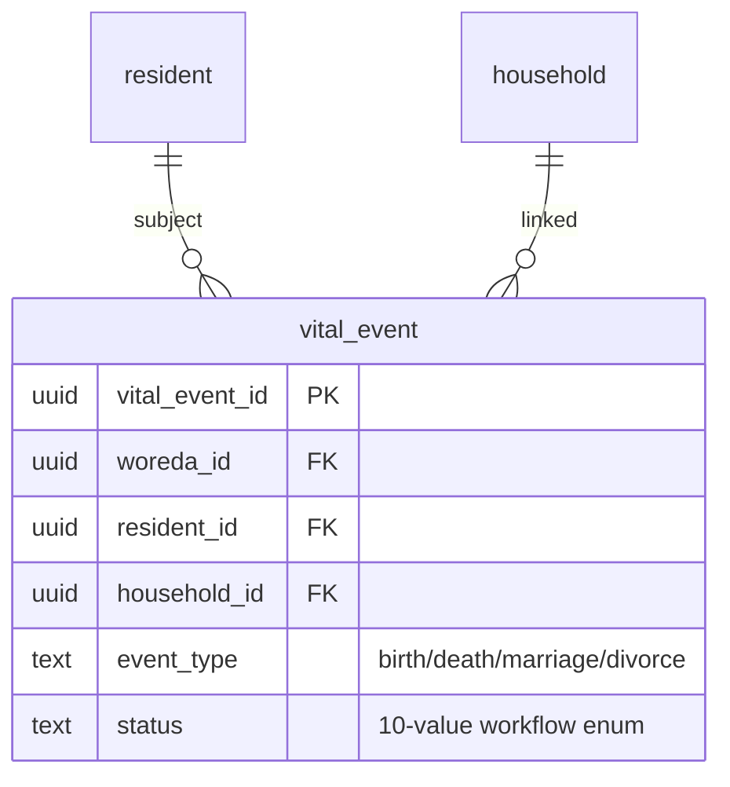
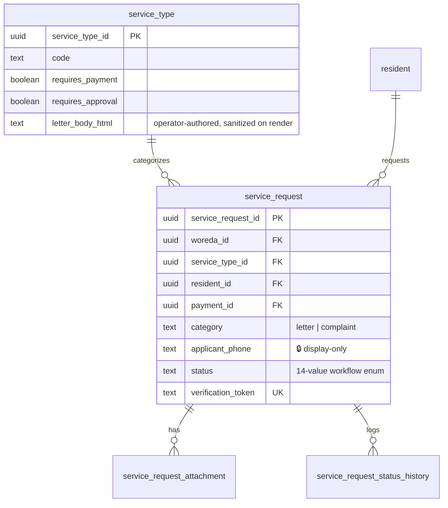
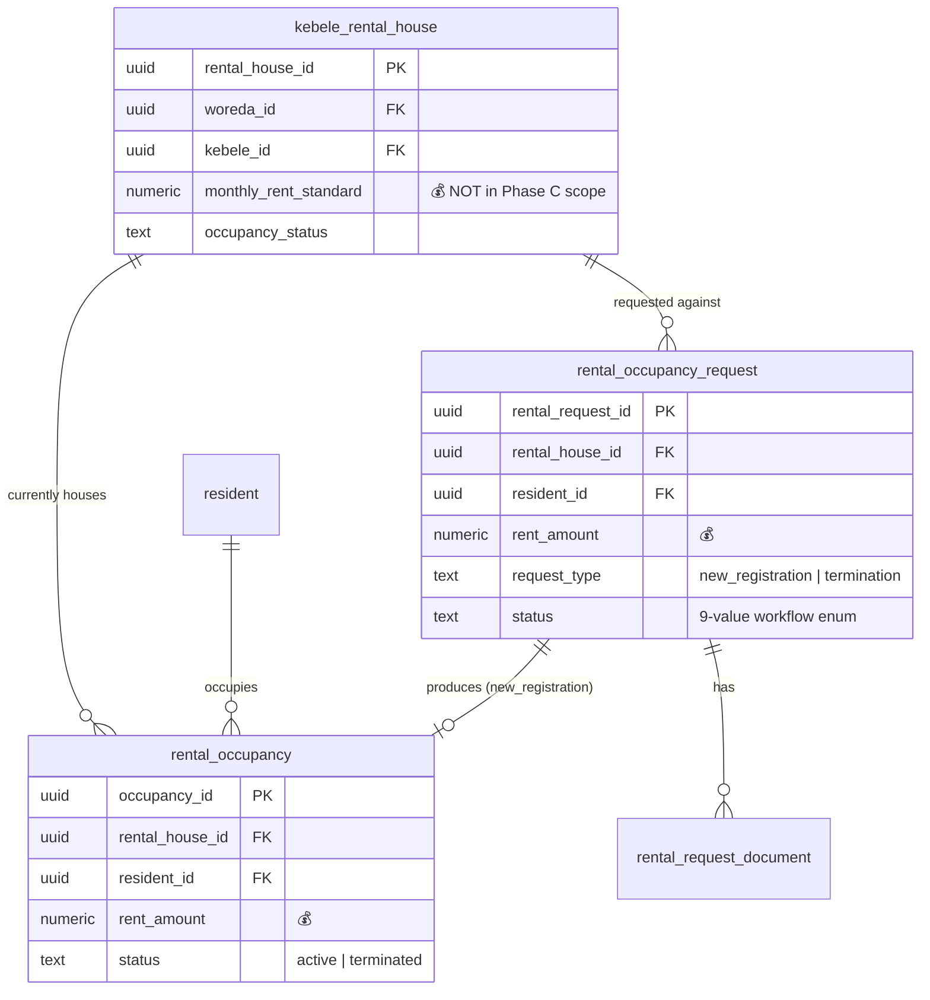
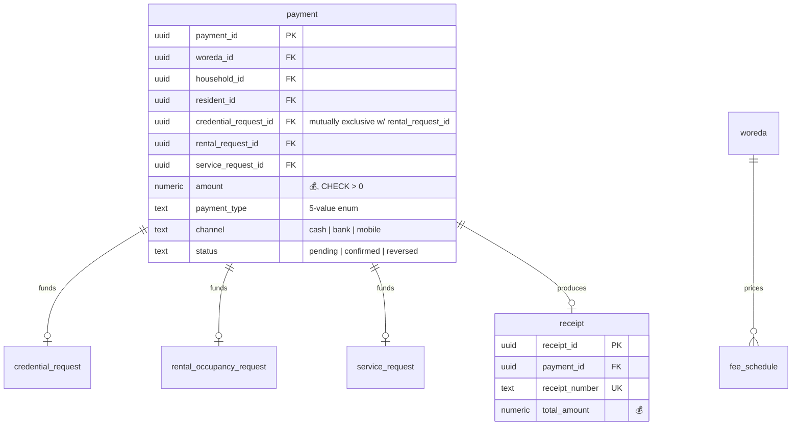

# Entity Relationship Diagram

INSA Enforcer Phase 1.3. Built directly from every migration under
`supabase/migrations/` (the baseline dump plus 22 incremental migrations) —
**42 tables**, not the 36 in the baseline alone: `console_role`,
`console_role_permission`, `user_permission_override`, `resident_document`,
`id_card_template_field_draft` and `rate_limit_bucket` were all added
afterward and are real, live tables the baseline-only count misses.
`rate_limit_bucket` is an infra-support table, not a domain one — see
"Sequence / counter tables" below for where it's documented.

**Freshness:** this is a snapshot as of migration `00000000000022`, hand-built
from the migrations, with no CI check behind it (unlike
[`docs/permissions-matrix.md`](./permissions-matrix.md), which regenerates
itself). Regenerate by re-reading `supabase/migrations/*.sql` after any schema
change that adds, drops, or re-keys a table — don't assume this page tracks
itself.

`woreda_id` is the tenant-partition key present on nearly every table below;
it is omitted from the compact diagrams to keep them legible and called out
once here instead. RLS scopes almost every policy to
`woreda_id = get_user_woreda_id()` (or `is_super_admin()`), per
[`docs/architecture.md`](./architecture.md).

## Domain map



Every domain hangs off `woreda` (the tenant root) and, within a tenant,
almost everything hangs off `resident`/`household`. Credentials, service
requests, and rental requests each optionally link to one `payment` row
(never more than one — see the constraint note at the bottom).

---

## Tenancy & RBAC

```mermaid
erDiagram
    woreda ||--o{ kebele : has
    woreda ||--o{ app_user : employs
    woreda ||--|| woreda_settings : configures
    woreda ||--o{ role_permission : "default matrix"
    woreda ||--o{ tenant_module_config : "module flags"
    app_user ||--o{ user_permission_override : "per-user grant/deny"
    app_user }o--o| console_role : "assigned (super_admin only)"
    console_role ||--o{ console_role_permission : grants

    woreda {
        uuid woreda_id PK
        text woreda_code UK
        smallint woreda_numeric_code UK
        text status
    }
    app_user {
        uuid user_id PK "= auth.users.id"
        uuid woreda_id FK
        text role
        text status
        uuid console_role_id FK "nullable, super_admin only"
    }
    console_role {
        uuid console_role_id PK
        text name UK
        boolean is_active
    }
    role_permission {
        uuid woreda_id PK_FK
        text role_name PK
        text permission_key PK
        boolean is_granted
    }
    user_permission_override {
        uuid user_id PK_FK
        text permission_key PK
        boolean is_granted
        uuid woreda_id FK "denormalized, trigger-derived"
    }
```

| Table                      | Purpose                                                                                                         | Key constraints                                                                                                                                                                                                                           |
| -------------------------- | --------------------------------------------------------------------------------------------------------------- | ----------------------------------------------------------------------------------------------------------------------------------------------------------------------------------------------------------------------------------------- |
| `woreda`                   | Tenant root                                                                                                     | `status` enum (`active`/`inactive`/`suspended`); `woreda_code` and `woreda_numeric_code` both unique                                                                                                                                      |
| `woreda_settings`          | Per-tenant config: fees, branding, `contact_phone`/`contact_email` 🔒, resident-number format string            | 1:1 with `woreda`                                                                                                                                                                                                                         |
| `kebele`                   | Sub-woreda geographic unit, reference data                                                                      | unique `(woreda_id, kebele_number)`                                                                                                                                                                                                       |
| `tenant_module_config`     | Per-tenant module on/off (`credentials`, `revenue`, `services`, …) — **absence of a row means enabled**         | PK `(woreda_id, module_key)`                                                                                                                                                                                                              |
| `app_user`                 | Staff account, 1:1 with `auth.users`                                                                            | `role` enum (8 values); `status` enum incl. `pending`; `console_role_id` nullable FK, `CHECK` restricts it to `role = 'super_admin'`                                                                                                      |
| `role_permission`          | Per-tenant override of the compiled default permission matrix                                                   | PK `(woreda_id, role_name, permission_key)`; `role_name` CHECK excludes `super_admin`/`tenant_admin`                                                                                                                                      |
| `console_role`             | Named, admin-defined roles scoping what an individual `super_admin` can do under `/admin` (2nd permission axis) | `console_role_id IS NULL` on `app_user` means **unrestricted** super admin — the load-bearing default                                                                                                                                     |
| `console_role_permission`  | Grants for a `console_role`, keyed against a fixed 5-value `CHECK`, not a lookup table                          | PK `(console_role_id, permission_key)`                                                                                                                                                                                                    |
| `user_permission_override` | Per-_user_ grant/deny, wins in both directions over `role_permission`                                           | `CHECK` locks 3 keys (`credential.approve`, `civil.approve`, `tenant.manage`) from ever being overridden; `woreda_id` is trigger-derived, never client-supplied                                                                           |
| `audit_log`                | Generic before/after audit trail, polymorphic `(entity_name, entity_id)`                                        | insert-only by convention (not DB-enforced); `source_ip` populated by 5 of 6 Edge Functions since INSA remediation Phase B (best-effort, request-header-derived — see `supabase/functions/_shared/clientIp.ts`, never a security control) |

🔒 = PII field. No 🔒 fields in this domain are encrypted at rest; RLS
tenant-scoping is the current control (see `docs/security-functionality.md`).

---

## Residents & Households



| Table                      | Purpose                                                                                                                 | Key constraints                                                                                                                                                                                                                                                |
| -------------------------- | ----------------------------------------------------------------------------------------------------------------------- | -------------------------------------------------------------------------------------------------------------------------------------------------------------------------------------------------------------------------------------------------------------- |
| `household`                | Dwelling unit. `household_head_resident_id`/`spouse_resident_id`/`alternate_head_resident_id` all FK back to `resident` | unique `(kebele_id, house_number)`; `house_type` enum                                                                                                                                                                                                          |
| `resident`                 | Person record — the hub of almost every other domain                                                                    | `sex`, `marital_status`, `residency_status` enums; `resident_email_format` regex `CHECK`; `resident_number` globally unique                                                                                                                                    |
| `household_change_log`     | Append-style history of household edits                                                                                 | —                                                                                                                                                                                                                                                              |
| `resident_number_sequence` | Per-woreda counter feeding `assign_resident_number()`                                                                   | PK `(woreda_id)`                                                                                                                                                                                                                                               |
| `resident_document`        | PDF-only attachments on a resident, `household_id` is a **snapshot at upload time**, not a live join                    | `content_type` CHECK pins `application/pdf`; dedicated private storage bucket (`resident-documents`) with server-side MIME + 10 MB size limits — the one bucket in this app that validates upload constraints at the bucket level rather than client-side only |

Both `phone_number` and `email` are duplicated on `resident` _and_
`household` — the two are independently editable, not a foreign key to one
canonical value.

---

## Credentials



| Table                                                        | Purpose                                                                                                                 | Key constraints                                                                                                                             |
| ------------------------------------------------------------ | ----------------------------------------------------------------------------------------------------------------------- | ------------------------------------------------------------------------------------------------------------------------------------------- |
| `credential_request`                                         | Issuance workflow (draft → … → active)                                                                                  | `request_type`/`status`/`credential_type` enums; unique `(woreda_id, request_number)`                                                       |
| `residence_credential`                                       | The issued card/certificate itself                                                                                      | `status` enum incl. `ready_to_print`/`printed`/`active`/`revoked`; unique `(woreda_id, credential_number)` and `(woreda_id, serial_number)` |
| `credential_request_status_history`                          | Append log of `credential_request.status` transitions                                                                   | —                                                                                                                                           |
| `credential_status_history`                                  | Append log of `residence_credential.status` transitions                                                                 | —                                                                                                                                           |
| `credential_print_log`                                       | Every print/reprint, with reprint authorization                                                                         | `print_type` enum                                                                                                                           |
| `credential_number_sequence` / `credential_request_sequence` | Per-woreda, per-year counters                                                                                           | composite PK `(woreda_id, seq_year)`                                                                                                        |
| `id_card_template` / `id_card_template_field`                | **Published/live** card layout — what `PrintableCard` actually renders                                                  | `id_card_template_field` positions fields as percentages of a canvas                                                                        |
| `id_card_template_field_draft`                               | Unpublished editor working copy, separate PK space from the live table, reconciled only by `publish_id_card_template()` | unique `(template_type, field_key)`                                                                                                         |

The signing pipeline (`sign-credential` Edge Function) reads every payload
field from the database itself, never the request — see
[`docs/api-security.md`](./api-security.md).

---

## Civil Registration



| Table                  | Purpose                                                         | Key constraints                                |
| ---------------------- | --------------------------------------------------------------- | ---------------------------------------------- |
| `vital_event`          | Birth/death/marriage/divorce registration and approval workflow | unique `(woreda_id, event_type, event_number)` |
| `vital_event_sequence` | Per-woreda, per-event-type, per-year counter                    | PK `(woreda_id, event_type, seq_year)`         |

A `death` event reaching `status = 'approved'` fires
`apply_death_on_approval()`, which flips the resident's
`residency_status` to `deceased` and **revokes** any active
`residence_credential` for them in the same transaction — a cross-domain
side effect worth knowing about before assuming civil registration and
credentials are independent.

---

## Service Requests



| Table                            | Purpose                                                             | Key constraints                                                                                            |
| -------------------------------- | ------------------------------------------------------------------- | ---------------------------------------------------------------------------------------------------------- |
| `service_type`                   | **Configurable data, not hardcoded** — the letter/complaint catalog | unique `(woreda_id, code)`                                                                                 |
| `service_request`                | A letter or complaint, `category` distinguishes the two             | `category`, `priority`, `status` enums; `verification_token` globally unique (public verification surface) |
| `service_request_attachment`     | Uploaded supporting documents                                       | —                                                                                                          |
| `service_request_status_history` | Append log of status transitions                                    | —                                                                                                          |
| `service_request_sequence`       | Per-woreda, per-year counter                                        | composite PK                                                                                               |

`service_request.applicant_phone` 🔒 is inserted and displayed but never
used in a search/filter query — the request list's search only covers
`request_number`/`applicant_name`/`subject`.

---

## Rental Houses



| Table                      | Purpose                                  | Key constraints                                                                           |
| -------------------------- | ---------------------------------------- | ----------------------------------------------------------------------------------------- |
| `kebele_rental_house`      | Government-owned rental unit inventory   | unique `(woreda_id, kebele_id, house_number)`                                             |
| `rental_occupancy`         | Active/terminated tenancy record         | `rent_amount > 0` CHECK; **only one `active` occupancy per house** (partial unique index) |
| `rental_occupancy_request` | New-registration or termination workflow | unique `(woreda_id, request_number)`                                                      |
| `rental_request_document`  | Uploaded contract/clearance/ID documents | —                                                                                         |
| `rental_request_sequence`  | Per-woreda, per-year counter             | composite PK                                                                              |

`apply_rental_occupancy_on_approval()` is the trigger that turns an
`approved` `rental_occupancy_request` into (or out of) a live
`rental_occupancy` row and flips `kebele_rental_house.occupancy_status` —
another cross-table side effect encoded as a trigger, not application code.

---

## Revenue



| Table              | Purpose                                                                                               | Key constraints                                                                                        |
| ------------------ | ----------------------------------------------------------------------------------------------------- | ------------------------------------------------------------------------------------------------------ |
| `payment`          | The revenue ledger. One row can fund a credential request, a rental request, **or** a service request | `payment_amount_check (amount > 0)`; `payment_source_exclusive_check` — see note below                 |
| `receipt`          | Printed receipt for a confirmed payment                                                               | unique `(woreda_id, receipt_number)`; carries its own `verification_token` (added in `00000000000013`) |
| `receipt_sequence` | Per-woreda, per-year counter                                                                          | composite PK                                                                                           |
| `fee_schedule`     | Per-woreda, per-service-type standard fee + penalty rate                                              | unique `(woreda_id, service_type)`                                                                     |

**Document as it actually is, not as it should be:** `payment_source_exclusive_check`
reads `CHECK (NOT (credential_request_id IS NOT NULL AND rental_request_id IS NOT NULL))`
— it only excludes those _two_ columns being set together. `service_request_id`
is not part of that check, so a `payment` row can technically reference both
a `service_request_id` and one of the other two simultaneously. No known
call site does this, but the constraint does not prevent it.

---

## Cross-domain views

| View                      | Purpose                                                                                                                                                                 | Notable history                                                                                                                                                                                                                                                                              |
| ------------------------- | ----------------------------------------------------------------------------------------------------------------------------------------------------------------------- | -------------------------------------------------------------------------------------------------------------------------------------------------------------------------------------------------------------------------------------------------------------------------------------------- |
| `approval_queue_v`        | Unions `service_request` + `credential_request` + `vital_event` + `rental_occupancy_request` into one inbox, filtered to in-flight statuses — backs `/woreda/approvals` | Originally created **without** `security_invoker`, which (owned by `postgres`, `rolbypassrls`) let RLS on all four underlying tables be silently bypassed for anyone selecting through it. Fixed in `00000000000006_view_security_invoker.sql`.                                              |
| `household_member_roster` | Flattened resident roster with computed `age`, filtered to `current_household_id IS NOT NULL AND active_flag = true`                                                    | Same defect, and the **actually-exploited** one: it was `GRANT`ed to `anon` in the baseline, so the exposure was live — verified against the deployed project (`anon` role: 0 rows from `resident` directly, but the un-fixed view still returned rows) before the same migration closed it. |

**This is the precedent any future decrypting view (Phase C of the
remediation plan) must follow from the start** — `security_invoker = on` is
not optional for a view meant to sit behind RLS.

---

## Sequence / counter tables (not diagrammed individually)

`credential_number_sequence`, `credential_request_sequence`,
`receipt_sequence`, `rental_request_sequence`, `resident_number_sequence`,
`service_request_sequence`, `vital_event_sequence` — all the same shape,
`(woreda_id [, event_type], seq_year) -> last_value`, incremented via
`INSERT ... ON CONFLICT DO UPDATE ... RETURNING` inside each domain's
`assign_*_number()` trigger. Listed once here rather than repeated in every
domain table above.

`rate_limit_bucket` (`00000000000022_rate_limit.sql`, INSA remediation
Phase B) is the same fixed-window-counter shape —
`(bucket_key, window_start) -> request_count`, incremented the same
`INSERT ... ON CONFLICT DO UPDATE ... RETURNING` way inside
`rate_limit_hit()` — but is platform infrastructure, not tenant data: no
`woreda_id`, deny-all RLS, `EXECUTE` on its one function granted only to
`service_role`. Not part of any domain group above.

---

## Superseded

`README.md`'s "SUPABASE DATABASE SCHEMA" section (the Phase 1 scaffold spec,
9 tables) is stale — compare its `payment` table (no `service_request_id`
FK, no `payment_source_exclusive_check`) against the `payment` table
documented above. Treat it as historical intent; this document is current.
