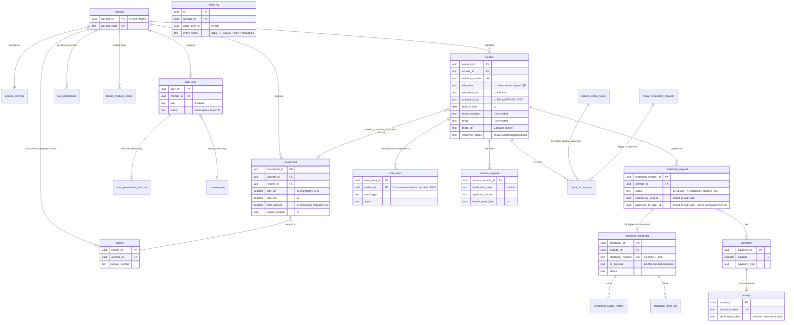

# Woreda Administration ERP — Independent Technical, Architectural & Compliance Review

**Review date:** 2026-09-07
**Commit reviewed:** `679b4f2` (`main`)
**Scope:** 42 tables, 156 RLS policies, 66 routes, 6 Edge Functions, 25 migrations
**Method:** Static review of the repository at the stated commit, plus executed checks
(`bun run test`, `bun run check:role-perms-drift`, `bun run build`, and a purpose-written
Ethiopian-calendar conversion harness, since removed).
**Posture:** Read-only. No code, schema, data, or configuration was modified.

### Evidence labelling used throughout

| Label                              | Meaning                                                                           |
| ---------------------------------- | --------------------------------------------------------------------------------- |
| **[VF]** Verified fact             | Directly observed in a named file, migration, policy, or executed command output. |
| **[IA]** Implementation assumption | Inferred from code structure; not executed against the live project.              |
| **[DR]** Design recommendation     | The reviewer's proposal, not an observation.                                      |

> **Live-project limitation.** Postgres ports are blocked from this environment and no
> `SUPABASE_ACCESS_TOKEN` was in scope, so **no check was run against the live database**.
> Every schema, RLS, and trigger statement below is verified against the migration files
> in the repository. Where the live project could differ from the repo, the check is
> marked **UNVERIFIED**, not PASS — per the rules of engagement.

---

## 0. Correction to the stated ground truth

Six "authoritative facts" in the review brief do not match the as-built system. In each
case the implementation is **deliberate and documented in-repo**; the brief is stale. These
are recorded as documentation drift (F-14), not as defects, but they must be corrected
before the brief is reused for accreditation.

| #   | Brief asserts                                                           | As-built **[VF]**                                                                     | Evidence                                                                                                                                              |
| --- | ----------------------------------------------------------------------- | ------------------------------------------------------------------------------------- | ----------------------------------------------------------------------------------------------------------------------------------------------------- |
| 1   | QR signed with **RS256**                                                | **ES256** (ECDSA P-256)                                                               | `src/config/credentialCryptoConfig.ts:1-30` — 64-byte vs 256-byte signature is a QR module-density constraint                                         |
| 2   | Credential number `WW-KK-YY-NNNNNN-C`, **mod-11**                       | **13 digits, Luhn (mod-10)**                                                          | `supabase/migrations/00000000000002_credential.sql:5-6,22,116` — explicitly replaced the bespoke mod-11 scheme                                        |
| 3   | `safeBase64Encode/Decode` **mandatory**                                 | **Do not exist**; byte-level `atob`/`btoa` + `TextEncoder`/`TextDecoder` used instead | `src/utils/harariCredentialCrypto.ts:99-110`; `supabase/functions/sign-credential/index.ts:34-52`. The Unicode hazard is genuinely absent — see KD-2. |
| 4   | Revenue, Reporting, Audit UI, ID-card template editor **not yet built** | **All built and routed**                                                              | `woreda.revenue.*`, `woreda.reports.*`, `woreda.audit.tsx`, `admin.credential-template.tsx`                                                           |
| 5   | DFD / Security Functionality Document **missing**                       | **Present**                                                                           | `docs/dfd.md`, `docs/security-functionality.md`, `docs/erd.md`, `docs/openapi.yaml`                                                                   |
| 6   | QR payload budget **~1.8 KB**                                           | Design budget is **~500 characters**                                                  | `supabase/functions/sign-credential/index.ts:7-13` — a far tighter, printer-driven constraint                                                         |

---

## 1. Executive Summary

The system is **architecturally sound and unusually well documented**. Tenant isolation,
the permission model, storage partitioning, and the Ethiopian calendar are implemented to a
standard well above typical for this class of system, and are backed by CI, a drift check,
and 76 passing unit tests.

It has **one critical, systemic defect**: the database enforces _who_ may touch a workflow
row, but never _what state change is legal_. Every maker-checker guarantee in the system is
therefore a client-side convention that a single authenticated HTTP request bypasses.

### Health rating by dimension

| Dim | Area                              | Rating     | One-line basis                                                                                                                |
| --- | --------------------------------- | ---------- | ----------------------------------------------------------------------------------------------------------------------------- |
| A   | Multi-tenant isolation & RLS      | 🟡 Amber   | 42/42 tables RLS-enabled, 156 policies, all tenant-scoped — but two `SECURITY DEFINER` triggers can write cross-tenant (F-03) |
| B   | RBAC & authorization              | 🟡 Amber   | Twice-enforced model is real and correct; seed drift on `credential.verify` uncovered by any check (F-05)                     |
| C   | **Workflow integrity**            | 🔴 **Red** | **No status-transition enforcement anywhere in the schema (F-01)**                                                            |
| D   | Data model & constraints          | 🟢 Green   | FKs complete, Luhn correct, one-active-household structurally guaranteed                                                      |
| E   | Security & INSA compliance        | 🟡 Amber   | Strong headers/CORS/sanitisation; credential-verify enumeration (F-02) and plaintext FAN ID (F-07)                            |
| F   | Localization & Ethiopian calendar | 🟢 Green   | Conversion verified correct across 2,192 days incl. Pagumē/leap/Enkutatash                                                    |
| G   | Credential & QR system            | 🟢 Green   | English-only signed payload confirmed; ES256 server-side only; no key material in bundle                                      |
| H   | Frontend & routing quality        | 🟢 Green   | KD-1 clean (11/11), `ssr:false` 66/66, cache keys tenant-scoped                                                               |
| I   | Audit & traceability              | 🟡 Amber   | 75 audit sites, `audit_log` immutable — but resident creation unaudited (F-06)                                                |
| J   | Performance & resilience          | 🟡 Amber   | 215-chunk code splitting works; wizard has no draft persistence (F-12)                                                        |
| K   | Schema drift & migrations         | 🟢 Green   | Repo is the single source; all 42 tables in migrations and documented                                                         |
| L   | Documentation & operability       | 🟢 Green   | ERD, DFD, OpenAPI, security docs, deploy runbook all present                                                                  |

### Top 5 risks

1. **F-01 (Critical)** — Maker-checker is not enforced server-side. A `registry_clerk`
   holding only `credential.issue` can drive a credential request from `submitted` straight
   to `paid` in one `PATCH`, minting a printable government ID with no verification, no
   approval, and no payment record. **Fraud-enabling; blocks go-live.**
2. **F-02 (High)** — The public credential-verification RPC is keyed on a _sequential_
   credential number, is granted to `anon`, and is deliberately un-rate-limited. Resident
   name, woreda, kebele, and credential status are enumerable at scale.
3. **F-03 (High)** — `vital_event.resident_id` has no same-woreda constraint, and
   `apply_death_on_approval()` (SECURITY DEFINER) filters only on `resident_id`. A crafted
   death registration can mark another tenant's resident deceased and revoke their cards.
4. **F-04 (High)** — The birth-approval trigger has no idempotency guard on
   `resident_id`; an `approved → returned → approved` cycle creates a duplicate resident.
5. **F-07 (Medium-High)** — `resident.national_id_no` (the 16-digit FAN ID) is stored in
   plaintext while the _phone number on the same row_ is encrypted — an inversion the
   encryption migration itself flags as unprincipled.

### Top 5 strengths

1. **Tenant isolation is genuinely twice-enforced.** All 42 tables carry RLS; all 156
   policies resolve tenancy from `get_user_woreda_id()` (session-derived), never from client
   input. Zero policies rely on client-supplied `woreda_id`.
2. **`force_actor_columns()`** — a trigger on 12 tables that overwrites every actor column
   with `auth.uid()`. Actor attribution in the audit trail **cannot be forged**, even by a
   caller crafting raw HTTP. This is a stronger control than most systems of this class have.
3. **The Ethiopian calendar is correct.** A purpose-written harness round-tripped every day
   from 2020-01-01 to 2026-01-01 (2,192 days) plus Pagumē 5/6, leap years, and Enkutatash
   boundaries — 13/13 passed. KD-3 is genuinely closed.
4. **Storage tenancy is structural.** 9 of 10 upload sites write `${woredaId}/…`; the tenth
   (`admin.credential-template.tsx`) is the documented platform-level exception. Isolation
   derives from the path prefix via `storage_path_woreda_id()` across 35 policy references.
5. **Documentation and tooling exceed the brief's assumptions** — ERD, DFD, OpenAPI,
   INSA write-ups, a permission-matrix generator, a CI drift check, 76 unit tests, and four
   codified review subagents.

---

## 2. Invariant Verification Table

| ID         | Invariant                                                                 | Result                  | Evidence                                                                                                                                                                                                                                                                                                                                                                                                                                                                 |
| ---------- | ------------------------------------------------------------------------- | ----------------------- | ------------------------------------------------------------------------------------------------------------------------------------------------------------------------------------------------------------------------------------------------------------------------------------------------------------------------------------------------------------------------------------------------------------------------------------------------------------------------ |
| **INV-01** | Every tenant-scoped table has `woreda_id` + enforcing RLS                 | ✅ **PASS** **[VF]**    | 42/42 tables `ENABLE ROW LEVEL SECURITY`; 156 policies. The 6 tables without `woreda_id` are platform-level by design (`console_role`, `console_role_permission`, `id_card_template{,_field,_field_draft}`, `rate_limit_bucket`) and gated by `is_super_admin()` / deny-all. `rate_limit_bucket` correctly has RLS on + **zero** policies + `REVOKE ALL` (`00000000000022:35-40`) — reachable only via `SECURITY DEFINER` RPC.                                           |
| **INV-02** | No cross-tenant data via any surface                                      | ⚠️ **PARTIAL** **[VF]** | Query/API/storage/export paths: PASS — every policy resolves tenancy server-side. **FAIL on two `SECURITY DEFINER` triggers**: `apply_death_on_approval()` and `apply_rental_occupancy_on_approval()` filter only on `resident_id` / `rental_house_id` with no `woreda_id` predicate, and `vital_event.resident_id` has no same-woreda FK constraint (`baseline.sql:703` region). See F-03.                                                                              |
| **INV-03** | No kebele-level workflow actor                                            | ✅ **PASS** **[VF]**    | Zero matches for `kebele_(admin\|clerk\|officer\|manager\|user\|role)` across `src/` and all migrations. `kebele` appears only as a geographic FK and display label. 19 kebeles across 6 woredas in `seed.sql` — matches spec exactly.                                                                                                                                                                                                                                   |
| **INV-04** | Portal separation at nav _and_ route level                                | ✅ **PASS** **[VF]**    | `admin.tsx:23` redirects non-`super_admin` → `/woreda/dashboard`; `woreda.tsx:22` redirects `super_admin` → `/admin/dashboard`. Both also gate on `status !== 'active'` (`admin.tsx:31`). Nav filtered by `NAV_PERMISSION_MAP` (`WoredaShell.tsx:76`) and `<ConsolePermissionGate>`.                                                                                                                                                                                     |
| **INV-05** | Maker ≠ checker, enforced beyond UI                                       | ❌ **FAIL** **[VF]**    | **No self-approval check exists anywhere.** Zero matches for a maker/checker constraint in any migration; the only occurrence of the phrase is a UI caption (`woreda.rental-houses.requests.$requestId.index.tsx:579`). `credential_request` records `verified_by_user_id` and `approved_by_user_id` (`woreda.credentials.$requestId.index.tsx:337,488`) but nothing compares them. See F-01.                                                                            |
| **INV-06** | Payment cannot precede approval; credential only via trigger              | ❌ **FAIL** **[VF]**    | `generate_residence_credential_on_payment()` fires on `NEW.status = 'paid' AND OLD.status IS DISTINCT FROM 'paid'` — it **never checks `OLD.status = 'awaiting_payment'`**. Any prior status transitions straight to `paid` and mints a `ready_to_print` credential. No `payment` row is required. See F-01.                                                                                                                                                             |
| **INV-07** | `permissions.ts` ↔ `role_permission` consistent; `tenant_admin` protected | ⚠️ **PARTIAL** **[VF]** | `bun run check:role-perms-drift` → _"OK: permissions.ts and default_role_perms() agree for every role."_ **But** the seeded `role_permission` denies `credential.verify` to `auditor`, `finance_clerk`, `viewer` across all 6 woredas while `ROLE_PERMISSIONS` grants it (F-05). Self-modification **is** blocked: `app_user_tenant_admin_write` carries `role <> 'tenant_admin'`, and `role_permission_role_name_check` excludes `super_admin`/`tenant_admin` entirely. |
| **INV-08** | Tenant IDs immutable; module toggles at nav + route                       | ✅ **PASS** **[VF]**    | Immutability holds via RLS symmetry: every tenant-scoped `UPDATE` policy carries `woreda_id = get_user_woreda_id()` in **both** `USING` and `WITH CHECK`, so a row can be moved neither out of nor into another tenant. `user_permission_override` adds an explicit re-derivation trigger (`00000000000019:126`). `<ModuleGate>` on 8 route files + `NAV_PERMISSION_MAP`. **[IA]** Module toggles were not exercised at runtime.                                         |
| **INV-09** | ≤1 active household membership per resident                               | ✅ **PASS** **[VF]**    | Structurally guaranteed, not merely constrained: membership is the scalar column `resident.current_household_id` (`baseline.sql:703`), not a join table — a scalar FK cannot hold two values. Compare `rental_occupancy_one_active_per_house` (`baseline.sql:743`), a partial unique index used where the model _does_ allow many rows.                                                                                                                                  |
| **INV-10** | Every critical write produces an audit record                             | ⚠️ **PARTIAL** **[VF]** | 75 `audit_log` insert sites across 34 files + 5 of 6 Edge Functions. `audit_log` is **immutable**: SELECT + INSERT policies only, no UPDATE/DELETE policy for any role, and `trg_force_actor` pins `actor_user_id`. **Gap:** `woreda.residents.new.tsx:91` inserts a resident with no audit row — the only mutating route lacking one (F-06).                                                                                                                            |

---

## 3. Findings Register

Severity: **Critical** = exploitable now, blocks go-live · **High** = exploitable with
preconditions, or systemic · **Medium** = control gap with compensating factors ·
**Low** = hygiene / documentation.

| ID       | Sev             | Dim  | Module                               | Title                                                                                                | Evidence                                                                                                                                                                                                                                                                                                                                                                                | Impact                                                                                                                                                                                                                                                                                                                                                                                                                                         | Recommended fix                                                                                                                                                                                                                                                                                                                                                   | Fix type                    |
| -------- | --------------- | ---- | ------------------------------------ | ---------------------------------------------------------------------------------------------------- | --------------------------------------------------------------------------------------------------------------------------------------------------------------------------------------------------------------------------------------------------------------------------------------------------------------------------------------------------------------------------------------- | ---------------------------------------------------------------------------------------------------------------------------------------------------------------------------------------------------------------------------------------------------------------------------------------------------------------------------------------------------------------------------------------------------------------------------------------------- | ----------------------------------------------------------------------------------------------------------------------------------------------------------------------------------------------------------------------------------------------------------------------------------------------------------------------------------------------------------------- | --------------------------- |
| **F-01** | 🔴 **Critical** | C    | Credentials, Civil, Rental, Services | **No status-transition enforcement; maker-checker bypassable via direct API**                        | `credential_request_update` policy (`baseline.sql:1569`) admits **any** holder of `credential.issue \| credential.approve \| credential.verify \| payment.collect \| revenue.collect`; no column-level `GRANT`; zero matches for any transition-validation function across all 25 migrations; `generate_residence_credential_on_payment()` guards only `NEW.status='paid'`              | A `registry_clerk` (holds `credential.issue`, lacks `credential.approve`) can `PATCH /credential_request?id=eq.X {"status":"paid"}` and mint a `ready_to_print` government ID with **no verification, no approval, and no payment row**. Same shape applies to `vital_event`, `rental_occupancy_request`, `service_request`. Terminal `rejected` is also resurrectable.                                                                        | Add a `BEFORE UPDATE` trigger per workflow table validating `(OLD.status → NEW.status)` against an allowed-transition table, asserting the actor holds the permission _for that specific transition_, and rejecting `approved_by_user_id = verified_by_user_id`. Tighten `generate_residence_credential_on_payment()` to require `OLD.status='awaiting_payment'`. | SQL migration (additive)    |
| **F-02** | 🟠 High         | E, G | Credentials                          | **Public verification RPC enables resident enumeration**                                             | `GRANT EXECUTE ON FUNCTION public.verify_credential_token(TEXT) TO anon` (`00000000000002:197`); body matches `WHERE replace(credential_number,'-','') = _credential_digits`; per-tenant sequential serial + Luhn ⇒ 1-in-10 guesses valid; CLAUDE.md records these RPCs as deliberately un-rate-limited                                                                                 | Unauthenticated bulk harvest of resident **full name (Amharic)**, woreda, kebele, issue/expiry date, and credential status. `photo_url` and `date_of_birth` are correctly gated behind `is_active_app_user()` — that gate shows the risk was considered, but the remaining fields are still PII.                                                                                                                                               | Key public verification on the **signed token / a random high-entropy token**, as `verify_service_letter` and `verify_receipt` already do (12 chars × 32-symbol alphabet ≈ 2⁶⁰). Retain the credential-number lookup for authenticated staff only. Add `rate_limit_hit()` to the anon path.                                                                       | SQL migration + code change |
| **F-03** | 🟠 High         | A    | Civil Registration, Rental           | **`SECURITY DEFINER` triggers can write across tenants**                                             | `apply_death_on_approval()`: `UPDATE public.resident … WHERE resident_id = NEW.resident_id` and `UPDATE public.residence_credential … WHERE resident_id = NEW.resident_id AND status='active'` — no `woreda_id` predicate; `vital_event_resident_id_fkey` references `resident(resident_id)` with **no same-woreda constraint**; same pattern in `apply_rental_occupancy_on_approval()` | A `civil_registrar` in Woreda A can register a death against Woreda B's resident; on approval the trigger (running as definer, RLS bypassed) marks B's resident deceased and revokes all their active credentials. **Mitigating [VF]:** `resident_id` is a UUIDv4 and RLS blocks reading other tenants' residents, so the attacker must already know the UUID — this is a defence-in-depth failure, not a trivially exploitable one.           | Add `AND woreda_id = NEW.woreda_id` to every `UPDATE`/`INSERT` inside these definer triggers, and a `BEFORE INSERT/UPDATE` check that `resident_id`/`household_id`/`rental_house_id` resolve to the same `woreda_id` as the parent row.                                                                                                                           | SQL migration (additive)    |
| **F-04** | 🟠 High         | C, D | Civil Registration                   | **Birth-approval trigger can duplicate residents**                                                   | `generate_resident_on_birth_approval()` guards only `NEW.status='approved' AND OLD.status IS DISTINCT FROM 'approved'`; it sets `NEW.resident_id` but never tests `NEW.resident_id IS NULL` before inserting                                                                                                                                                                            | `approved → returned → approved` (reachable through the UI's own return path, and trivially via F-01) inserts a **second resident record** for the same child, consuming a resident number and creating a duplicate civil identity.                                                                                                                                                                                                            | Add `AND NEW.resident_id IS NULL` to the trigger's guard so the insert is idempotent regardless of how often the row re-enters `approved`.                                                                                                                                                                                                                        | SQL migration (additive)    |
| **F-05** | 🟡 Medium       | B    | Settings / RBAC                      | **Seeded `role_permission` contradicts `ROLE_PERMISSIONS` for `credential.verify`** (KD-5 confirmed) | `seed.sql`: `'auditor'\|'finance_clerk'\|'viewer', 'credential.verify', 'false'` × 6 woredas each, verbatim; `permissions.ts` grants `CREDENTIAL_VERIFY` to all three. `user_has_perm()` COALESCEs override → `role_permission` → `default_role_perms()`, so the seeded `false` **wins**.                                                                                               | Three roles silently cannot verify credentials despite the compiled matrix saying they can. `check:role-perms-drift` does **not** cover this axis (it compares `permissions.ts` ↔ `default_role_perms()` only), so the divergence is invisible to CI.                                                                                                                                                                                          | Decide which is authoritative, correct the other, then extend the drift check to compare `seed.sql`'s `role_permission` against `ROLE_PERMISSIONS` — flagging deliberate overrides via an explicit allow-list rather than silence.                                                                                                                                | Code change + SQL migration |
| **F-06** | 🟡 Medium       | I    | Residents                            | **Resident creation writes no audit record**                                                         | `woreda.residents.new.tsx:91` — `supabase.from("resident").insert({…})` with no `audit_log` insert; it is the **only** mutating route file in `src/routes/` lacking one (verified by sweep across all routes)                                                                                                                                                                           | INV-10 requires an audit record for every critical create. Registration of a new resident — the system's foundational identity event — leaves no actor/timestamp trail.                                                                                                                                                                                                                                                                        | Add the same `audit_log` insert used by `woreda.residents.$residentId.edit.tsx`, with `entity_name='resident'`, `action_type='RESIDENT_CREATED'`. Chain `.select().maybeSingle()` per the repo's verify-the-mutation house rule.                                                                                                                                  | Code change                 |
| **F-07** | 🟡 Medium       | E    | Cross-cutting                        | **Highest-sensitivity PII left in plaintext while lower-sensitivity fields are encrypted**           | `00000000000023_pii_encryption.sql:24-36`, self-documented: encrypted = phone/email/amounts; **still plaintext = `resident.national_id_no` (16-digit FAN ID), `full_name`, `full_name_am`, `date_of_birth`, `father_name`, `mother_full_name`, `household.gps_lat/gps_lng`, and `household.rent_amount`** — the migration explicitly calls the last "an oversight"                      | A stolen dump or backup yields national identity numbers, full names, dates of birth, and household GPS coordinates in the clear. The FAN ID is a stronger identifier than the phone number that _is_ encrypted. INSA 1.3 / 3.9 not met for these columns.                                                                                                                                                                                     | Extend the existing Vault-backed pattern (already inert and additive) to `national_id_no` and `household.rent_amount` as Stage 2; treat names/DOB/GPS as a scoped Stage 3 decision with explicit sign-off on the search/index trade-off.                                                                                                                          | SQL migration (additive)    |
| **F-08** | 🟡 Medium       | H    | Cross-cutting                        | **TanStack Query cache not cleared on sign-out**                                                     | `WoredaShell.tsx:85` and `AdminShell.tsx:46` call `supabase.auth.signOut()` then navigate; no `queryClient.clear()` anywhere in `src/`                                                                                                                                                                                                                                                  | On a shared workstation, signing out and signing in as a _different tenant's_ user leaves the previous session's cached rows resident in memory. **Mitigating [VF]:** all 218 fetching `queryKey`s include `woredaId` (bare keys such as `["residents"]` are `invalidateQueries` prefixes only, confirmed at every call site), so a different tenant produces a cache **miss**, not a stale hit. Residual risk is same-tenant, different-user. | Call `queryClient.clear()` in both shells' sign-out handlers before navigating.                                                                                                                                                                                                                                                                                   | Code change                 |
| **F-09** | 🟡 Medium       | E    | Services                             | **Operator-authored letter HTML rendered via `dangerouslySetInnerHTML`**                             | `woreda.services.$requestId.print.tsx:174` and `LetterTemplatesTab.tsx:241`                                                                                                                                                                                                                                                                                                             | Stored-XSS surface if the sanitiser is bypassed. **Mitigating [VF]:** the print route sanitises at `:81` — `renderLetterTemplate(sanitizeLetterHtml(templateHtml), …)` — against a tag/attribute/**inline-style-property** allow-list (`letterTemplate.ts:17,48,49`), which is a stricter design than most. The third site (`ui/chart.tsx:73`) injects generated CSS only.                                                                     | Confirm the Settings **preview** path (`LetterTemplatesTab.tsx:104`) applies `sanitizeLetterHtml` identically to the print path; add a unit test asserting `<script>`, `onerror=`, and `javascript:` are stripped.                                                                                                                                                | Code change + test          |
| **F-10** | 🟢 Low          | F    | Cross-cutting                        | **No regression tests for the Ethiopian calendar despite KD-3 recurring three times**                | `src/utils/__tests__/` does not exist; the 13 test files under `src/lib/`, `src/stores/`, `scripts/` cover permissions, auth redirect, error messages, phone, drift — none cover `ethiopianCalendar.ts`                                                                                                                                                                                 | The single most defect-prone module in the system (three prior incidents) has zero automated coverage. Correctness today (**verified** — see §7) is unprotected against regression tomorrow.                                                                                                                                                                                                                                                   | Commit the conversion harness used in this review: known-date table (Enkutatash, Pagumē 5/6, leap boundary) plus a multi-year round-trip property test.                                                                                                                                                                                                           | Test (code change)          |
| **F-11** | 🟢 Low          | F    | Admin Console                        | **Amharic strings present in the English-default Super Admin Console**                               | Ethiopic characters in 7 of 8 `admin.*` routes — e.g. `admin.tenants.index.tsx` (24 lines), `admin.tenants.$woredaId.provision.tsx` (27 lines)                                                                                                                                                                                                                                          | Brief requires "English-default with no Amharic operational leakage". **[IA]** In every sampled case the Amharic is a _bilingual data label_ for an Amharic-named entity (`{ key: "credentials", am: "የመኖሪያ መታወቂያ", en: "Credentials" }`) or a `titleAm` prop — not operational chrome. Reported as PARTIAL, not a failure.                                                                                                                    | Confirm with the system owner that bilingual entity labels are intended in the console; if so, record the exception in `docs/architecture.md` so future reviews do not re-flag it.                                                                                                                                                                                | Documentation               |
| **F-12** | 🟢 Low          | J    | Residents, Civil                     | **Multi-step wizards have no draft persistence**                                                     | `ResidentWizardSteps.tsx` holds 4-step state in component state; no `localStorage`/draft-row write observed                                                                                                                                                                                                                                                                             | On a low-connectivity link — the deployment's normal condition — a dropped session mid-wizard loses all entered data.                                                                                                                                                                                                                                                                                                                          | Persist wizard state to `localStorage` keyed by `woredaId` + form id, cleared on successful submit.                                                                                                                                                                                                                                                               | Code change                 |
| **F-13** | 🟢 Low          | J    | Verification, Print                  | **Heavy libraries statically imported**                                                              | Static imports of `html5-qrcode` (878 kB), `jspdf` (502 kB), `html2canvas-pro` (437 kB), `leaflet` (242 kB)                                                                                                                                                                                                                                                                             | **Mitigating [VF]:** `bun run build` produces **215 client chunks**; route-level splitting already isolates each library into its own chunk (`woreda.credentials.verify` = 396 kB, `jspdf.es.min` = 392 kB). Entry chunk is 644 kB uncompressed. Impact is limited to the routes that need them.                                                                                                                                               | Optional: `React.lazy` the scanner and map components so the entry chunk shrinks further. Low priority given splitting already works.                                                                                                                                                                                                                             | Code change                 |
| **F-14** | 🟢 Low          | L    | Documentation                        | **Governing brief contradicts the implementation in six places**                                     | See §0                                                                                                                                                                                                                                                                                                                                                                                  | An auditor working from the brief would raise six false findings (RS256, mod-11, `safeBase64*`, "unbuilt" modules, "missing" DFD, 1.8 KB budget).                                                                                                                                                                                                                                                                                              | Reconcile the brief against `docs/architecture.md` and `CLAUDE.md` before it is reused for accreditation.                                                                                                                                                                                                                                                         | Documentation               |

---

## 4. Schema Drift Table (Dimension K)

**Headline result: no drift.** The known-highest risk — manually applied SQL absent from
the repo, specifically the Rental Houses schema (KD-4) — **did not materialise**. All 42
tables are defined in numbered migrations _and_ documented in `docs/erd.md`.

| Object class                                     | In repo?                               | In live DB?       | Documented?                                                                                  | Notes                                                                                                                                                                                                   |
| ------------------------------------------------ | -------------------------------------- | ----------------- | -------------------------------------------------------------------------------------------- | ------------------------------------------------------------------------------------------------------------------------------------------------------------------------------------------------------- |
| 42 tables incl. all 7 rental-house objects       | ✅ **[VF]** 25 migrations, 4,537 lines | ⚠️ **UNVERIFIED** | ✅ 42/42 named in `docs/erd.md`                                                              | `kebele_rental_house`, `rental_occupancy`, `rental_occupancy_request`, `rental_request_document`, `rental_request_sequence` all present in `baseline.sql`. KD-4 **not reproduced**.                     |
| 156 RLS policies                                 | ✅ **[VF]**                            | ⚠️ **UNVERIFIED** | ✅ `docs/security-functionality.md`                                                          |                                                                                                                                                                                                         |
| 10 views (incl. 6 `*_decrypted`)                 | ✅ **[VF]**                            | ⚠️ **UNVERIFIED** | ⚠️ Partial — the `*_decrypted` views are described in migration 23's header, not in `erd.md` | Minor: fold into `erd.md` on next regeneration.                                                                                                                                                         |
| `role_permission` seed (1,512 rows = 6 × 42 × 6) | ✅ **[VF]** `seed.sql`                 | ⚠️ **UNVERIFIED** | ✅ `docs/permissions-matrix.md` (generated)                                                  | All 6 woredas carry byte-identical grants **[VF]**. `super_admin`/`tenant_admin` correctly absent — `role_permission_role_name_check` excludes them by design; they resolve via `default_role_perms()`. |
| 6 Edge Functions                                 | ✅ **[VF]**                            | ⚠️ **UNVERIFIED** | ✅ `docs/api-security.md`, `docs/openapi.yaml`                                               | Separate deploy artifact; `supabase db push` does not touch them.                                                                                                                                       |

> **Codification order — not required.** The recommended action for Dimension K is
> _verification_, not codification: run `supabase db diff` against the live project to
> confirm the live schema matches these 25 migrations. That is the one check this
> review could not perform.

---

## 5. As-Built ERD (core domain)

🔒 = PII/sensitive · 🔐 = encrypted at rest as of migration 23 · ⚠️ = **sensitive but plaintext** (F-07)

---

## 6. Remediation Backlog

Sequenced S1 → S5. All SQL is **additive**; nothing below drops or rewrites an existing
object. Every item states its tenant-isolation mechanism, per the rules of engagement.

### S1 — Close the workflow-integrity hole (blocks go-live)

> **Title:** Enforce legal status transitions and maker≠checker in the database
>
> **Scope:** Add an additive migration introducing (a) a `workflow_transition` reference
> table listing `(entity, from_status, to_status, required_permission)` for
> `credential_request`, `vital_event`, `rental_occupancy_request`, `service_request`;
> (b) a `BEFORE UPDATE` trigger per table that rejects any `OLD.status → NEW.status` pair
> absent from that table, asserts the actor holds the transition's `required_permission`
> via `user_has_perm()`, and raises when `NEW.approved_by_user_id = NEW.verified_by_user_id`;
> (c) tighten `generate_residence_credential_on_payment()` to additionally require
> `OLD.status = 'awaiting_payment'`. Do not alter existing policies or columns.
>
> **Tenant isolation:** the trigger reads `NEW.woreda_id` from the row under modification
> and resolves permissions through `user_has_perm()`, which is keyed on `auth.uid()` →
> `app_user.woreda_id`. No client-supplied tenant identifier is consulted. The
> `workflow_transition` table is platform-level reference data (no `woreda_id`), readable
> by `authenticated`, writable only by `is_super_admin()`.
>
> **Acceptance criteria:**
>
> 1. A `registry_clerk` holding only `credential.issue` receives a raised exception on
>    `PATCH credential_request {"status":"paid"}` from `submitted`. _(Fails today.)_
> 2. Setting `approved_by_user_id` equal to `verified_by_user_id` raises, via both the UI
>    and a direct PostgREST call.
> 3. A request in terminal `rejected` cannot transition to any other status.
> 4. `status='paid'` from any `OLD.status` other than `awaiting_payment` raises, and no
>    `residence_credential` row is created.
> 5. The full happy path (`submitted → under_review → pending_approval → awaiting_payment
→ paid → printed`) still completes with two distinct actors.
> 6. `bun run test`, `bun run build`, `bun run check:role-perms-drift` all pass.

### S2 — Close the cross-tenant and duplication vectors

> **Title:** Scope `SECURITY DEFINER` triggers to their own tenant; make birth approval idempotent
>
> **Scope:** Additive migration replacing four trigger function bodies:
> `apply_death_on_approval()` and `apply_rental_occupancy_on_approval()` gain
> `AND woreda_id = NEW.woreda_id` on every `UPDATE`/`INSERT`;
> `generate_resident_on_birth_approval()` gains `AND NEW.resident_id IS NULL`;
> plus `BEFORE INSERT OR UPDATE` checks asserting `vital_event.resident_id`,
> `vital_event.household_id`, and `rental_occupancy_request.rental_house_id` resolve to a
> row whose `woreda_id` equals the parent's.
>
> **Tenant isolation:** every added predicate compares against `NEW.woreda_id`, itself
> already constrained by the table's RLS `WITH CHECK` to `get_user_woreda_id()`.
>
> **Acceptance criteria:**
>
> 1. A `vital_event` INSERT whose `resident_id` belongs to another woreda is rejected.
> 2. Approving a death event never modifies a `resident` or `residence_credential` row in
>    another woreda (verify by row count per `woreda_id` before/after).
> 3. Cycling a birth event `approved → returned → approved` creates **exactly one**
>    resident; `NEW.resident_id` is preserved across the cycle.
> 4. Existing civil-registration and rental happy paths still pass.

### S3 — Harden the public verification surface

> **Title:** De-enumerate credential verification; rate-limit the anonymous path
>
> **Scope:** Additive migration adding a random high-entropy `verification_token` to
> `residence_credential` (mirroring `assign_letter_verification_token()` /
> `assign_receipt_verification_token()`, 12 chars from a 32-symbol alphabet), backfilled
> for existing rows; a new `verify_credential_by_token(text)` granted to `anon`; a
> `rate_limit_hit()` call on that path. Keep `verify_credential_token(TEXT)` for
> authenticated staff and `REVOKE` it from `anon`. Update `v.$token.tsx` to call the new RPC.
>
> **Tenant isolation:** the RPC is `SECURITY DEFINER` and returns a **single** row matched
> on an unguessable token; it exposes no tenant-scoped listing and accepts no `woreda_id`.
> Fields already gated behind `is_active_app_user()` stay gated.
>
> **Acceptance criteria:**
>
> 1. Sequential credential numbers submitted to any `anon`-executable function return no
>    resident data.
> 2. A physically printed card's QR still resolves to a valid verification page.
> 3. Exceeding the rate limit returns a generic error; per the repo's fail-open policy, an
>    RPC failure in the limiter still allows the request.
> 4. Revocation status remains live (a valid token on a revoked card shows revoked).

### S4 — Restore audit and RBAC consistency

> **Title:** Audit resident creation; reconcile and CI-guard the `role_permission` seed
>
> **Scope:** Add the missing `audit_log` insert to `woreda.residents.new.tsx` following the
> pattern in `woreda.residents.$residentId.edit.tsx`, chaining `.select().maybeSingle()`
> per the repo's verify-the-mutation house rule. Resolve the `credential.verify`
> divergence (F-05) in whichever direction the system owner designates, and extend
> `scripts/check-role-perms-drift.ts` to compare `seed.sql`'s `role_permission` against
> `ROLE_PERMISSIONS`, with an explicit allow-list for intended per-tenant overrides.
>
> **Tenant isolation:** the audit row carries `woreda_id` from the auth store's `woredaId`
> and is constrained by `audit_log_tenant_insert` (`woreda_id = get_user_woreda_id()`).
>
> **Acceptance criteria:**
>
> 1. Creating a resident writes exactly one `audit_log` row with correct actor, tenant,
>    timestamp, and `action_type='RESIDENT_CREATED'`.
> 2. `bun run check:role-perms-drift` fails on an intentionally introduced seed divergence
>    and passes on the reconciled tree.
> 3. `auditor`, `finance_clerk`, and `viewer` behave per the designated decision in both
>    the UI and a direct query.

### S5 — Data-at-rest, resilience, and documentation

> **Title:** Extend PII encryption; add calendar regression tests; reconcile the brief
>
> **Scope:** Stage 2 of the migration-23 pattern covering `resident.national_id_no` and
> `household.rent_amount` (additive and inert, plaintext stays authoritative until a later
> retirement migration). Commit the Ethiopian-calendar harness from §7 as
> `src/utils/__tests__/ethiopianCalendar.test.ts`. Add `queryClient.clear()` to both
> shells' sign-out paths. Persist wizard drafts to `localStorage`. Correct the six items
> in §0 in `docs/architecture.md`.
>
> **Tenant isolation:** encryption operates column-wise beneath existing RLS; the
> `*_decrypted` views must be created `security_invoker = true`, matching
> `00000000000006_view_security_invoker.sql`, so RLS continues to apply to the caller.
>
> **Acceptance criteria:**
>
> 1. `national_id_no` ciphertext is present and the decrypted view returns the original
>    value **only** to a caller whose RLS admits the row.
> 2. Calendar tests cover Pagumē 5/6, leap years, Enkutatash, and a multi-year round trip;
>    they run in CI.
> 3. Signing out and in as a different user shows no data from the prior session.
> 4. `docs/architecture.md` states ES256, 13-digit Luhn, the ~500-character payload budget,
>    and the true module build status.

---

## 7. INSA Compliance Gap Statement

Separating **control failures** (the control is absent or defeatable) from
**evidence gaps** (the control may exist but this review could not confirm it).

### Control failures — remediation required

| INSA ref              | Control                                          | Status                | Finding                                                                                               |
| --------------------- | ------------------------------------------------ | --------------------- | ----------------------------------------------------------------------------------------------------- |
| §4.2.1 Access control | Segregation of duties / maker-checker            | ❌ **FAIL**           | F-01 — enforced only in the UI; defeated by one authenticated HTTP request                            |
| §4.2.1 Access control | Tenant boundary on all write paths               | ❌ **FAIL** (partial) | F-03 — two `SECURITY DEFINER` triggers write without a `woreda_id` predicate                          |
| §4.2.4 Sensitive data | AES-256 at rest for sensitive fields (1.3 / 3.9) | ⚠️ **PARTIAL**        | F-07 — FAN ID, names, DOB, GPS plaintext; the migration documents this itself                         |
| §5 API security       | Public endpoints resist enumeration              | ❌ **FAIL**           | F-02 — `verify_credential_token` keyed on a sequential identifier, granted to `anon`, un-rate-limited |
| §4.2.5 Audit          | Audit record for every critical write            | ⚠️ **PARTIAL**        | F-06 — resident creation unaudited                                                                    |

### Controls verified as met

| INSA ref  | Control                        | Evidence **[VF]**                                                                                                                                                                                                                                                                     |
| --------- | ------------------------------ | ------------------------------------------------------------------------------------------------------------------------------------------------------------------------------------------------------------------------------------------------------------------------------------- |
| §4.2.1    | RBAC, least privilege          | 8 roles; twice-enforced (`<PermissionGate>` + `user_has_perm()` in RLS); `auditor`/`viewer` hold **zero** write permissions and every write policy requires a permission neither has                                                                                                  |
| §4.2.1    | Tenant isolation on read paths | 42/42 tables RLS-enabled; 156/156 policies resolve tenancy from `get_user_woreda_id()`, never client input                                                                                                                                                                            |
| §4.2.2    | Injection resistance           | All access via the Supabase client (parameterised); **zero** dynamic SQL in all 6 Edge Functions                                                                                                                                                                                      |
| §4.2.2    | XSS                            | 3 `dangerouslySetInnerHTML` sites; the print path sanitises against a tag/attribute/inline-style allow-list (`letterTemplate.ts:17,48,49`) — see F-09 for the residual check                                                                                                          |
| §4.2.3    | Session handling               | Idle timeout 20 min warn / 25 min force (within the 15–30 min band), cross-tab via `localStorage`, absolute-timestamp checks; `status='active'` re-gated on every permission resolution                                                                                               |
| §4.2.3    | Actor non-repudiation          | `force_actor_columns()` on 12 tables overwrites every actor column with `auth.uid()` — **forgery-proof**                                                                                                                                                                              |
| §4.2.4    | Audit immutability             | `audit_log` has SELECT + INSERT policies only; no UPDATE/DELETE policy exists for any role                                                                                                                                                                                            |
| §4.2.4    | File uploads                   | 5 MB cap, `accept` type allow-lists, 9 private buckets, signed URLs only, randomised (`crypto.randomUUID()`) names, tenant path prefix on 9/10 sites                                                                                                                                  |
| §5        | API auth                       | All 6 Edge Functions validate the caller's JWT via `admin.auth.getUser(jwt)`; 4 re-check `status === 'active'`; `sign-credential` additionally checks `user_has_perm('credential.print')` **and** woreda match, and reads **every** signed field from the database, never the request |
| §5        | Generic client errors          | `safeError()` in `_shared/response.ts` keeps driver text server-side and returns fixed strings; `sign-credential:151` deliberately stopped echoing the row's status enum                                                                                                              |
| §5        | CORS                           | Explicit `ALLOWED_ORIGINS` allow-list per function; never bare `*`                                                                                                                                                                                                                    |
| §5        | Rate limiting                  | Postgres-backed fixed-window limiter keyed on the **verified caller `user_id`**, never a client-supplied IP; deliberately fail-open                                                                                                                                                   |
| Transport | Security headers               | HSTS, scoped CSP, `X-Frame-Options: SAMEORIGIN`, `Permissions-Policy`, nosniff, referrer-policy — applied to success _and_ error responses (`src/server.ts`)                                                                                                                          |

### Evidence gaps — verification required, not remediation

| Gap                              | Why it is a gap, not a failure                                                                                                          | How to close                                                                                                             |
| -------------------------------- | --------------------------------------------------------------------------------------------------------------------------------------- | ------------------------------------------------------------------------------------------------------------------------ |
| **Live schema not inspected**    | Postgres ports blocked; no access token in scope. Every schema claim rests on migration files.                                          | Run `supabase db diff` against the live project and attach the (expected-empty) output.                                  |
| **RLS not exercised at runtime** | Policies were read, not executed. A policy that reads correctly can still behave unexpectedly.                                          | Execute the three bypass scenarios below as an authenticated non-super user.                                             |
| **Module toggles not exercised** | `<ModuleGate>` verified statically on 8 route files only.                                                                               | Toggle a module off for one tenant; confirm nav hides it _and_ direct navigation redirects.                              |
| **Backup/restore evidence**      | `docs/security-functionality.md` describes the posture; no restore drill is recorded.                                                   | Perform and document one point-in-time restore.                                                                          |
| **Key-rotation runbook**         | Rotation is discussed in `docs/security-functionality.md` and CLAUDE.md but no standalone procedure exists for `HARARI_EC_PRIVATE_KEY`. | Write the runbook. Note the hard constraint: rotating the signing key invalidates **every card already in circulation**. |
| **Penetration test**             | None on record.                                                                                                                         | Commission one after S1–S3 land.                                                                                         |

### Bypass scenarios — analytical result

| #   | Scenario                                              | Result **[VF, static]**                                                                                                                                                                                                                                                                                                         |
| --- | ----------------------------------------------------- | ------------------------------------------------------------------------------------------------------------------------------------------------------------------------------------------------------------------------------------------------------------------------------------------------------------------------------- |
| 1   | Forged `woreda_id` in the request body                | ✅ **Blocked.** No policy reads `woreda_id` from client input; all 156 derive it from `get_user_woreda_id()`. `user_permission_override` additionally re-derives it in a `BEFORE INSERT/UPDATE` trigger.                                                                                                                        |
| 2   | Direct PostgREST access with the anon key             | ✅ **Blocked for data.** Baseline grants broad DML to `anon`, but this is **deliberate and audited** (`00000000000007:5-10`): no policy in `public` admits `anon` or `PUBLIC`, so RLS returns 0 rows / 0 affected. `TRUNCATE`/`TRIGGER`/`REFERENCES` were revoked. ❌ **Not blocked for `verify_credential_token`** — see F-02. |
| 3   | Storage object URL guessing                           | ✅ **Blocked.** All 9 buckets private; reads via time-limited `createSignedUrl` only; object names are `crypto.randomUUID()`; `storage_path_woreda_id()` derives the owning tenant from the path prefix across 35 policy references.                                                                                            |
| 4   | _(added)_ Authenticated out-of-order state transition | ❌ **Succeeds.** F-01 — the finding of this review.                                                                                                                                                                                                                                                                             |

---

## Appendix A — Known Defect Pattern Re-Verification

| #        | Pattern                                                     | Result                                      | Evidence                                                                                                                                                                                                                                                                                                                                                                                                                                                                                                                                                                                   |
| -------- | ----------------------------------------------------------- | ------------------------------------------- | ------------------------------------------------------------------------------------------------------------------------------------------------------------------------------------------------------------------------------------------------------------------------------------------------------------------------------------------------------------------------------------------------------------------------------------------------------------------------------------------------------------------------------------------------------------------------------------------ |
| **KD-1** | Dynamic route with children not authored as `$id.index.tsx` | ✅ **CLEAN**                                | All 11 dynamic segments checked. Every segment with siblings uses `.index.tsx`: `admin.tenants.$woredaId`, `woreda.credentials.$requestId`, `woreda.households.$householdId`, `woreda.rental-houses.$houseId`, `woreda.residents.$residentId`, `woreda.services.$requestId`, `woreda.rental-houses.requests.$requestId`. **Rental Houses — the explicitly flagged module — is correct.** Segments without siblings (`woreda.civil.$eventId`, `verify.letter.$token`, `verify.receipt.$token`, `woreda.reports.$reportType`, `woreda.revenue.$paymentId`) correctly do not need the suffix. |
| **KD-2** | Raw `btoa`/`atob` breaking Amharic                          | ✅ **NOT PRESENT** (naming divergence only) | 4 call sites, **all byte-level and Unicode-safe**: `harariCredentialCrypto.ts:103,158` and `sign-credential/index.ts:38,50` convert `Uint8Array ↔ base64` via `charCodeAt`/`fromCharCode`, with UTF-8 handled by `TextEncoder`/`TextDecoder` (`sign-credential:40`, `harariCredentialCrypto:109`). The hazard — `btoa(unicodeString)` — does not occur. `safeBase64Encode/Decode` do not exist under those names; see F-14.                                                                                                                                                                |
| **KD-3** | Ethiopian calendar partial-year bugs                        | ✅ **FIXED — verified by execution**        | Purpose-written harness: 6 known-date pairs (Enkutatash 2016/2017/2018 EC, Pagumē 5 of 2016, **Pagumē 6 of leap year 2015**, a mid-year date) **plus a round-trip over every day from 2020-01-01 to 2026-01-01 (2,192 days)** asserting `isValidEthiopianDate` and exact GC→EC→GC identity. **13/13 passed.** Implementation is JDN-based (`gregorianToEthiopian` / `ethiopianToGregorian`), leap rule `year % 4 === 3`, Pagumē capped at 5/6. Harness removed post-review (read-only); recommend committing it — F-10.                                                                    |
| **KD-4** | Schema drift from manually applied SQL                      | ✅ **NOT REPRODUCED**                       | All 42 tables — including the seven rental-house objects specifically flagged — are defined in numbered migrations and named in `docs/erd.md`. Live-DB confirmation remains **UNVERIFIED** (see §7).                                                                                                                                                                                                                                                                                                                                                                                       |
| **KD-5** | Permissions added to `permissions.ts` without a DB seed     | ⚠️ **PRESENT, inverted**                    | The compiled matrix and `default_role_perms()` agree (drift check passes). The gap is on the **uncovered** axis: the seeded `role_permission` **denies** `credential.verify` to `auditor`, `finance_clerk`, and `viewer` across all 6 woredas while `ROLE_PERMISSIONS` grants it. A DB-backed role/permission admin module does exist (`RolesPermissionsTab.tsx`), contrary to the brief. See F-05.                                                                                                                                                                                        |

## Appendix B — Executed Check Log

| Check               | Command                                | Result                                                                          |
| ------------------- | -------------------------------------- | ------------------------------------------------------------------------------- |
| Permission drift    | `bun run check:role-perms-drift`       | ✅ _"OK: permissions.ts and default_role_perms() agree for every role."_        |
| Unit tests          | `bun run test`                         | ✅ 13 files, **76 passed**                                                      |
| Production build    | `bun run build`                        | ✅ exit 0; 215 client chunks; entry 644 kB                                      |
| Calendar conversion | purpose-written vitest harness         | ✅ **13/13 passed** (incl. 2,192-day round trip)                                |
| RLS/policy matrix   | scripted parse of 25 migrations        | ✅ 42 tables, 42 RLS-enabled, 156 policies, 0 relying on client input           |
| Route conventions   | scripted sweep of `src/routes/`        | ✅ `ssr:false` 66/66; KD-1 11/11 clean                                          |
| Storage tenancy     | sweep of all 10 `.upload()` call sites | ✅ 9/10 tenant-prefixed; 1 documented platform exception                        |
| Seed integrity      | scripted parse of `seed.sql`           | ✅ 6 woredas, 19 kebeles, 1,512 `role_permission` rows, all 6 woredas identical |

---

_Review conducted read-only against commit `679b4f2`. No code, schema, data, or
configuration was modified. All findings cite a file, table, policy, function, or route.
Checks that could not be executed are marked UNVERIFIED rather than passed._
